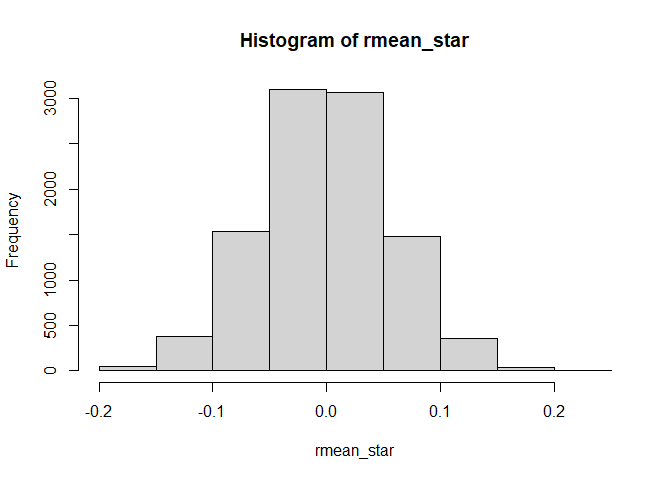
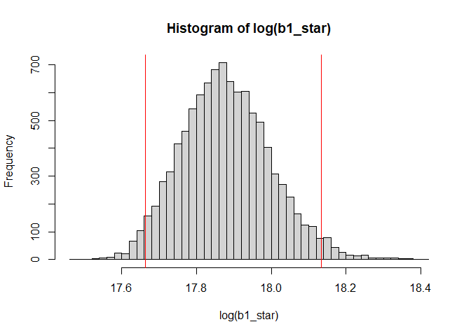
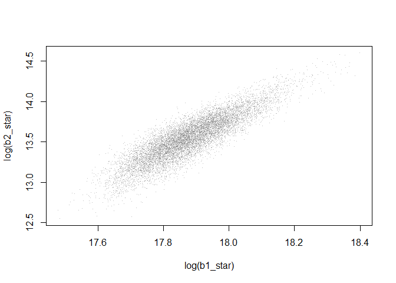
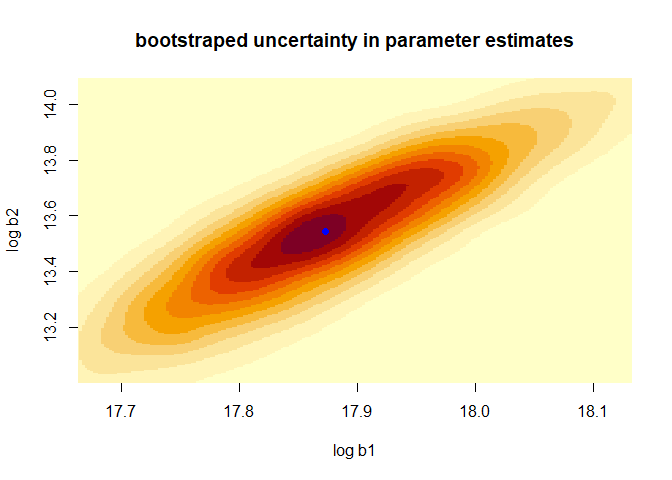
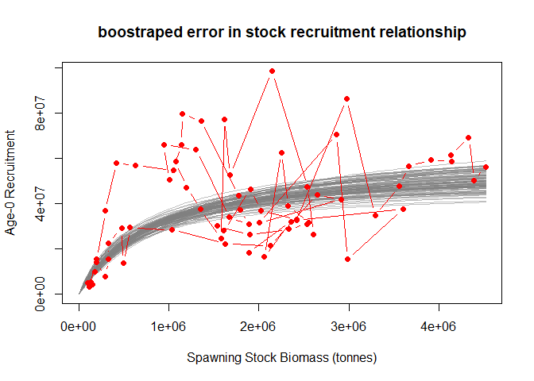

report_02_model_fitting.R
================
colin
2024-03-08

``` r
# Fitting Models to Data in R

# Colin Millar, modified from Iago Mosqueira and Ernesto Jardim

# This script shows the steps followed to fit a stock-recruitment model to
# in the file 'north_sea_herring_SR.csv'

# Load and explore data ----

# load data from comma-separated file to data.frame
herring <- read.csv(file = "data/north_sea_herring_SR.csv", header = TRUE)

# take a look at what we have
head(herring) # this looks at the first 6 rows
```

    ##   Yearclass     SSB Observed_Recruitment
    ## 1      1948 4518040             56145093
    ## 2      1949 4385050             50464602
    ## 3      1950 4330430             69407566
    ## 4      1951 4136480             61716445
    ## 5      1952 4136990             58747959
    ## 6      1953 3910340             59467218

``` r
str(herring) # this lets us inspect what the columns contain
```

    ## 'data.frame':    70 obs. of  3 variables:
    ##  $ Yearclass           : int  1948 1949 1950 1951 1952 1953 1954 1955 1956 1957 ...
    ##  $ SSB                 : int  4518040 4385050 4330430 4136480 4136990 3910340 3663330 3560320 3291180 2972320 ...
    ##  $ Observed_Recruitment: int  56145093 50464602 69407566 61716445 58747959 59467218 56609612 47813982 34964602 86471368 ...

``` r
# lets rename some columns because I am lazy and want the code to be
# readable and easier to type
names(herring)
```

    ## [1] "Yearclass"            "SSB"                  "Observed_Recruitment"

``` r
names(herring) <- c("yc", "ssb", "rec")
head(herring)
```

    ##     yc     ssb      rec
    ## 1 1948 4518040 56145093
    ## 2 1949 4385050 50464602
    ## 3 1950 4330430 69407566
    ## 4 1951 4136480 61716445
    ## 5 1952 4136990 58747959
    ## 6 1953 3910340 59467218

``` r
# to access the diffrent columns use '$' i.e to see the SSB values:
herring$ssb
```

    ##  [1] 4518040 4385050 4330430 4136480 4136990 3910340 3663330 3560320 3291180 2972320 2418190 3599930 2981130 2865720 2007080 2912220 2649680 2126230 1628400 1031640  570384
    ## [22]  495514  475644  327069  333097  296100  199150  113624  152709  103618  137193  181098  198595  297379  414810  630887 1048400 1137080 1150430 1361420 1772460 1796410
    ## [43] 1891780 1671160 1303370  945614 1005750 1075220 1195870 1353060 1577830 1620660 1680650 2147020 2538990 2608510 2536540 2333020 1899840 1540250 1612820 1905820 2023720
    ## [64] 2421690 2553070 2327400 2250320 2059980 2357200 1886840

``` r
# and to see observed recruitment
herring$rec
```

    ##  [1] 56145093 50464602 69407566 61716445 58747959 59467218 56609612 47813982 34964602 86471368 32612252 37555591 15555432 70626790 31537174 42042143 44071367 21386902
    ## [19] 22258706 28554312 29461218 13785776 29192220 22447234 15653161  7910321 14307598  3221820  4171184  4999661  5307598 10119897 15392756 36813217 58141143 57095225
    ## [37] 54817934 66142150 79764521 76685393 43716643 37172373 30841310 34062991 64013959 66075478 50599536 58787521 47093490 37743240 24540245 77447966 52720654 98596630
    ## [55] 47474912 26513951 31143087 28861577 26320079 30295733 28331385 46331823 37007850 33186133 31809759 39244296 62713688 16493131 32135412 18500941

``` r
# initial plot of SSB vs. recruits
plot(
  rec ~ ssb,
  data = herring, # look in herring for x and y values
  xlab = "SSB (thousand tonnes)",
  ylab = "Recruits at age 0 (millions)"
)
```

<!-- -->

``` r
# probably better to set x and y limits to start at zero
plot(
  rec ~ ssb,
  data = herring, # look in herring for x and y values
  xlim = c(0, max(ssb)), # set x limits
  ylim = c(0, max(rec)), # set y limits
  xlab = "SSB (thousand tonnes)",
  ylab = "Recruits at age 0 (millions)"
)
```

<!-- -->

``` r
# We are now going to demonstrate the same techniques employed in the spreadsheet
# solution to the assignment

# Beverton and holt recruitmet model R=b1*S/(b2+S) ----


# (1) Calculate predicted R for each year ----
# Rpred = b1 * S / (b2 + S)

# starting values for b1 and b2
a <- 1
b <- 1

# set up the other variables (i.e. S)
S <- herring$ssb

Rpred <- a * S / (b + S)

# (2) Calculate log residuals, Ln(obs/pred) ----

# assign observed recruitment
Robs <- herring$rec

resids <- log(Robs / Rpred) # = log(Robs) - log(Rpred)

# note that in R, log is the natural log:
?log # see the help file for the log function
log(exp(1))
```

    ## [1] 1

``` r
log(exp(10))
```

    ## [1] 10

``` r
# (3) Calculate sum of squared residuals ----

?sum # see the help file for sum
ssq_resids <- sum(resids^2)

# (4) Minimize sum-of-squares with solver by adjusting a and b ----

# to do this, we need to set up a function that takes
# a and b as input, and returns the sums of squared residuals

# in R a function is a collection of steps: i.e.
add <- function(b1, b2) {
  b1 + b2
}
add(1, 2)
```

    ## [1] 3

``` r
# 3

# the sums of squares function is collection of the previous 3 steps:
ssq <- function(a, b) {
  # 1. Calculate predicted R for each year
  Rpred <- a * S / (b + S)
  # 2. Calculate log residuals, Ln(obs/pred)
  resids <- log(Robs / Rpred)
  # 3. Calculate sum of squared residuals
  ssq_resids <- sum(resids^2)

  # return
  ssq_resids
}

# lets test this out:
ssq(a = 1, b = 1)
```

    ## [1] 20995.77

``` r
# you don't have to 'name' the inputs, but then the order has to be correct
ssq(1, 1)
```

    ## [1] 20995.77

``` r
# variables can be use also, not just numbers
ssq(a, b)
```

    ## [1] 20995.77

``` r
# try some different values, you can imagine trying out differnet values and finding the one that gives the lowest ssq
ssq(2, 1)
```

    ## [1] 19350.23

``` r
# now we need to search over lots of values for b1 and b2 to
# find the minimum.
# There are lots of ways to do this, we will first look at the optim function.
# the help file for optim is:
?optim

ssq_optim <- function(par) {
  a <- par[1]
  b <- par[2]

  ssq(a, b)
}

ssq_optim(c(1, 1))
```

    ## [1] 20995.77

``` r
ssq_optim(c(2, 1))
```

    ## [1] 19350.23

``` r
# use c to combine the starting values into a vector
?c
par0 <- c(1, 1)

# lets test the new ssq funciton at the starting values
ssq_optim(par0)
```

    ## [1] 20995.77

``` r
# lets run it..
opt <- optim(par0, ssq_optim)
```

    ## Warning in log(Robs/Rpred): NaNs produced

    ## Warning in log(Robs/Rpred): NaNs produced

    ## Warning in log(Robs/Rpred): NaNs produced

    ## Warning in log(Robs/Rpred): NaNs produced

    ## Warning in log(Robs/Rpred): NaNs produced

    ## Warning in log(Robs/Rpred): NaNs produced

    ## Warning in log(Robs/Rpred): NaNs produced

    ## Warning in log(Robs/Rpred): NaNs produced

    ## Warning in log(Robs/Rpred): NaNs produced

    ## Warning in log(Robs/Rpred): NaNs produced

    ## Warning in log(Robs/Rpred): NaNs produced

    ## Warning in log(Robs/Rpred): NaNs produced

    ## Warning in log(Robs/Rpred): NaNs produced

    ## Warning in log(Robs/Rpred): NaNs produced

``` r
opt
```

    ## $par
    ## [1] 1.053451e+13 1.101196e+12
    ## 
    ## $value
    ## [1] 100.5715
    ## 
    ## $counts
    ## function gradient 
    ##      225       NA 
    ## 
    ## $convergence
    ## [1] 0
    ## 
    ## $message
    ## NULL

``` r
# it didn't do so well....  lets try with different starting values:
opt <- optim(c(32000000, 300), ssq_optim)
```

    ## Warning in log(Robs/Rpred): NaNs produced

    ## Warning in log(Robs/Rpred): NaNs produced

    ## Warning in log(Robs/Rpred): NaNs produced

``` r
opt
```

    ## $par
    ## [1] 57844348.4   763729.3
    ## 
    ## $value
    ## [1] 16.2205
    ## 
    ## $counts
    ## function gradient 
    ##       69       NA 
    ## 
    ## $convergence
    ## [1] 0
    ## 
    ## $message
    ## NULL

``` r
# better now :)

# (5) Plot observed and predicted R ----

# get the parameter estimates from the optimisation
a <- opt$par[1]
b <- opt$par[2]

# predict recruitment
Rpred <- a * S / (b + S)

# plot
plot(
  Robs ~ S,
  xlim = c(0, max(S)), # set x limits
  ylim = c(0, max(Robs)), # set y limits
  xlab = "Spawning Stock Biomass (tonnes)",
  ylab = "Age-0 Recruitment"
)

# add predictions to the plot
points(Rpred ~ S, col = "red", pch = 2)
```

<!-- -->

``` r
# (6) Plot residuals ----

# calculate residuals
resids <- log(Robs / Rpred)

# plot them
plot(resids ~ S)
# add in a reference line
abline(h = 0, lty = 2)
```

<!-- -->

``` r
###############################################################################
# We are now going to demonstrate the same solution, but taking advantage of
# the tools provided by a programming / scripting language
###############################################################################

#==============================================================================
# Beverton and holt recruitmet model R=b1*S/(b2+S)
#==============================================================================
```

``` r
# (1) Calculate predicted R for each year
# Rpred = b1 * S / (b2 + S)
```

``` r
# this time we will write a function to do this called bevholt
#  to be safe we will also pass in S
#  this way we know for sure wha values of S are being used

bevholt <- function(b, S) {
  b[1] * S / (b[2] + S)
}

# compute R at the starting values for b1 and b2
Rpred <- bevholt(c(1, 1), S = herring$ssb)

# lets jump to step 4 ...
```

``` r
# (4) Minimize sum-of-squares with solver by adjusting b1 and b2
```

``` r
# now lets modify the ssq function to accept S and Robs,
# and use the function bevholt

# the sums of squares function is collection of the previous 3 steps:
ssq <- function(b, S, Robs) {
  # 1. Calculate predicted R for each year
  Rpred <- bevholt(b, S)
  # 2. Calculate log residuals, Ln(obs/pred)
  resids <- log(Robs / Rpred)
  # 3. Calculate sum of squared residuals
  ssq_resids <- sum(resids^2)

  # return
  ssq_resids
}

# lets test this out:
ssq(c(a, b), herring$ssb, herring$rec) # what to you notice this time?
```

    ## [1] 16.2205

``` r
ssq(c(1, 1), herring$ssb, herring$rec)
```

    ## [1] 20995.77

``` r
ssq(c(2, 2), herring$ssb, herring$rec)
```

    ## [1] 19350.24

``` r
# now we need to search over lots of values for b1 and b2 to
# find the minimum.

ssq_optim <- function(par, S, Robs) {
  b <- exp(par)

  ssq(b, S, Robs)
}

# use c to combine the starting values into a vector
par0 <- log(c(1, 1))

# lets test the new ssq funciton
ssq_optim(par0, S = herring$ssb, Robs = herring$rec)
```

    ## [1] 20995.77

``` r
# lets run it..
opt <- optim(par0, ssq_optim, S = herring$ssb, Robs = herring$rec)

opt
```

    ## $par
    ## [1]  17.30522 -20.43000
    ## 
    ## $value
    ## [1] 36.36511
    ## 
    ## $counts
    ## function gradient 
    ##       53       NA 
    ## 
    ## $convergence
    ## [1] 0
    ## 
    ## $message
    ## NULL

``` r
# the fit is not quite there yet, so lets try better starting values.
# this highlights the presence of multiple 'local' minima
par0 <- c(20, 5)
opt <- optim(par0, ssq_optim, S = herring$ssb, Robs = herring$rec)

opt
```

    ## $par
    ## [1] 17.87299 13.54454
    ## 
    ## $value
    ## [1] 16.2205
    ## 
    ## $counts
    ## function gradient 
    ##       71       NA 
    ## 
    ## $convergence
    ## [1] 0
    ## 
    ## $message
    ## NULL

``` r
# (5) Plot observed and predicted R
```

``` r
# predict recruitment over the full S range
Spred <- seq(0, max(herring$ssb), length.out = 100)
Rpred <- bevholt(exp(opt$par), S = Spred)

# plot
plot(
  rec ~ ssb,
  data = herring, # pass in data this time
  xlim = c(0, max(S)), # set x limits
  ylim = c(0, max(Robs)), # set y limits
  xlab = "Spawning Stock Biomass (tonnes)",
  ylab = "Age-0 Recruitment"
)

# add predictions to the plot as a line
lines(Rpred ~ Spred, col = "red", pch = 2)
```

<!-- -->

``` r
###############################################################################
# The following is to demonstrate a techniques for calculating confidence
# intervals - this is not part of the course and purely for demonstation
# purposes
###############################################################################

# Bootstrapping is so called because it is like you are acheieving something
# from nothing.
#
# but in fact it is taking advantage of the fact that your samle of data
# contains information about how it varies...
#
# this can be seen from the residuals:

# lets run the fit again
fit <- optim(par0, ssq_optim, S = herring$ssb, Robs = herring$rec)

# and calculate the residuals
Rpred <- bevholt(exp(fit$par), herring$ssb)
resids <- log( herring$rec / Rpred)

# and plot a histogram
hist(resids, nclass = 20)
```

<!-- -->

``` r
# the mean of the residuals is:
mean(resids)
```

    ## [1] -0.0001802251

``` r
# but is there not error in this?

# resample from this as if the resuduals are random and reclaculate the mean
r_star <- sample(resids,  replace = TRUE)
mean(r_star)
```

    ## [1] -0.01005598

``` r
# do it again
r_star <- sample(resids, replace = TRUE)
mean(r_star)
```

    ## [1] -0.02544972

``` r
# do it lots of times!
rmean_star <-
  replicate(10000, {
    r_star <- sample(resids, replace = TRUE)
    mean(r_star)
  })

hist(rmean_star)
```

<!-- -->

``` r
# so we are able to access the error inherent in the model fit?
#
# And we can propagate this through to the parameter estimates?
```

``` r
# resample from the residuals as if the resuduals are random and reestimate the
# parameters
r_star <- sample(resids, replace = TRUE)
opt <- optim(par0, ssq_optim, S = herring$ssb, Robs = Rpred + r_star)
opt$par
```

    ## [1] 17.87308 13.54536

``` r
# do it again
r_star <- sample(resids, replace = TRUE)
opt <- optim(par0, ssq_optim, S = herring$ssb, Robs = Rpred + r_star)
opt$par
```

    ## [1] 17.87308 13.54536

``` r
# do it lots of times!
par_star <-
  replicate(10000, {
    r_star <- sample(resids, replace = TRUE)
    opt <- optim(par0, ssq_optim, S = herring$ssb, Robs = Rpred * exp(r_star),
                 method = "BFGS")
    opt$par
  })

# separate b1 and b2 bootstrap simulations for ease of inspection
b1_star <- exp(par_star[1,])
b2_star <- exp(par_star[2,])

# plot histograms of simulations
hist(log(b1_star), nclass = 50)
# add confidence intervals
abline(v = quantile(log(b1_star), c(0.025, 0.975)), col = "red")
```

<!-- -->

``` r
quantile(b1_star, c(0.025, 0.975))
```

    ##     2.5%    97.5% 
    ## 46704443 75305356

``` r
# what does the 2D bootstrap simulation look like?
plot(log(b1_star), log(b2_star), pch = ".", col = grey(.5, alpha = 0.5))
```

<!-- -->

``` r
# a colourful 2d densty plot
image(MASS::kde2d(log(b1_star), log(b2_star), n = 400),
      xlab = "log b1", ylab = "log b2",
      xlim = quantile(log(b1_star), c(0.025, 0.975)),
      ylim = quantile(log(b2_star), c(0.025, 0.975)),
      main = "bootstraped uncertainty in parameter estimates")
# plot the least squares estimate
points(fit$par[1], fit$par[2], pch = 16, col = "blue")
```

<!-- -->

``` r
# plot
# predict recruitment over the full S range
Spred <- seq(0, max(herring$ssb), length.out = 100)
Rpred <- apply(par_star, 2, function(x) bevholt(exp(x), S = Spred))

# plot a few curves to see the uncertainty in the relationship
matplot(Spred, Rpred[, sample(1:ncol(Rpred), 100)], type = "l", lty = 1, col = grey(0.5, alpha = 0.5),
        xlim = c(0, max(S)), # set x limits
        ylim = c(0, max(Robs)), # set y limits
        xlab = 'Spawning Stock Biomass (tonnes)',
        ylab = 'Age-0 Recruitment',
        main = "boostraped error in stock recruitment relationship")
# add the data
points(herring$ssb, herring$rec, type = "b", pch = 16, col = "red")
```

<!-- -->

``` r
# ==============================================================================
# A note on GLMs for SR modeling
# ==============================================================================

# for plotting lets order the SR data
herring_ord <- herring[order(herring$ssb),]

# mean
mean_fit <- glm(rec ~ 1, data = herring_ord)

plot(herring_ord$ssb, herring_ord$rec)
lines(herring_ord$ssb, fitted(mean_fit), col = "red", lwd = 2)
```

<!-- -->

``` r
# linear 1
linear1_fit <- glm(rec ~ ssb - 1, data = herring_ord)

plot(herring_ord$ssb, herring_ord$rec)
lines(herring_ord$ssb, fitted(linear1_fit), col = "red", lwd = 2)
```

<!-- -->

``` r
# linear 2
linear2_fit <- glm(rec ~ ssb, data = herring_ord)

plot(herring_ord$ssb, herring_ord$rec)
lines(herring_ord$ssb, fitted(linear2_fit), col = "red", lwd = 2)
```

<!-- -->

``` r
# log transformed ricker
# R = a S exp(-bS)
# =>  log R = log(a) -bS + log(S)

ricker_fit <- glm(rec ~ ssb, offset = log(ssb), data = herring_ord, family = Gamma(log))

plot(herring_ord$ssb, herring_ord$rec)
lines(herring_ord$ssb, fitted(ricker_fit), col = "red", lwd = 2)
```

<!-- -->

``` r
# inverse transformed beverton holt
# R = a S / (b + S)
# =>  1 / R = (b + S) / (aS)
# =>        = b / (aS) + S / (aS)
# =>        = b/a * 1/S + 1 / a

bh_fit <- glm(rec ~ I(1 / ssb), data = herring_ord, family = Gamma(inverse))

plot(herring_ord$ssb, herring_ord$rec)
lines(herring_ord$ssb, fitted(bh_fit), col = "red", lwd = 2)
```

<!-- -->

``` r
# all of 'em
plot(herring_ord$ssb, herring_ord$rec)
lines(herring_ord$ssb, fitted(mean_fit), col = "red", lwd = 2)
lines(herring_ord$ssb, fitted(linear1_fit), col = "blue", lwd = 2)
lines(herring_ord$ssb, fitted(linear2_fit), col = "lightblue", lwd = 2)
lines(herring_ord$ssb, fitted(ricker_fit), col = "seagreen", lwd = 2)
lines(herring_ord$ssb, fitted(bh_fit), col = "orange", lwd = 2)
```

<!-- -->

``` r
# I can add code for confidence intervals if that would be helpful?
# you get to the you can extract the standard errors of the fit from the
# predict.glm function.

# this can be useful if you want to quickly check for covariates etc.
# but if you are going to use this in a stock assessmet model you will
# have to go down the route of using optim or a similar optimiser anyway
```
