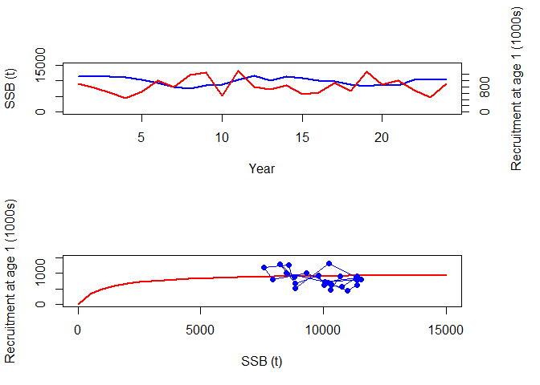

report_03_biological_production.R
================
colin
2024-03-08

``` r
################################################################################
## 1  Mortality

Amax <- 15
age <- 1:Amax
Ninit <- 1000
Nvec <- numeric(Amax)
M <- rep(0.2, Amax)
Fmort <- c(0, 0, rep(0.3, Amax - 2))

Nvec[1] <- Ninit
for (a in 1:(Amax - 1)) {
  Nvec[a + 1] <- Nvec[a] * exp(-M[a] - Fmort[a])
}


data.frame(age, Nvec, M, Fmort)
```

    ##    age        Nvec   M Fmort
    ## 1    1 1000.000000 0.2   0.0
    ## 2    2  818.730753 0.2   0.0
    ## 3    3  670.320046 0.2   0.3
    ## 4    4  406.569660 0.2   0.3
    ## 5    5  246.596964 0.2   0.3
    ## 6    6  149.568619 0.2   0.3
    ## 7    7   90.717953 0.2   0.3
    ## 8    8   55.023220 0.2   0.3
    ## 9    9   33.373270 0.2   0.3
    ## 10  10   20.241911 0.2   0.3
    ## 11  11   12.277340 0.2   0.3
    ## 12  12    7.446583 0.2   0.3
    ## 13  13    4.516581 0.2   0.3
    ## 14  14    2.739445 0.2   0.3
    ## 15  15    1.661557 0.2   0.3

``` r
################################################################################
## 2  Growth

Winf <- 10
k <- 0.5
t0 <- -0.1
b <- 3

w <- Winf * (1 - exp(-k * (age - t0)))^b
B <- Nvec * w

data.frame(age, Nvec, w, B)
```

    ##    age        Nvec         w          B
    ## 1    1 1000.000000 0.7571391  757.13911
    ## 2    2  818.730753 2.7470391 2249.08540
    ## 3    3  670.320046 4.8884208 3276.80648
    ## 4    4  406.569660 6.6137983 2688.96974
    ## 5    5  246.596964 7.8356920 1932.25785
    ## 6    6  149.568619 8.6454561 1293.08893
    ## 7    7   90.717953 9.1627769  831.22837
    ## 8    8   55.023220 9.4863821  521.97129
    ## 9    9   33.373270 9.6863220  323.26424
    ## 10  10   20.241911 9.8089498  198.55189
    ## 11  11   12.277340 9.8838291  121.34713
    ## 12  12    7.446583 9.9294308   73.94033
    ## 13  13    4.516581 9.9571579   44.97231
    ## 14  14    2.739445 9.9740003   27.32322
    ## 15  15    1.661557 9.9842250   16.58936

``` r
sum(B)
```

    ## [1] 14356.54

``` r
################################################################################
## 3  Recruitment

mat <- c(0, 0, rep(1, Amax - 2))
SSBvec <- B * mat
sum(SSBvec)
```

    ## [1] 11350.31

``` r
alpha <- 1000
beta <- 1000
Tmax <- 25
year <- 1:Tmax

N <- matrix(nrow = Amax, ncol = Tmax)
SSB <- matrix(nrow = Amax, ncol = Tmax)

N[, 1] <- Nvec
SSB[, 1] <- N[, 1] * mat * w

N[1, 2] <- (alpha * sum(SSB[, 1])) / (beta + sum(SSB[, 1]))
for (a in 1:(Amax - 1)) {
  N[a + 1, 2] <- N[a, 1] * exp(-M[a] - Fmort[a])
}
SSB[, 2] <- N[, 2] * mat * w

for (t in 1:(Tmax - 1))
{
  N[1, t + 1] <- (alpha * sum(SSB[, t])) / (beta + sum(SSB[, t]))
  for (a in 1:(Amax - 1)) {
    N[a + 1, t + 1] <- N[a, t] * exp(-M[a] - Fmort[a])
  }
  SSB[, t + 1] <- N[, t + 1] * mat * w
}

round(N)
```

    ##       [,1] [,2] [,3] [,4] [,5] [,6] [,7] [,8] [,9] [,10] [,11] [,12] [,13] [,14] [,15] [,16] [,17] [,18] [,19] [,20] [,21] [,22] [,23] [,24] [,25]
    ##  [1,] 1000  919  919  919  917  916  915  914  913   913   913   912   912   912   912   912   912   912   912   912   912   912   912   912   912
    ##  [2,]  819  819  752  752  752  751  750  749  748   748   747   747   747   747   747   747   747   747   747   747   747   747   747   747   747
    ##  [3,]  670  670  670  616  616  616  615  614  613   613   612   612   612   612   611   611   611   611   611   611   611   611   611   611   611
    ##  [4,]  407  407  407  407  374  374  374  373  372   372   372   371   371   371   371   371   371   371   371   371   371   371   371   371   371
    ##  [5,]  247  247  247  247  247  227  227  227  226   226   226   225   225   225   225   225   225   225   225   225   225   225   225   225   225
    ##  [6,]  150  150  150  150  150  150  137  137  137   137   137   137   137   137   137   136   136   136   136   136   136   136   136   136   136
    ##  [7,]   91   91   91   91   91   91   91   83   83    83    83    83    83    83    83    83    83    83    83    83    83    83    83    83    83
    ##  [8,]   55   55   55   55   55   55   55   55   51    51    51    50    50    50    50    50    50    50    50    50    50    50    50    50    50
    ##  [9,]   33   33   33   33   33   33   33   33   33    31    31    31    31    31    31    30    30    30    30    30    30    30    30    30    30
    ## [10,]   20   20   20   20   20   20   20   20   20    20    19    19    19    19    19    19    18    18    18    18    18    18    18    18    18
    ## [11,]   12   12   12   12   12   12   12   12   12    12    12    11    11    11    11    11    11    11    11    11    11    11    11    11    11
    ## [12,]    7    7    7    7    7    7    7    7    7     7     7     7     7     7     7     7     7     7     7     7     7     7     7     7     7
    ## [13,]    5    5    5    5    5    5    5    5    5     5     5     5     5     4     4     4     4     4     4     4     4     4     4     4     4
    ## [14,]    3    3    3    3    3    3    3    3    3     3     3     3     3     3     3     3     3     3     3     3     3     3     3     2     2
    ## [15,]    2    2    2    2    2    2    2    2    2     2     2     2     2     2     2     2     2     2     2     2     2     2     2     2     2

``` r
rec_age <- 1
SR <-
  data.frame(
    year = year[1:(Tmax - rec_age)],
    SSB = colSums(SSB)[1:(Tmax - rec_age)],
    Rec = N[1, (rec_age + 1):Tmax]
  )

SSB.curve <- seq(0, 12000, by = 500)
Rec.curve <- (alpha * SSB.curve) / (beta + SSB.curve)

par(mfrow = c(2, 1), oma = c(0, 0, 0, 3))
plot(SR$year, SR$SSB,
  ylim = c(0, 12000), type = "l", lwd = 2, col = "blue", xlab = "Year",
  ylab = "SSB (t)"
)
lines(SR$year, SR$Rec * 10, lwd = 2, col = "red")
axis(4, at = seq(0, 12000, by = 2000), labels = seq(0, 1200, by = 200))
mtext("Recruitment at age 1 (1000s)", side = 4, line = 3)

plot(SSB.curve, Rec.curve,
  ylim = c(0, 1000), type = "l", xlab = "SSB (t)",
  ylab = "Recruitment at age 1 (1000s)", lwd = 2, col = "red"
)
points(SR$SSB, SR$Rec, type = "o", pch = 16, col = "blue")
```

<!-- -->

``` r
data.frame(SSB.curve, Rec.curve)
```

    ##    SSB.curve Rec.curve
    ## 1          0    0.0000
    ## 2        500  333.3333
    ## 3       1000  500.0000
    ## 4       1500  600.0000
    ## 5       2000  666.6667
    ## 6       2500  714.2857
    ## 7       3000  750.0000
    ## 8       3500  777.7778
    ## 9       4000  800.0000
    ## 10      4500  818.1818
    ## 11      5000  833.3333
    ## 12      5500  846.1538
    ## 13      6000  857.1429
    ## 14      6500  866.6667
    ## 15      7000  875.0000
    ## 16      7500  882.3529
    ## 17      8000  888.8889
    ## 18      8500  894.7368
    ## 19      9000  900.0000
    ## 20      9500  904.7619
    ## 21     10000  909.0909
    ## 22     10500  913.0435
    ## 23     11000  916.6667
    ## 24     11500  920.0000
    ## 25     12000  923.0769

``` r
################################################################################
## 4  Recruitment variability

v <- 1000

## Year 1
N[, 1] <- Nvec
SSB[, 1] <- N[, 1] * mat * w

## Later years
for (t in 1:(Tmax - 1))
{
  N[1, t + 1] <- (alpha * sum(SSB[, t])) / (beta + sum(SSB[, t])) + v * runif(1, -0.5, 0.5)
  for (a in 1:(Amax - 1)) {
    N[a + 1, t + 1] <- N[a, t] * exp(-M[a] - Fmort[a])
  }
  SSB[, t + 1] <- N[, t + 1] * mat * w
}

round(N, 3)
```

    ##           [,1]     [,2]     [,3]     [,4]     [,5]    [,6]     [,7]    [,8]     [,9]   [,10]    [,11]   [,12]   [,13]   [,14]   [,15]   [,16]    [,17]    [,18]   [,19]
    ##  [1,] 1000.000 1365.578  912.210 1103.871 1012.830 756.968 1166.537 495.121 1045.946 535.826 1214.940 929.160 919.355 766.457 456.080 600.405 1119.509 1108.295 575.858
    ##  [2,]  818.731  818.731 1118.041  746.855  903.773 829.235  619.753 955.079  405.370 856.348  438.697 994.709 760.732 752.704 627.522 373.407  491.570  916.576 907.395
    ##  [3,]  670.320  670.320  670.320  915.374  611.473 739.947  678.921 507.411  781.953 331.889  701.119 359.175 814.398 622.835 616.262 513.772  305.720  402.464 750.429
    ##  [4,]  406.570  406.570  406.570  406.570  555.203 370.877  448.801 411.786  307.760 474.278  201.301 425.250 217.851 493.958 377.768 373.782  311.618  185.428 244.107
    ##  [5,]  246.597  246.597  246.597  246.597  246.597 336.747  224.948 272.211  249.761 186.666  287.664 122.095 257.927 132.133 299.600 229.128  226.710  189.006 112.468
    ##  [6,]  149.569  149.569  149.569  149.569  149.569 149.569  204.248 136.438  165.104 151.488  113.219 174.477  74.054 156.441  80.143 181.717  138.973  137.507 114.638
    ##  [7,]   90.718   90.718   90.718   90.718   90.718  90.718   90.718 123.882   82.754 100.141   91.882  68.671 105.826  44.916  94.886  48.609  110.217   84.292  83.402
    ##  [8,]   55.023   55.023   55.023   55.023   55.023  55.023   55.023  55.023   75.139  50.193   60.739  55.729  41.651  64.187  27.243  57.551   29.483   66.850  51.125
    ##  [9,]   33.373   33.373   33.373   33.373   33.373  33.373   33.373  33.373   33.373  45.574   30.443  36.840  33.801  25.263  38.931  16.524   34.907   17.882  40.547
    ## [10,]   20.242   20.242   20.242   20.242   20.242  20.242   20.242  20.242   20.242  20.242   27.642  18.465  22.344  20.502  15.322  23.613   10.022   21.172  10.846
    ## [11,]   12.277   12.277   12.277   12.277   12.277  12.277   12.277  12.277   12.277  12.277   12.277  16.766  11.200  13.553  12.435   9.294   14.322    6.079  12.841
    ## [12,]    7.447    7.447    7.447    7.447    7.447   7.447    7.447   7.447    7.447   7.447    7.447   7.447  10.169   6.793   8.220   7.542    5.637    8.687   3.687
    ## [13,]    4.517    4.517    4.517    4.517    4.517   4.517    4.517   4.517    4.517   4.517    4.517   4.517   4.517   6.168   4.120   4.986    4.575    3.419   5.269
    ## [14,]    2.739    2.739    2.739    2.739    2.739   2.739    2.739   2.739    2.739   2.739    2.739   2.739   2.739   2.739   3.741   2.499    3.024    2.775   2.074
    ## [15,]    1.662    1.662    1.662    1.662    1.662   1.662    1.662   1.662    1.662   1.662    1.662   1.662   1.662   1.662   1.662   2.269    1.516    1.834   1.683
    ##          [,20]    [,21]   [,22]   [,23]   [,24]    [,25]
    ##  [1,] 1234.125  831.688 755.227 792.349 630.777 1352.993
    ##  [2,]  471.473 1010.416 680.928 618.327 648.720  516.437
    ##  [3,]  742.912  386.009 827.259 557.497 506.244  531.127
    ##  [4,]  455.158  450.599 234.126 501.758 338.139  307.052
    ##  [5,]  148.058  276.067 273.302 142.005 304.332  205.092
    ##  [6,]   68.215   89.802 167.443 165.766  86.130  184.586
    ##  [7,]   69.531   41.375  54.468 101.560 100.542   52.241
    ##  [8,]   50.586   42.173  25.095  33.036  61.599   60.982
    ##  [9,]   31.009   30.682  25.579  15.221  20.037   37.362
    ## [10,]   24.593   18.808  18.609  15.515   9.232   12.153
    ## [11,]    6.579   14.916  11.408  11.287   9.410    5.599
    ## [12,]    7.789    3.990   9.047   6.919   6.846    5.707
    ## [13,]    2.236    4.724   2.420   5.487   4.197    4.152
    ## [14,]    3.196    1.356   2.865   1.468   3.328    2.545
    ## [15,]    1.258    1.938   0.823   1.738   0.890    2.019

``` r
rec_age <- 1
SR <-
  data.frame(
    year = year[1:(Tmax - rec_age)],
    SSB = colSums(SSB)[1:(Tmax - rec_age)],
    Rec = N[1, (rec_age + 1):Tmax]
  )

SSB.curve <- seq(0, 15000, by = 500)
Rec.curve <- (alpha * SSB.curve) / (beta + SSB.curve)

plot(SR$year, SR$SSB,
  ylim = c(0, 15000), type = "l", lwd = 2, col = "blue", xlab = "Year",
  ylab = "SSB (t)"
)
lines(SR$year, SR$Rec * 10, lwd = 2, col = "red")
axis(4, at = seq(0, 12000, by = 2000), labels = seq(0, 1200, by = 200))
mtext("Recruitment at age 1 (1000s)", side = 4, line = 3)

plot(SSB.curve, Rec.curve,
  xlim = c(0, 15000), ylim = c(0, 1500), type = "l",
  xlab = "SSB (t)", ylab = "Recruitment at age 1 (1000s)", lwd = 2, col = "red"
)
points(SR$SSB, SR$Rec, type = "o", pch = 16, col = "blue")
```

<!-- -->
