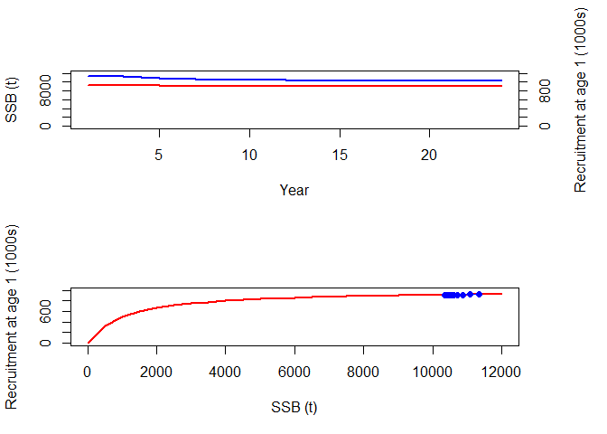

report_03_biological_production.R
================
colin
2024-03-08

``` r
################################################################################
## 1  Mortality

Amax <- 15
age <- 1:Amax
Ninit <- 1000
Nvec <- numeric(Amax)
M <- rep(0.2, Amax)
Fmort <- c(0, 0, rep(0.3, Amax - 2))

Nvec[1] <- Ninit
for (a in 1:(Amax - 1)) {
  Nvec[a + 1] <- Nvec[a] * exp(-M[a] - Fmort[a])
}


data.frame(age, Nvec, M, Fmort)
```

    ##    age        Nvec   M Fmort
    ## 1    1 1000.000000 0.2   0.0
    ## 2    2  818.730753 0.2   0.0
    ## 3    3  670.320046 0.2   0.3
    ## 4    4  406.569660 0.2   0.3
    ## 5    5  246.596964 0.2   0.3
    ## 6    6  149.568619 0.2   0.3
    ## 7    7   90.717953 0.2   0.3
    ## 8    8   55.023220 0.2   0.3
    ## 9    9   33.373270 0.2   0.3
    ## 10  10   20.241911 0.2   0.3
    ## 11  11   12.277340 0.2   0.3
    ## 12  12    7.446583 0.2   0.3
    ## 13  13    4.516581 0.2   0.3
    ## 14  14    2.739445 0.2   0.3
    ## 15  15    1.661557 0.2   0.3

``` r
################################################################################
## 2  Growth

Winf <- 10
k <- 0.5
t0 <- -0.1
b <- 3

w <- Winf * (1 - exp(-k * (age - t0)))^b
B <- Nvec * w

data.frame(age, Nvec, w, B)
```

    ##    age        Nvec         w          B
    ## 1    1 1000.000000 0.7571391  757.13911
    ## 2    2  818.730753 2.7470391 2249.08540
    ## 3    3  670.320046 4.8884208 3276.80648
    ## 4    4  406.569660 6.6137983 2688.96974
    ## 5    5  246.596964 7.8356920 1932.25785
    ## 6    6  149.568619 8.6454561 1293.08893
    ## 7    7   90.717953 9.1627769  831.22837
    ## 8    8   55.023220 9.4863821  521.97129
    ## 9    9   33.373270 9.6863220  323.26424
    ## 10  10   20.241911 9.8089498  198.55189
    ## 11  11   12.277340 9.8838291  121.34713
    ## 12  12    7.446583 9.9294308   73.94033
    ## 13  13    4.516581 9.9571579   44.97231
    ## 14  14    2.739445 9.9740003   27.32322
    ## 15  15    1.661557 9.9842250   16.58936

``` r
sum(B)
```

    ## [1] 14356.54

``` r
################################################################################
## 3  Recruitment

mat <- c(0, 0, rep(1, Amax - 2))
SSBvec <- B * mat
sum(SSBvec)
```

    ## [1] 11350.31

``` r
alpha <- 1000
beta <- 1000
Tmax <- 25
year <- 1:Tmax

N <- matrix(nrow = Amax, ncol = Tmax)
SSB <- matrix(nrow = Amax, ncol = Tmax)

N[, 1] <- Nvec
SSB[, 1] <- N[, 1] * mat * w

N[1, 2] <- (alpha * sum(SSB[, 1])) / (beta + sum(SSB[, 1]))
for (a in 1:(Amax - 1)) {
  N[a + 1, 2] <- N[a, 1] * exp(-M[a] - Fmort[a])
}
SSB[, 2] <- N[, 2] * mat * w

for (t in 1:(Tmax - 1))
{
  N[1, t + 1] <- (alpha * sum(SSB[, t])) / (beta + sum(SSB[, t]))
  for (a in 1:(Amax - 1)) {
    N[a + 1, t + 1] <- N[a, t] * exp(-M[a] - Fmort[a])
  }
  SSB[, t + 1] <- N[, t + 1] * mat * w
}

round(N)
```

    ##       [,1] [,2] [,3] [,4] [,5] [,6] [,7] [,8] [,9] [,10] [,11] [,12] [,13] [,14] [,15] [,16] [,17] [,18] [,19] [,20] [,21] [,22] [,23] [,24] [,25]
    ##  [1,] 1000  919  919  919  917  916  915  914  913   913   913   912   912   912   912   912   912   912   912   912   912   912   912   912   912
    ##  [2,]  819  819  752  752  752  751  750  749  748   748   747   747   747   747   747   747   747   747   747   747   747   747   747   747   747
    ##  [3,]  670  670  670  616  616  616  615  614  613   613   612   612   612   612   611   611   611   611   611   611   611   611   611   611   611
    ##  [4,]  407  407  407  407  374  374  374  373  372   372   372   371   371   371   371   371   371   371   371   371   371   371   371   371   371
    ##  [5,]  247  247  247  247  247  227  227  227  226   226   226   225   225   225   225   225   225   225   225   225   225   225   225   225   225
    ##  [6,]  150  150  150  150  150  150  137  137  137   137   137   137   137   137   137   136   136   136   136   136   136   136   136   136   136
    ##  [7,]   91   91   91   91   91   91   91   83   83    83    83    83    83    83    83    83    83    83    83    83    83    83    83    83    83
    ##  [8,]   55   55   55   55   55   55   55   55   51    51    51    50    50    50    50    50    50    50    50    50    50    50    50    50    50
    ##  [9,]   33   33   33   33   33   33   33   33   33    31    31    31    31    31    31    30    30    30    30    30    30    30    30    30    30
    ## [10,]   20   20   20   20   20   20   20   20   20    20    19    19    19    19    19    19    18    18    18    18    18    18    18    18    18
    ## [11,]   12   12   12   12   12   12   12   12   12    12    12    11    11    11    11    11    11    11    11    11    11    11    11    11    11
    ## [12,]    7    7    7    7    7    7    7    7    7     7     7     7     7     7     7     7     7     7     7     7     7     7     7     7     7
    ## [13,]    5    5    5    5    5    5    5    5    5     5     5     5     5     4     4     4     4     4     4     4     4     4     4     4     4
    ## [14,]    3    3    3    3    3    3    3    3    3     3     3     3     3     3     3     3     3     3     3     3     3     3     3     2     2
    ## [15,]    2    2    2    2    2    2    2    2    2     2     2     2     2     2     2     2     2     2     2     2     2     2     2     2     2

``` r
rec_age <- 1
SR <-
  data.frame(
    year = year[1:(Tmax - rec_age)],
    SSB = colSums(SSB)[1:(Tmax - rec_age)],
    Rec = N[1, (rec_age + 1):Tmax]
  )

SSB.curve <- seq(0, 12000, by = 500)
Rec.curve <- (alpha * SSB.curve) / (beta + SSB.curve)

par(mfrow = c(2, 1), oma = c(0, 0, 0, 3))
plot(SR$year, SR$SSB,
  ylim = c(0, 12000), type = "l", lwd = 2, col = "blue", xlab = "Year",
  ylab = "SSB (t)"
)
lines(SR$year, SR$Rec * 10, lwd = 2, col = "red")
axis(4, at = seq(0, 12000, by = 2000), labels = seq(0, 1200, by = 200))
mtext("Recruitment at age 1 (1000s)", side = 4, line = 3)

plot(SSB.curve, Rec.curve,
  ylim = c(0, 1000), type = "l", xlab = "SSB (t)",
  ylab = "Recruitment at age 1 (1000s)", lwd = 2, col = "red"
)
points(SR$SSB, SR$Rec, type = "o", pch = 16, col = "blue")
```

<!-- -->

``` r
data.frame(SSB.curve, Rec.curve)
```

    ##    SSB.curve Rec.curve
    ## 1          0    0.0000
    ## 2        500  333.3333
    ## 3       1000  500.0000
    ## 4       1500  600.0000
    ## 5       2000  666.6667
    ## 6       2500  714.2857
    ## 7       3000  750.0000
    ## 8       3500  777.7778
    ## 9       4000  800.0000
    ## 10      4500  818.1818
    ## 11      5000  833.3333
    ## 12      5500  846.1538
    ## 13      6000  857.1429
    ## 14      6500  866.6667
    ## 15      7000  875.0000
    ## 16      7500  882.3529
    ## 17      8000  888.8889
    ## 18      8500  894.7368
    ## 19      9000  900.0000
    ## 20      9500  904.7619
    ## 21     10000  909.0909
    ## 22     10500  913.0435
    ## 23     11000  916.6667
    ## 24     11500  920.0000
    ## 25     12000  923.0769

``` r
################################################################################
## 4  Recruitment variability

v <- 1000

## Year 1
N[, 1] <- Nvec
SSB[, 1] <- N[, 1] * mat * w

## Later years
for (t in 1:(Tmax - 1))
{
  N[1, t + 1] <- (alpha * sum(SSB[, t])) / (beta + sum(SSB[, t])) + v * runif(1, -0.5, 0.5)
  for (a in 1:(Amax - 1)) {
    N[a + 1, t + 1] <- N[a, t] * exp(-M[a] - Fmort[a])
  }
  SSB[, t + 1] <- N[, t + 1] * mat * w
}

round(N, 3)
```

    ##           [,1]    [,2]    [,3]    [,4]    [,5]    [,6]     [,7]    [,8]     [,9]    [,10]    [,11]    [,12]    [,13]   [,14]   [,15]   [,16]   [,17]   [,18]   [,19]    [,20]
    ##  [1,] 1000.000 888.212 777.506 624.118 443.588 638.763 1006.457 808.561 1176.274 1253.581  512.916 1310.855  789.804 733.247 844.612 579.875 631.797 926.627 662.316 1274.468
    ##  [2,]  818.731 818.731 727.206 636.568 510.985 363.179  522.975 824.017  661.993  963.051 1026.345  419.940 1073.237 646.637 600.332 691.510 474.761 517.272 758.658  542.258
    ##  [3,]  670.320 670.320 670.320 595.386 521.178 418.359  297.346 428.176  674.648  541.994  788.480  840.300  343.818 878.692 529.421 491.510 566.160 388.702 423.506  621.136
    ##  [4,]  406.570 406.570 406.570 406.570 361.120 316.110  253.747 180.349  259.702  409.195  328.736  478.237  509.668 208.536 532.954 321.110 298.116 343.394 235.759  256.870
    ##  [5,]  246.597 246.597 246.597 246.597 246.597 219.030  191.731 153.906  109.387  157.517  248.189  199.389  290.066 309.129 126.483 323.253 194.763 180.817 208.279  142.995
    ##  [6,]  149.569 149.569 149.569 149.569 149.569 149.569  132.849 116.291   93.348   66.347   95.539  150.534  120.935 175.934 187.496  76.716 196.063 118.130 109.671  126.327
    ##  [7,]   90.718  90.718  90.718  90.718  90.718  90.718   90.718  80.577   70.534   56.619   40.241   57.947   91.304  73.351 106.709 113.722  46.531 118.918  71.649   66.519
    ##  [8,]   55.023  55.023  55.023  55.023  55.023  55.023   55.023  55.023   48.872   42.781   34.341   24.408   35.147  55.378  44.490  64.722  68.976  28.222  72.127   43.458
    ##  [9,]   33.373  33.373  33.373  33.373  33.373  33.373   33.373  33.373   33.373   29.643   25.948   20.829   14.804  21.318  33.589  26.984  39.256  41.836  17.118   43.748
    ## [10,]   20.242  20.242  20.242  20.242  20.242  20.242   20.242  20.242   20.242   20.242   17.979   15.738   12.633   8.979  12.930  20.373  16.367  23.810  25.375   10.382
    ## [11,]   12.277  12.277  12.277  12.277  12.277  12.277   12.277  12.277   12.277   12.277   12.277   10.905    9.546   7.663   5.446   7.842  12.357   9.927  14.442   15.391
    ## [12,]    7.447   7.447   7.447   7.447   7.447   7.447    7.447   7.447    7.447    7.447    7.447    7.447    6.614   5.790   4.648   3.303   4.757   7.495   6.021    8.759
    ## [13,]    4.517   4.517   4.517   4.517   4.517   4.517    4.517   4.517    4.517    4.517    4.517    4.517    4.517   4.012   3.512   2.819   2.004   2.885   4.546    3.652
    ## [14,]    2.739   2.739   2.739   2.739   2.739   2.739    2.739   2.739    2.739    2.739    2.739    2.739    2.739   2.739   2.433   2.130   1.710   1.215   1.750    2.757
    ## [15,]    1.662   1.662   1.662   1.662   1.662   1.662    1.662   1.662    1.662    1.662    1.662    1.662    1.662   1.662   1.662   1.476   1.292   1.037   0.737    1.061
    ##          [,21]    [,22]   [,23]   [,24]   [,25]
    ##  [1,]  871.683 1010.364 704.200 464.961 906.516
    ##  [2,] 1043.446  713.674 827.216 576.551 380.678
    ##  [3,]  443.964  854.302 584.307 677.267 472.040
    ##  [4,]  376.738  269.278 518.160 354.400 410.783
    ##  [5,]  155.799  228.503 163.325 314.280 214.954
    ##  [6,]   86.731   94.497 138.594  99.062 190.620
    ##  [7,]   76.621   52.605  57.315  84.062  60.084
    ##  [8,]   40.346   46.473  31.907  34.764  50.986
    ##  [9,]   26.358   24.471  28.187  19.352  21.085
    ## [10,]   26.534   15.987  14.842  17.097  11.738
    ## [11,]    6.297   16.094   9.697   9.002  10.370
    ## [12,]    9.335    3.819   9.761   5.881   5.460
    ## [13,]    5.313    5.662   2.317   5.921   3.567
    ## [14,]    2.215    3.222   3.434   1.405   3.591
    ## [15,]    1.672    1.343   1.954   2.083   0.852

``` r
rec_age <- 1
SR <-
  data.frame(
    year = year[1:(Tmax - rec_age)],
    SSB = colSums(SSB)[1:(Tmax - rec_age)],
    Rec = N[1, (rec_age + 1):Tmax]
  )

SSB.curve <- seq(0, 15000, by = 500)
Rec.curve <- (alpha * SSB.curve) / (beta + SSB.curve)

plot(SR$year, SR$SSB,
  ylim = c(0, 15000), type = "l", lwd = 2, col = "blue", xlab = "Year",
  ylab = "SSB (t)"
)
lines(SR$year, SR$Rec * 10, lwd = 2, col = "red")
axis(4, at = seq(0, 12000, by = 2000), labels = seq(0, 1200, by = 200))
mtext("Recruitment at age 1 (1000s)", side = 4, line = 3)

plot(SSB.curve, Rec.curve,
  xlim = c(0, 15000), ylim = c(0, 1500), type = "l",
  xlab = "SSB (t)", ylab = "Recruitment at age 1 (1000s)", lwd = 2, col = "red"
)
points(SR$SSB, SR$Rec, type = "o", pch = 16, col = "blue")
```

<!-- -->
