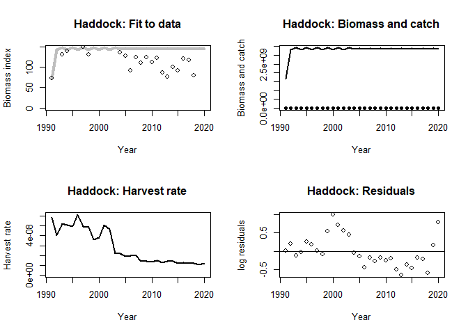
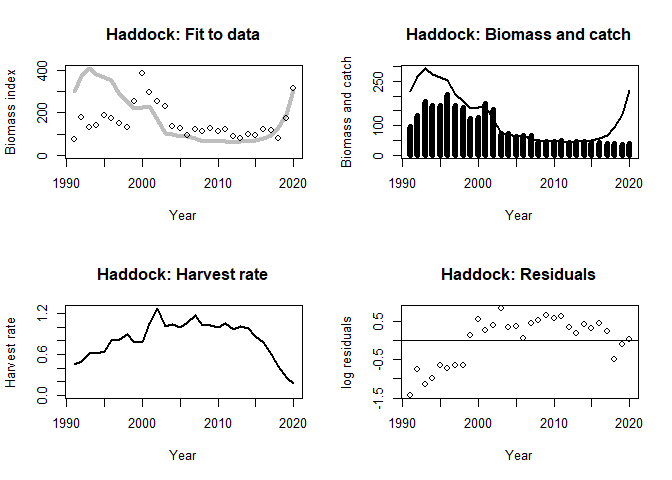
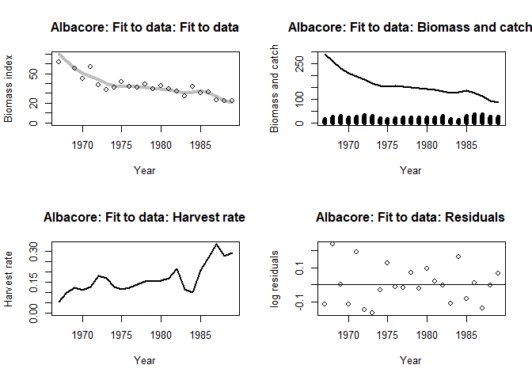
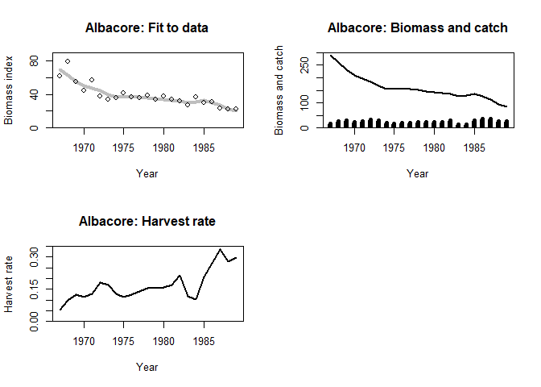
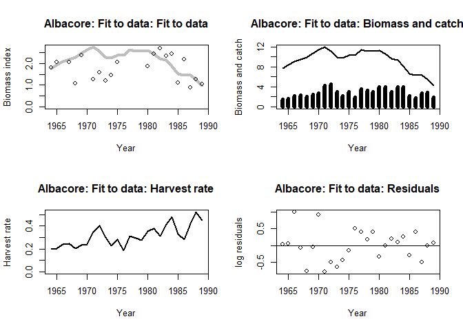
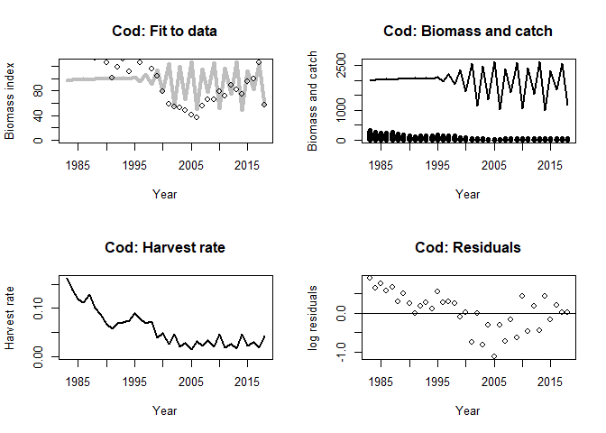
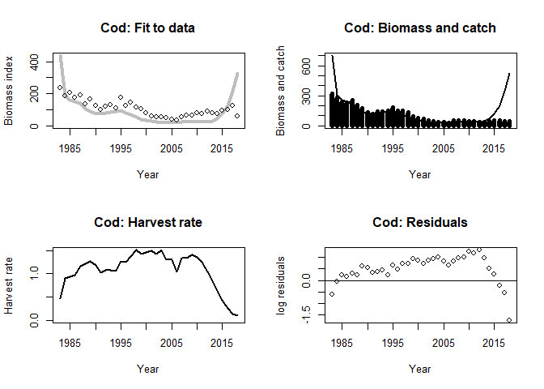
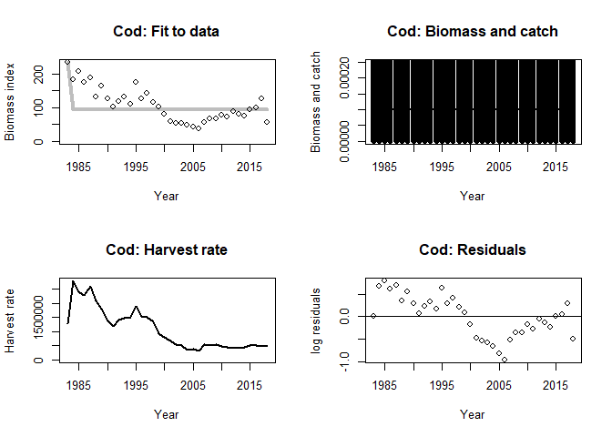
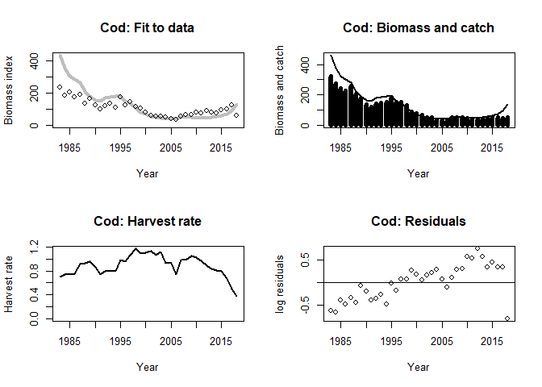
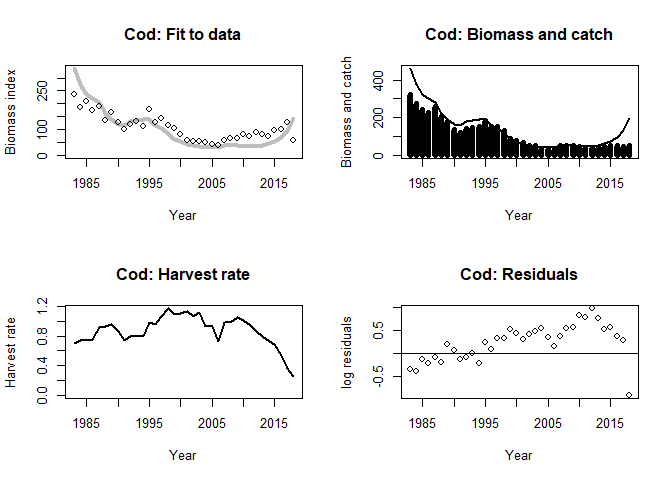

report_04_biomass_dynamics.R
================
colin
2024-03-08

``` r
Schaefer <- function(par, data, verbose = FALSE) {
  # extract parameters
  r <- exp(par[["logr"]])
  K <- exp(par[["logK"]])
  Binit <- exp(par[["logBinit"]])
  q <- exp(par[["logq"]])

  # extract data
  year <- data$Year
  C <- data$Catch
  I <- data$Index

  # useful variables
  n <- length(year)
  B <- numeric(n)

  # create population from catch data and model parameters
  B[1] <- Binit
  for (i in 1:(n - 1))
  {
    B[i + 1] <- max(B[i] + r * B[i] * (1 - B[i] / K) - C[i], 1e-4)
  }
  Ifit <- q * B

  # get residuals and sums of squares
  res <- log(I) - log(Ifit) # log(I / Ifit)
  RSS <- sum(res^2)

  if (verbose) {
    # make useful summaries
    pars <- c(r = r, K = K, Binit = Binit, q = q)
    refpts <- c(HRmsy = 0.5 * r, Bmsy = 0.5 * K, MSY = 0.25 * r * K)

    list(B = B, HR = C / B, Ifit = Ifit, res = res, pars = pars, refpts = refpts, RSS = RSS)
  } else {
    RSS
  }
}

plot_shaefer <- function(fit, data, main) {
  oldpar <- par(mfrow = c(2, 2))

  plot(data$Year, fit$Ifit,
    ylim = c(0, max(fit$Ifit)), type = "l", lwd = 4,
    col = "gray", xlab = "Year", ylab = "Biomass index",
    main = paste0(main, ": Fit to data")
  )
  points(Index ~ Year, data)

  plot(data$Year, fit$B,
    type = "l", ylim = c(0, max(fit$B)), lwd = 2,
    xlab = "Year", ylab = "Biomass and catch", main = paste0(main, ": Biomass and catch")
  )
  points(Catch ~ Year, data, type = "h", lwd = 6)

  plot(data$Year, fit$HR,
    ylim = c(0, max(fit$HR)), type = "l",
    lwd = 2, xlab = "Year", ylab = "Harvest rate", main = paste0(main, ": Harvest rate")
  )

  plot(data$Year, fit$res,
    xlab = "Year", ylab = "log residuals",
    main = paste0(main, ": Residuals")
  )
  abline(h = 0)

  par(oldpar)
}

################################################################################
## Norther Shelf Haddock


haddock <- read.csv("data/haddock_biomass.csv", header = TRUE)

init <-
  c(
    logr = log(1.000),
    logK = log(8 * mean(haddock$Catch)),
    logBinit = log(4 * mean(haddock$Catch)),
    logq = log(haddock$Index[1] / (4 * mean(haddock$Catch)))
  )

Schaefer(par = init, haddock)
```

    ## [1] 9.533432

``` r
opt <- optim(init, Schaefer, data = haddock)
opt
```

    ## $par
    ##        logr        logK    logBinit        logq 
    ##   0.6854223  21.9413123  21.2271790 -16.9647003 
    ## 
    ## $value
    ## [1] 5.011487
    ## 
    ## $counts
    ## function gradient 
    ##      367       NA 
    ## 
    ## $convergence
    ## [1] 0
    ## 
    ## $message
    ## NULL

``` r
fit <- Schaefer(opt$par, haddock, verbose = TRUE)


plot_shaefer(fit, haddock, main = "Haddock")
```

<!-- -->

``` r
fit$pars
```

    ##            r            K        Binit            q 
    ## 1.984610e+00 3.380577e+09 1.655186e+09 4.288686e-08

``` r
fit$refpts
```

    ##        HRmsy         Bmsy          MSY 
    ## 9.923048e-01 1.690289e+09 1.677282e+09

``` r
# different initial values?
init2 <-
  c(
    logr = log(1),
    logK = log(950),
    logBinit = log(500),
    logq = log(3)
  )

opt2 <- nlminb(init2, Schaefer, data = haddock, control = list(eval.max = 1e6, iter.max = 1e6))
opt2
```

    ## $par
    ##       logr       logK   logBinit       logq 
    ## 0.09742064 6.36647927 5.37319311 0.33104088 
    ## 
    ## $objective
    ## [1] 10.65572
    ## 
    ## $convergence
    ## [1] 0
    ## 
    ## $iterations
    ## [1] 9020
    ## 
    ## $evaluations
    ## function gradient 
    ##    15489    48597 
    ## 
    ## $message
    ## [1] "X-convergence (3)"

``` r
fit2 <- Schaefer(opt2$par, haddock, verbose = TRUE)
plot_shaefer(fit2, haddock, main = "Haddock")
```

<!-- -->

``` r
################################################################################
## South Atlantic albacore

albacore <- read.table("data/albacore_biomass.dat", header = TRUE)
init <- c(logr = log(0.5), logK = log(200), logBinit = log(100), logq = log(0.5))

Schaefer(par = init, albacore)
```

    ## [1] 6.618921

``` r
optim(init, Schaefer, data = albacore)
```

    ## $par
    ##      logr      logK  logBinit      logq 
    ## -1.176867  5.527608  5.668160 -1.427132 
    ## 
    ## $value
    ## [1] 0.2666322
    ## 
    ## $counts
    ## function gradient 
    ##      397       NA 
    ## 
    ## $convergence
    ## [1] 0
    ## 
    ## $message
    ## NULL

``` r
est <- optim(init, Schaefer, data = albacore)$par
fit <- Schaefer(est, albacore, verbose = TRUE)

plot_shaefer(fit, albacore, main = "Albacore: Fit to data")
```

<!-- -->

``` r
par(mfrow = c(2, 2))

plot(albacore$Year, fit$Ifit,
  ylim = c(0, 90), yaxs = "i", type = "l", lwd = 4,
  col = "gray", xlab = "Year", ylab = "Biomass index",
  main = "Albacore: Fit to data"
)
points(Index ~ Year, albacore)

plot(albacore$Year, fit$B,
  type = "l", ylim = c(0, 300), yaxs = "i", lwd = 2,
  xlab = "Year", ylab = "Biomass and catch", main = "Albacore: Biomass and catch"
)
points(Catch ~ Year, albacore, type = "h", lwd = 6)

plot(albacore$Year, fit$HR,
  ylim = c(0, 0.35), yaxs = "i", type = "l",
  lwd = 2, xlab = "Year", ylab = "Harvest rate", main = "Albacore: Harvest rate"
)

fit$pars
```

    ##           r           K       Binit           q 
    ##   0.3082429 251.5415380 289.5012810   0.2399961

``` r
fit$refpts
```

    ##       HRmsy        Bmsy         MSY 
    ##   0.1541215 125.7707690  19.3839743

``` r
################################################################################
## Georges Bank winter flounder

flounder <- read.table("data/flounder_biomass.dat", header = TRUE)

K.init <- 8 * mean(flounder$Catch)
B.init <- 0.5 * K.init
q.init <- flounder$Index[1] / B.init
init <- c(
  logr = log(0.5), logK = log(K.init),
  logBinit = log(B.init), logq = log(q.init)
)

Schaefer(par = init, flounder)
```

    ## [1] 6.848887

``` r
optim(init, Schaefer, data = flounder)
```

    ## $par
    ##       logr       logK   logBinit       logq 
    ## -0.5672213  3.1704496  1.6288811 -1.1952416 
    ## 
    ## $value
    ## [1] 5.317258
    ## 
    ## $counts
    ## function gradient 
    ##      501       NA 
    ## 
    ## $convergence
    ## [1] 1
    ## 
    ## $message
    ## NULL

``` r
opt <- optim(init, Schaefer,
  data = flounder, method = "Nelder-Mead",
  control = list(maxit = 1e5, reltol = 1e-10)
)

plot_shaefer(Schaefer(opt$par, flounder, verbose = TRUE), flounder, main = "Albacore: Fit to data")
```

<!-- --><!-- -->

``` r
nlminb(init, Schaefer, data = flounder, control = list(eval.max = 1e4, iter.max = 1e4))
```

    ## $par
    ##      logr      logK  logBinit      logq 
    ## -1.245834 20.565254  2.039987 -1.466488 
    ## 
    ## $objective
    ## [1] 5.20085
    ## 
    ## $convergence
    ## [1] 0
    ## 
    ## $iterations
    ## [1] 1184
    ## 
    ## $evaluations
    ## function gradient 
    ##     1636     6517 
    ## 
    ## $message
    ## [1] "relative convergence (4)"

``` r
est <- nlminb(init, Schaefer,
  data = flounder,
  control = list(eval.max = 1e4, iter.max = 1e4)
)$par

fit <- Schaefer(est, flounder, verbose = TRUE)

plot_shaefer(fit, flounder, main = "Albacore: Fit to data")
```

<!-- -->

``` r
t(fit$pars)
```

    ##              r         K    Binit         q
    ## [1,] 0.2877009 853839959 7.690509 0.2307343

``` r
t(fit$refpts)
```

    ##          HRmsy      Bmsy      MSY
    ## [1,] 0.1438504 426919980 61412621

``` r
################################################################################
## Cod

cod <- read.csv("data/cod_biomass.csv", header = TRUE)
init <- c(
  logr = log(1.000),
  logK = log(8 * mean(cod$Catch)),
  logBinit = log(4 * mean(cod$Catch)),
  logq = log(cod$Index[1] / (4 * mean(cod$Catch)))
)

Schaefer(par = init, cod)
```

    ## [1] 6147.405

``` r
opt <- optim(init, Schaefer, data = cod)
opt
```

    ## $par
    ##       logr       logK   logBinit       logq 
    ##  0.9669862  7.6646002  7.5943473 -3.0252612 
    ## 
    ## $value
    ## [1] 8.098919
    ## 
    ## $counts
    ## function gradient 
    ##      275       NA 
    ## 
    ## $convergence
    ## [1] 0
    ## 
    ## $message
    ## NULL

``` r
fit <- Schaefer(opt$par, cod, verbose = TRUE)
exp(opt$par)
```

    ##         logr         logK     logBinit         logq 
    ## 2.630006e+00 2.131540e+03 1.986932e+03 4.854514e-02

``` r
plot_shaefer(fit, cod, main = "Cod")
```

<!-- -->

``` r
fit$pars
```

    ##            r            K        Binit            q 
    ## 2.630006e+00 2.131540e+03 1.986932e+03 4.854514e-02

``` r
fit$refpts
```

    ##       HRmsy        Bmsy         MSY 
    ##    1.315003 1065.770202 1401.491156

``` r
# use contstraints ?
lower <- c(logr = log(.8), logK = log(500), logBinit = log(300), logq = log(.2))
upper <- c(logr = log(1.5), logK = log(1000), logBinit = log(700), logq = log(.9))

opt <- nlminb(init, Schaefer, data = cod, lower = lower, upper = upper, control = list(eval.max = 1e4, iter.max = 1e4))
opt
```

    ## $par
    ##       logr       logK   logBinit       logq 
    ##  0.3446441  6.4814126  6.5499314 -0.4690590 
    ## 
    ## $objective
    ## [1] 21.57828
    ## 
    ## $convergence
    ## [1] 1
    ## 
    ## $iterations
    ## [1] 35
    ## 
    ## $evaluations
    ## function gradient 
    ##       73      182 
    ## 
    ## $message
    ## [1] "false convergence (8)"

``` r
exp(opt$par)
```

    ##        logr        logK    logBinit        logq 
    ##   1.4114874 652.8925725 699.1962208   0.6255907

``` r
fit <- Schaefer(opt$par, cod, verbose = TRUE)

plot_shaefer(fit, cod, main = "Cod")
```

<!-- -->

``` r
fit$pars
```

    ##           r           K       Binit           q 
    ##   1.4114874 652.8925725 699.1962208   0.6255907

``` r
fit$refpts
```

    ##       HRmsy        Bmsy         MSY 
    ##   0.7057437 326.4462863 230.3874179

``` r
# initialise at nlminb solution?
opt <- optim(init, Schaefer, data = cod, method = "BFGS")
opt
```

    ## $par
    ##       logr       logK   logBinit       logq 
    ##  0.3730447 -7.8878967 -8.2984267 13.7561552 
    ## 
    ## $value
    ## [1] 7.328305
    ## 
    ## $counts
    ## function gradient 
    ##       27        9 
    ## 
    ## $convergence
    ## [1] 0
    ## 
    ## $message
    ## NULL

``` r
opt <- optim(opt$par, Schaefer, data = cod, method = "Nelder-Mead")
opt
```

    ## $par
    ##       logr       logK   logBinit       logq 
    ##  0.3730447 -7.8878967 -8.2984267 13.7561552 
    ## 
    ## $value
    ## [1] 7.328305
    ## 
    ## $counts
    ## function gradient 
    ##       61       NA 
    ## 
    ## $convergence
    ## [1] 0
    ## 
    ## $message
    ## NULL

``` r
fit <- Schaefer(opt$par, cod, verbose = TRUE)

plot_shaefer(fit, cod, main = "Cod")
```

<!-- -->

``` r
fit$pars
```

    ##            r            K        Binit            q 
    ## 1.452149e+00 3.752580e-04 2.489081e-04 9.423718e+05

``` r
fit$refpts
```

    ##        HRmsy         Bmsy          MSY 
    ## 0.7260746279 0.0001876290 0.0001362327

``` r
# initialise at solver solution ?
init <- c(logr = log(1.02798251784361), logK = log(920.324078858206), logBinit = log(460.961477373726), logq = log(0.729428157796693))

opt <- optim(init, Schaefer, data = cod)
opt
```

    ## $par
    ##        logr        logK    logBinit        logq 
    ##  0.02759484  6.82472452  6.13332207 -0.05490219 
    ## 
    ## $value
    ## [1] 5.288505
    ## 
    ## $counts
    ## function gradient 
    ##      405       NA 
    ## 
    ## $convergence
    ## [1] 0
    ## 
    ## $message
    ## NULL

``` r
fit <- Schaefer(opt$par, cod, verbose = TRUE)
exp(opt$par)
```

    ##        logr        logK    logBinit        logq 
    ##   1.0279791 920.3228363 460.9649756   0.9465777

``` r
plot_shaefer(fit, cod, main = "Cod")
```

<!-- -->

``` r
fit$pars
```

    ##           r           K       Binit           q 
    ##   1.0279791 920.3228363 460.9649756   0.9465777

``` r
fit$refpts
```

    ##       HRmsy        Bmsy         MSY 
    ##   0.5139896 460.1614182 236.5181608

``` r
# try a different optimiser - this is the best fit... but is it sensible?
set.seed(15) # this optimiser is simulation based and the fits can depend on the random seed
# if the model does not fit that well
opt <- optim(init, Schaefer, data = cod, method = "SANN")
opt
```

    ## $par
    ##        logr        logK    logBinit        logq 
    ##  0.02759816  6.82472587  6.13331448 -0.31549440 
    ## 
    ## $value
    ## [1] 7.314251
    ## 
    ## $counts
    ## function gradient 
    ##    10000       NA 
    ## 
    ## $convergence
    ## [1] 0
    ## 
    ## $message
    ## NULL

``` r
fit <- Schaefer(opt$par, cod, verbose = TRUE)
exp(opt$par)
```

    ##        logr        logK    logBinit        logq 
    ##   1.0279825 920.3240789 460.9614774   0.7294282

``` r
plot_shaefer(fit, cod, main = "Cod")
```

<!-- -->

``` r
fit$pars
```

    ##           r           K       Binit           q 
    ##   1.0279825 920.3240789 460.9614774   0.7294282

``` r
fit$refpts
```

    ##       HRmsy        Bmsy         MSY 
    ##   0.5139913 460.1620394 236.5192660
