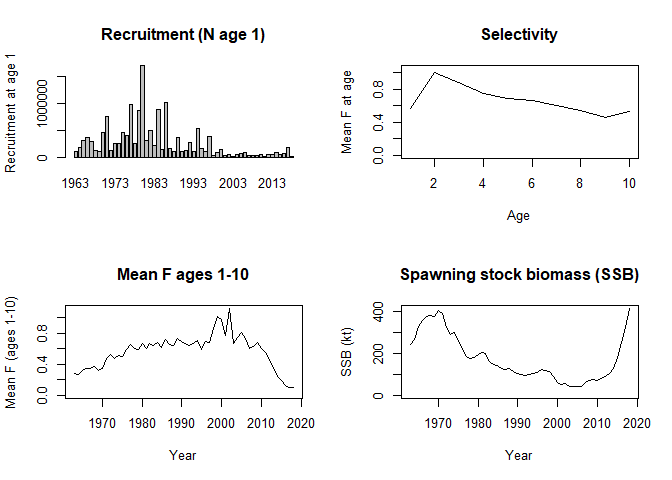
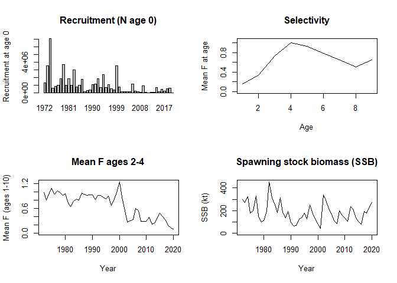

report_06_VPA.R
================
colin
2024-03-08

``` r
source("utilities_vpa.R")

## Read catch at age
catch <- read.csv("data/cod_catch.csv", header = TRUE, check.names = FALSE, row.names = 1)
Year <- as.numeric(row.names(catch))

## Run model
model <- vpa(catch, Mvec = c(rep(0.1, 2), rep(0.3, 8)), Fterm = 0.1, Fages = 3)

## View results
par(mfrow = c(2, 2))

## Fishing mortality
round(model$F, 3)
```

    ##          1     2     3     4     5     6     7     8     9   10+
    ## 1963 0.195 0.652 0.249 0.275 0.290 0.380 0.041 0.432 0.112 0.195
    ## 1964 0.074 0.433 0.451 0.266 0.263 0.350 0.369 0.086 0.149 0.201
    ## 1965 0.459 0.476 0.526 0.429 0.258 0.225 0.230 0.356 0.054 0.213
    ## 1966 0.436 0.649 0.479 0.395 0.310 0.239 0.187 0.218 0.279 0.228
    ## 1967 0.239 0.607 0.567 0.374 0.424 0.338 0.293 0.232 0.130 0.218
    ## 1968 0.342 0.736 0.609 0.492 0.401 0.368 0.273 0.174 0.162 0.203
    ## 1969 0.055 0.512 0.500 0.450 0.380 0.382 0.288 0.230 0.131 0.216
    ## 1970 0.281 0.668 0.619 0.460 0.435 0.275 0.233 0.174 0.167 0.192
    ## 1971 0.549 1.027 0.636 0.543 0.545 0.378 0.244 0.185 0.329 0.253
    ## 1972 0.382 1.066 0.796 0.502 0.500 0.581 0.488 0.296 0.266 0.350
    ## 1973 0.606 0.915 0.732 0.652 0.418 0.440 0.434 0.284 0.062 0.260
    ## 1974 0.779 0.951 0.555 0.541 0.523 0.364 0.349 0.320 0.358 0.342
    ## 1975 0.483 0.890 0.675 0.523 0.621 0.536 0.324 0.290 0.350 0.321
    ## 1976 0.927 1.341 0.731 0.622 0.425 0.639 0.559 0.163 0.170 0.297
    ## 1977 0.884 1.266 0.672 0.444 0.506 0.422 0.598 0.522 0.658 0.592
    ## 1978 0.271 1.293 0.777 0.631 0.673 0.561 0.426 0.495 0.478 0.466
    ## 1979 1.357 0.838 0.835 0.462 0.556 0.367 0.453 0.280 0.411 0.381
    ## 1980 1.485 0.999 0.869 0.668 0.490 0.474 0.540 0.486 0.260 0.429
    ## 1981 0.878 1.111 0.903 0.652 0.557 0.415 0.489 0.302 0.321 0.370
    ## 1982 0.745 1.039 1.117 0.781 0.649 0.702 0.476 0.404 0.322 0.401
    ## 1983 0.478 1.164 1.064 0.788 0.639 0.590 0.502 0.426 0.295 0.408
    ## 1984 1.240 1.081 0.914 0.704 0.632 0.574 0.475 0.452 0.269 0.399
    ## 1985 0.735 1.185 0.858 0.703 0.589 0.577 0.484 0.394 0.284 0.387
    ## 1986 1.168 1.002 0.961 0.818 0.749 0.647 0.624 0.486 0.303 0.471
    ## 1987 0.347 1.206 0.777 0.805 0.599 0.778 0.650 0.605 0.319 0.524
    ## 1988 0.389 1.105 1.084 0.705 0.670 0.640 0.570 0.428 0.398 0.466
    ## 1989 0.838 1.023 1.006 0.889 0.582 0.735 0.620 0.677 0.350 0.549
    ## 1990 0.591 1.357 0.860 0.783 0.660 0.399 0.575 0.290 0.831 0.565
    ## 1991 0.620 0.961 0.885 0.707 0.716 0.768 0.651 0.632 0.257 0.513
    ## 1992 0.662 1.040 0.762 0.812 0.583 0.686 0.663 0.335 0.414 0.470
    ## 1993 0.410 1.086 0.921 0.833 0.758 0.575 0.803 0.538 0.197 0.513
    ## 1994 1.091 0.952 0.941 0.816 0.658 0.708 0.422 0.642 0.343 0.469
    ## 1995 0.448 1.171 0.903 0.741 0.583 0.533 0.513 0.233 0.354 0.367
    ## 1996 0.209 0.955 0.942 0.662 0.735 0.758 0.766 0.759 0.450 0.659
    ## 1997 0.352 0.847 0.931 0.840 0.684 0.800 0.886 0.615 0.284 0.595
    ## 1998 0.457 1.308 1.205 1.095 1.078 0.792 0.818 0.739 0.495 0.684
    ## 1999 0.577 0.873 1.461 1.149 1.034 1.127 1.231 1.059 0.702 0.997
    ## 2000 0.398 1.065 1.229 1.315 1.315 1.040 0.965 0.875 0.722 0.854
    ## 2001 0.197 1.019 0.831 0.858 0.899 0.728 0.777 0.577 0.993 0.782
    ## 2002 0.666 1.118 1.166 1.281 1.050 1.265 0.913 1.328 1.213 1.151
    ## 2003 0.223 0.715 0.717 0.794 0.687 0.565 0.789 0.735 0.678 0.734
    ## 2004 0.499 0.825 1.008 0.775 0.681 0.734 0.574 0.703 0.882 0.719
    ## 2005 0.183 0.777 0.935 0.883 0.740 0.674 0.675 0.634 1.591 0.966
    ## 2006 0.381 1.548 0.810 0.581 0.773 0.706 0.593 0.856 0.458 0.636
    ## 2007 0.472 0.765 0.821 0.776 0.636 0.662 0.351 0.462 0.648 0.487
    ## 2008 0.315 0.684 0.821 0.651 0.817 0.905 0.800 0.460 0.290 0.517
    ## 2009 0.263 0.711 0.739 0.732 0.877 0.920 0.635 0.596 0.725 0.652
    ## 2010 0.247 0.627 0.757 0.585 0.805 0.876 0.737 0.449 0.427 0.538
    ## 2011 0.189 0.430 0.466 0.494 0.513 0.832 0.626 1.005 0.273 0.635
    ## 2012 0.267 0.412 0.446 0.408 0.462 0.455 0.766 0.446 0.407 0.540
    ## 2013 0.110 0.288 0.399 0.406 0.372 0.335 0.375 0.553 0.291 0.406
    ## 2014 0.115 0.224 0.316 0.355 0.363 0.244 0.162 0.265 0.171 0.200
    ## 2015 0.080 0.231 0.219 0.201 0.302 0.335 0.193 0.106 0.102 0.134
    ## 2016 0.047 0.149 0.201 0.179 0.161 0.181 0.169 0.083 0.052 0.101
    ## 2017 0.056 0.087 0.135 0.147 0.147 0.093 0.096 0.110 0.066 0.091
    ## 2018 0.100 0.100 0.100 0.100 0.100 0.100 0.100 0.100 0.100 0.100

``` r
## Recruitment
barplot(model$N[, 1], ylab = "Recruitment at age 1", main = "Recruitment (N age 1)")

## Selectivity
round(model$F, 3)
```

    ##          1     2     3     4     5     6     7     8     9   10+
    ## 1963 0.195 0.652 0.249 0.275 0.290 0.380 0.041 0.432 0.112 0.195
    ## 1964 0.074 0.433 0.451 0.266 0.263 0.350 0.369 0.086 0.149 0.201
    ## 1965 0.459 0.476 0.526 0.429 0.258 0.225 0.230 0.356 0.054 0.213
    ## 1966 0.436 0.649 0.479 0.395 0.310 0.239 0.187 0.218 0.279 0.228
    ## 1967 0.239 0.607 0.567 0.374 0.424 0.338 0.293 0.232 0.130 0.218
    ## 1968 0.342 0.736 0.609 0.492 0.401 0.368 0.273 0.174 0.162 0.203
    ## 1969 0.055 0.512 0.500 0.450 0.380 0.382 0.288 0.230 0.131 0.216
    ## 1970 0.281 0.668 0.619 0.460 0.435 0.275 0.233 0.174 0.167 0.192
    ## 1971 0.549 1.027 0.636 0.543 0.545 0.378 0.244 0.185 0.329 0.253
    ## 1972 0.382 1.066 0.796 0.502 0.500 0.581 0.488 0.296 0.266 0.350
    ## 1973 0.606 0.915 0.732 0.652 0.418 0.440 0.434 0.284 0.062 0.260
    ## 1974 0.779 0.951 0.555 0.541 0.523 0.364 0.349 0.320 0.358 0.342
    ## 1975 0.483 0.890 0.675 0.523 0.621 0.536 0.324 0.290 0.350 0.321
    ## 1976 0.927 1.341 0.731 0.622 0.425 0.639 0.559 0.163 0.170 0.297
    ## 1977 0.884 1.266 0.672 0.444 0.506 0.422 0.598 0.522 0.658 0.592
    ## 1978 0.271 1.293 0.777 0.631 0.673 0.561 0.426 0.495 0.478 0.466
    ## 1979 1.357 0.838 0.835 0.462 0.556 0.367 0.453 0.280 0.411 0.381
    ## 1980 1.485 0.999 0.869 0.668 0.490 0.474 0.540 0.486 0.260 0.429
    ## 1981 0.878 1.111 0.903 0.652 0.557 0.415 0.489 0.302 0.321 0.370
    ## 1982 0.745 1.039 1.117 0.781 0.649 0.702 0.476 0.404 0.322 0.401
    ## 1983 0.478 1.164 1.064 0.788 0.639 0.590 0.502 0.426 0.295 0.408
    ## 1984 1.240 1.081 0.914 0.704 0.632 0.574 0.475 0.452 0.269 0.399
    ## 1985 0.735 1.185 0.858 0.703 0.589 0.577 0.484 0.394 0.284 0.387
    ## 1986 1.168 1.002 0.961 0.818 0.749 0.647 0.624 0.486 0.303 0.471
    ## 1987 0.347 1.206 0.777 0.805 0.599 0.778 0.650 0.605 0.319 0.524
    ## 1988 0.389 1.105 1.084 0.705 0.670 0.640 0.570 0.428 0.398 0.466
    ## 1989 0.838 1.023 1.006 0.889 0.582 0.735 0.620 0.677 0.350 0.549
    ## 1990 0.591 1.357 0.860 0.783 0.660 0.399 0.575 0.290 0.831 0.565
    ## 1991 0.620 0.961 0.885 0.707 0.716 0.768 0.651 0.632 0.257 0.513
    ## 1992 0.662 1.040 0.762 0.812 0.583 0.686 0.663 0.335 0.414 0.470
    ## 1993 0.410 1.086 0.921 0.833 0.758 0.575 0.803 0.538 0.197 0.513
    ## 1994 1.091 0.952 0.941 0.816 0.658 0.708 0.422 0.642 0.343 0.469
    ## 1995 0.448 1.171 0.903 0.741 0.583 0.533 0.513 0.233 0.354 0.367
    ## 1996 0.209 0.955 0.942 0.662 0.735 0.758 0.766 0.759 0.450 0.659
    ## 1997 0.352 0.847 0.931 0.840 0.684 0.800 0.886 0.615 0.284 0.595
    ## 1998 0.457 1.308 1.205 1.095 1.078 0.792 0.818 0.739 0.495 0.684
    ## 1999 0.577 0.873 1.461 1.149 1.034 1.127 1.231 1.059 0.702 0.997
    ## 2000 0.398 1.065 1.229 1.315 1.315 1.040 0.965 0.875 0.722 0.854
    ## 2001 0.197 1.019 0.831 0.858 0.899 0.728 0.777 0.577 0.993 0.782
    ## 2002 0.666 1.118 1.166 1.281 1.050 1.265 0.913 1.328 1.213 1.151
    ## 2003 0.223 0.715 0.717 0.794 0.687 0.565 0.789 0.735 0.678 0.734
    ## 2004 0.499 0.825 1.008 0.775 0.681 0.734 0.574 0.703 0.882 0.719
    ## 2005 0.183 0.777 0.935 0.883 0.740 0.674 0.675 0.634 1.591 0.966
    ## 2006 0.381 1.548 0.810 0.581 0.773 0.706 0.593 0.856 0.458 0.636
    ## 2007 0.472 0.765 0.821 0.776 0.636 0.662 0.351 0.462 0.648 0.487
    ## 2008 0.315 0.684 0.821 0.651 0.817 0.905 0.800 0.460 0.290 0.517
    ## 2009 0.263 0.711 0.739 0.732 0.877 0.920 0.635 0.596 0.725 0.652
    ## 2010 0.247 0.627 0.757 0.585 0.805 0.876 0.737 0.449 0.427 0.538
    ## 2011 0.189 0.430 0.466 0.494 0.513 0.832 0.626 1.005 0.273 0.635
    ## 2012 0.267 0.412 0.446 0.408 0.462 0.455 0.766 0.446 0.407 0.540
    ## 2013 0.110 0.288 0.399 0.406 0.372 0.335 0.375 0.553 0.291 0.406
    ## 2014 0.115 0.224 0.316 0.355 0.363 0.244 0.162 0.265 0.171 0.200
    ## 2015 0.080 0.231 0.219 0.201 0.302 0.335 0.193 0.106 0.102 0.134
    ## 2016 0.047 0.149 0.201 0.179 0.161 0.181 0.169 0.083 0.052 0.101
    ## 2017 0.056 0.087 0.135 0.147 0.147 0.093 0.096 0.110 0.066 0.091
    ## 2018 0.100 0.100 0.100 0.100 0.100 0.100 0.100 0.100 0.100 0.100

``` r
plot(colMeans(model$F) / max(colMeans(model$F)),
  ylim = c(0, 1.05),
  type = "l", main = "Selectivity", xlab = "Age", ylab = "Mean F at age"
)

## Fbar
Fbar <- rowMeans(model$F)
plot(Year, Fbar,
  ylim = c(0, max(Fbar)), main = "Mean F ages 1-10",
  ylab = "Mean F (ages 1-10)", type = "l"
)

## SSB

## Read weigths and maturity at age
wt <- read.csv("data/cod_weights.csv", header = TRUE, check.names = FALSE, row.names = 1)
mat <- read.csv("data/cod_maturity.csv", header = TRUE, check.names = FALSE, row.names = 1)

ssb <- rowSums(model$N * wt * mat) / 1000
plot(Year, ssb,
  ylim = c(0, max(ssb)), main = "Spawning stock biomass (SSB)",
  ylab = "SSB (kt)", type = "l"
)
```

<!-- -->

``` r
# Now for some haddock
## Read catch at age
catch <- read.csv("data/haddock_catch.csv", header = TRUE, check.names = FALSE, row.names = 1)
Year <- as.numeric(row.names(catch))

## Run model
model <- vpa(catch, Mvec = 0.2, Fterm = 0.1, Fages = 3)

## View results
par(mfrow = c(2, 2))

## Fishing mortality
round(model$F, 3)
```

    ##          0     1     2     3     4     5     6     7    8+
    ## 1972 0.238 0.373 0.894 1.268 0.779 0.862 0.740 0.185 0.596
    ## 1973 0.025 0.758 0.627 1.150 0.625 0.428 0.851 0.621 0.633
    ## 1974 0.110 0.693 0.992 0.972 0.950 0.388 0.230 0.702 0.440
    ## 1975 0.100 0.664 1.025 1.167 1.072 0.835 0.384 0.135 0.451
    ## 1976 0.237 0.651 0.843 1.310 0.696 1.149 0.752 0.129 0.676
    ## 1977 0.137 0.700 1.017 0.944 1.109 0.757 0.786 0.470 0.671
    ## 1978 0.182 0.408 0.953 0.950 1.054 1.021 0.578 0.695 0.765
    ## 1979 0.288 0.256 0.932 1.128 0.685 0.918 0.831 0.258 0.669
    ## 1980 0.526 0.238 0.714 1.154 1.016 0.367 0.772 0.556 0.565
    ## 1981 0.494 0.304 0.388 0.952 0.829 0.547 0.142 0.550 0.413
    ## 1982 0.360 0.306 0.410 0.745 0.769 0.503 0.397 0.231 0.377
    ## 1983 0.211 0.335 0.591 0.850 0.863 0.843 0.582 0.282 0.569
    ## 1984 0.152 0.316 0.614 1.010 0.860 0.826 0.698 0.502 0.675
    ## 1985 0.147 0.413 0.536 0.909 0.956 0.515 0.722 0.480 0.572
    ## 1986 0.029 0.233 0.815 1.030 1.086 0.691 0.218 0.373 0.427
    ## 1987 0.062 0.221 0.935 0.921 0.971 0.704 0.613 0.235 0.517
    ## 1988 0.064 0.292 0.705 1.222 0.826 0.916 0.523 0.256 0.565
    ## 1989 0.051 0.289 0.777 1.015 1.008 0.482 0.706 0.379 0.522
    ## 1990 0.020 0.313 0.980 0.898 0.928 0.584 0.223 0.357 0.388
    ## 1991 0.131 0.274 0.802 1.022 0.633 0.777 0.368 0.209 0.451
    ## 1992 0.177 0.249 0.738 1.023 0.986 0.417 0.733 0.273 0.474
    ## 1993 0.242 0.298 0.820 1.037 0.902 0.842 0.335 0.553 0.577
    ## 1994 0.042 0.254 0.646 0.954 0.998 0.717 0.671 0.309 0.565
    ## 1995 0.386 0.220 0.614 0.911 0.961 0.802 0.415 0.375 0.531
    ## 1996 0.183 0.144 0.601 1.028 1.071 1.051 1.078 1.413 1.181
    ## 1997 0.081 0.273 0.573 0.695 0.765 1.041 0.827 0.791 0.886
    ## 1998 0.062 0.283 0.751 0.764 0.983 0.807 0.824 0.661 0.764
    ## 1999 0.029 0.283 0.773 1.114 1.067 1.270 0.856 1.195 1.107
    ## 2000 0.018 0.169 1.011 1.319 1.395 0.898 1.162 0.632 0.898
    ## 2001 0.023 0.185 0.443 1.104 1.078 0.978 0.720 0.571 0.756
    ## 2002 0.314 0.348 0.300 0.511 0.813 0.796 0.884 0.594 0.758
    ## 2003 0.048 0.124 0.242 0.235 0.327 0.553 0.539 0.453 0.515
    ## 2004 0.027 0.249 0.359 0.218 0.297 0.451 0.546 0.322 0.440
    ## 2005 0.008 0.174 0.401 0.390 0.200 0.360 0.576 0.394 0.443
    ## 2006 0.014 0.149 0.521 0.704 0.572 0.359 0.376 0.714 0.483
    ## 2007 0.013 0.117 0.321 0.602 0.683 0.510 0.216 0.266 0.331
    ## 2008 0.033 0.124 0.267 0.227 0.337 0.356 0.298 0.077 0.244
    ## 2009 0.012 0.126 0.179 0.280 0.392 0.212 0.243 0.173 0.209
    ## 2010 0.029 0.167 0.297 0.327 0.241 0.335 0.142 0.181 0.219
    ## 2011 0.084 0.079 0.147 0.538 0.469 0.414 0.350 0.160 0.308
    ## 2012 0.012 0.129 0.090 0.214 0.321 0.210 0.141 0.192 0.181
    ## 2013 0.019 0.140 0.245 0.112 0.361 0.216 0.128 0.070 0.138
    ## 2014 0.006 0.146 0.362 0.465 0.266 0.447 0.155 0.112 0.238
    ## 2015 0.020 0.054 0.518 0.641 0.300 0.283 0.394 0.218 0.299
    ## 2016 0.004 0.069 0.166 0.618 0.423 0.174 0.040 0.316 0.177
    ## 2017 0.010 0.036 0.218 0.218 0.482 0.194 0.052 0.037 0.095
    ## 2018 0.007 0.026 0.088 0.247 0.209 0.256 0.095 0.100 0.150
    ## 2019 0.006 0.046 0.073 0.129 0.158 0.190 0.173 0.089 0.151
    ## 2020 0.100 0.100 0.100 0.100 0.100 0.100 0.100 0.100 0.100

``` r
## Recruitment
barplot(model$N[, 1], ylab = "Recruitment at age 0", main = "Recruitment (N age 0)")

## Selectivity
round(model$F, 3)
```

    ##          0     1     2     3     4     5     6     7    8+
    ## 1972 0.238 0.373 0.894 1.268 0.779 0.862 0.740 0.185 0.596
    ## 1973 0.025 0.758 0.627 1.150 0.625 0.428 0.851 0.621 0.633
    ## 1974 0.110 0.693 0.992 0.972 0.950 0.388 0.230 0.702 0.440
    ## 1975 0.100 0.664 1.025 1.167 1.072 0.835 0.384 0.135 0.451
    ## 1976 0.237 0.651 0.843 1.310 0.696 1.149 0.752 0.129 0.676
    ## 1977 0.137 0.700 1.017 0.944 1.109 0.757 0.786 0.470 0.671
    ## 1978 0.182 0.408 0.953 0.950 1.054 1.021 0.578 0.695 0.765
    ## 1979 0.288 0.256 0.932 1.128 0.685 0.918 0.831 0.258 0.669
    ## 1980 0.526 0.238 0.714 1.154 1.016 0.367 0.772 0.556 0.565
    ## 1981 0.494 0.304 0.388 0.952 0.829 0.547 0.142 0.550 0.413
    ## 1982 0.360 0.306 0.410 0.745 0.769 0.503 0.397 0.231 0.377
    ## 1983 0.211 0.335 0.591 0.850 0.863 0.843 0.582 0.282 0.569
    ## 1984 0.152 0.316 0.614 1.010 0.860 0.826 0.698 0.502 0.675
    ## 1985 0.147 0.413 0.536 0.909 0.956 0.515 0.722 0.480 0.572
    ## 1986 0.029 0.233 0.815 1.030 1.086 0.691 0.218 0.373 0.427
    ## 1987 0.062 0.221 0.935 0.921 0.971 0.704 0.613 0.235 0.517
    ## 1988 0.064 0.292 0.705 1.222 0.826 0.916 0.523 0.256 0.565
    ## 1989 0.051 0.289 0.777 1.015 1.008 0.482 0.706 0.379 0.522
    ## 1990 0.020 0.313 0.980 0.898 0.928 0.584 0.223 0.357 0.388
    ## 1991 0.131 0.274 0.802 1.022 0.633 0.777 0.368 0.209 0.451
    ## 1992 0.177 0.249 0.738 1.023 0.986 0.417 0.733 0.273 0.474
    ## 1993 0.242 0.298 0.820 1.037 0.902 0.842 0.335 0.553 0.577
    ## 1994 0.042 0.254 0.646 0.954 0.998 0.717 0.671 0.309 0.565
    ## 1995 0.386 0.220 0.614 0.911 0.961 0.802 0.415 0.375 0.531
    ## 1996 0.183 0.144 0.601 1.028 1.071 1.051 1.078 1.413 1.181
    ## 1997 0.081 0.273 0.573 0.695 0.765 1.041 0.827 0.791 0.886
    ## 1998 0.062 0.283 0.751 0.764 0.983 0.807 0.824 0.661 0.764
    ## 1999 0.029 0.283 0.773 1.114 1.067 1.270 0.856 1.195 1.107
    ## 2000 0.018 0.169 1.011 1.319 1.395 0.898 1.162 0.632 0.898
    ## 2001 0.023 0.185 0.443 1.104 1.078 0.978 0.720 0.571 0.756
    ## 2002 0.314 0.348 0.300 0.511 0.813 0.796 0.884 0.594 0.758
    ## 2003 0.048 0.124 0.242 0.235 0.327 0.553 0.539 0.453 0.515
    ## 2004 0.027 0.249 0.359 0.218 0.297 0.451 0.546 0.322 0.440
    ## 2005 0.008 0.174 0.401 0.390 0.200 0.360 0.576 0.394 0.443
    ## 2006 0.014 0.149 0.521 0.704 0.572 0.359 0.376 0.714 0.483
    ## 2007 0.013 0.117 0.321 0.602 0.683 0.510 0.216 0.266 0.331
    ## 2008 0.033 0.124 0.267 0.227 0.337 0.356 0.298 0.077 0.244
    ## 2009 0.012 0.126 0.179 0.280 0.392 0.212 0.243 0.173 0.209
    ## 2010 0.029 0.167 0.297 0.327 0.241 0.335 0.142 0.181 0.219
    ## 2011 0.084 0.079 0.147 0.538 0.469 0.414 0.350 0.160 0.308
    ## 2012 0.012 0.129 0.090 0.214 0.321 0.210 0.141 0.192 0.181
    ## 2013 0.019 0.140 0.245 0.112 0.361 0.216 0.128 0.070 0.138
    ## 2014 0.006 0.146 0.362 0.465 0.266 0.447 0.155 0.112 0.238
    ## 2015 0.020 0.054 0.518 0.641 0.300 0.283 0.394 0.218 0.299
    ## 2016 0.004 0.069 0.166 0.618 0.423 0.174 0.040 0.316 0.177
    ## 2017 0.010 0.036 0.218 0.218 0.482 0.194 0.052 0.037 0.095
    ## 2018 0.007 0.026 0.088 0.247 0.209 0.256 0.095 0.100 0.150
    ## 2019 0.006 0.046 0.073 0.129 0.158 0.190 0.173 0.089 0.151
    ## 2020 0.100 0.100 0.100 0.100 0.100 0.100 0.100 0.100 0.100

``` r
plot(colMeans(model$F) / max(colMeans(model$F)),
  ylim = c(0, 1.05),
  type = "l", main = "Selectivity", xlab = "Age", ylab = "Mean F at age"
)

## Fbar
Fbar <- rowMeans(model$F[, paste(2:4)])
plot(Year, Fbar,
  ylim = c(0, max(Fbar)), main = "Mean F ages 2-4",
  ylab = "Mean F (ages 1-10)", type = "l"
)

## SSB

## Read weigths and maturity at age
wt <- read.csv("data/haddock_weights.csv", header = TRUE, check.names = FALSE, row.names = 1)
mat <- read.csv("data/haddock_maturity.csv", header = TRUE, check.names = FALSE, row.names = 1)

ssb <- rowSums(model$N * wt * mat) / 1000
plot(Year, ssb,
  ylim = c(0, max(ssb)), main = "Spawning stock biomass (SSB)",
  ylab = "SSB (kt)", type = "l"
)
```

<!-- -->
