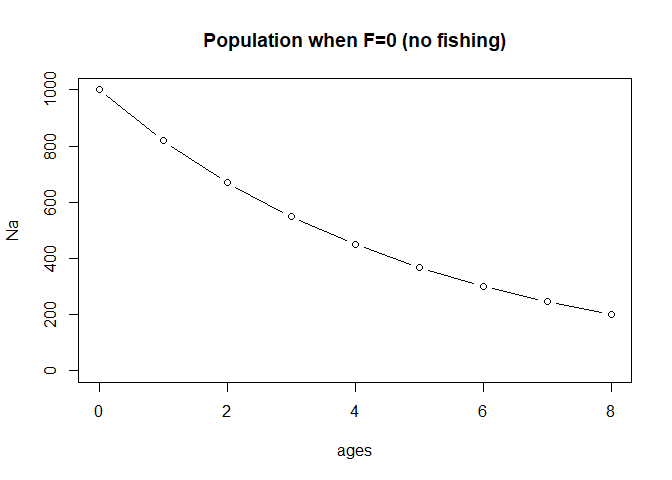
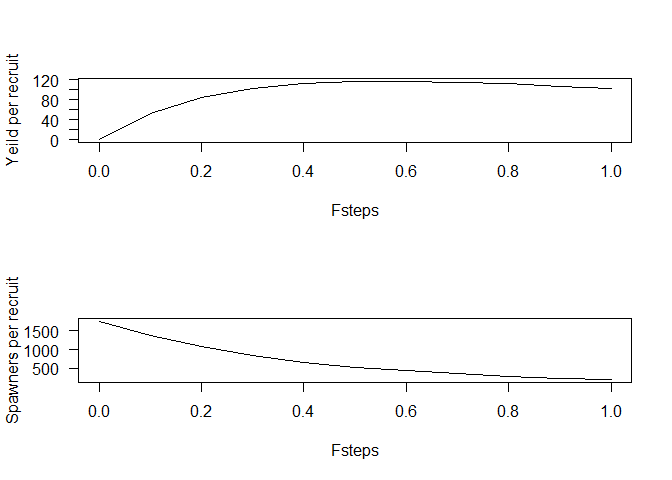
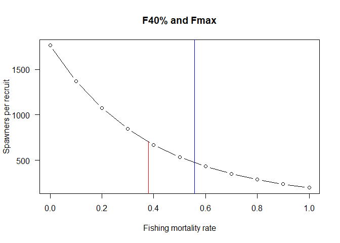

report_07_YPR_SPR.R
================
colin
2024-03-08

``` r
# Calculating Yeild per recruit reference points in R

# Colin Millar

# This script shows the steps followed to Calculate
# yeild per recruit reference points from the a VPA fit to
# the data in 'bluefin_catage.dat'

# ==============================================================================
#
# Use results from VPA assignment to estimate Fmax and F40% for
# northern shelf haddock.
#
#   M=0.2
#   Assume 2017 selectivity pattern from VPA (less influenced by 2020 F assumption).
#   Knife edge  maturity at age 2 (0% mature at ages 0-1, 100% mature at ages 2+)
#   Growth k=0.2 Linf = 70, t0 = 0
#   Weight = 0.0059 x Length^3.13
#
# ==============================================================================
```

``` r
# first lets rerun the assessment from yesterday:
```

``` r
# get vpa function
source("utilities_vpa.R")

# Read catch at age, change units
catage <- read.csv("data/haddock_catch.csv", header = TRUE, check.names = FALSE, row.names = 1)

# Run model
vpafit <- vpa(catage, 0.2, 0.1, 3)


# but actually, we will use the results from the calibrated VPA which you haven
# in your spreadsheets
Fa <- c(0.025, 0.076, 0.327, 0.238, 0.465, 0.255, 0.058, 0.040, 0.118)
ages <- 0:8
```

``` r
# (1) Calculate partial recruitment for ages 1 to 20: Pa=Fa/Ffull, assuming P16+=P15
```

``` r
# Calculate the F pattern
Pa <- Fa / max(Fa)
```

``` r
# (2) Calculate mean lengh at age: La= L∞[1-e-k(a-to)]
#   Growth k=0.2 Linf = 70, t0 = 0
```

``` r
# set up growth parameters
Linf <- 70
k <- 0.2
t0 <- 0

# calculate mean length at age
La <- Linf * (1 - exp(-k * (ages - t0)))
```

``` r
# (3) Calculate mean weight at age: wa = alpha * L^beta
#   Weight = 0.0059 x Length^3.13
```

``` r
wa <- 0.0059 * La^3.13
```

``` r
# (4) Assume an arbitrary number of recruits (N1=R=1000)
```

``` r
R <- 1000
```

``` r
# (5) Assume F=0 (for now)
```

``` r
F <- 0
```

``` r
# (6) Calculate abundance at age: Na+1=Na exp(-(Pa*F + M))
#     M = 0.2
```

``` r
# set up N vector
Na <- numeric(length(Fa))

# define M
M <- 0.2

# assign age 1 and propagate down the ages
Na[1] <- R
for (i in seq_along(Na)[-1]) {
  Na[i] <- Na[i - 1] * exp(-(Pa[i - 1] * F + M))
}

# have a quick peek
plot(ages, Na,
  type = "b", ylim = c(0, 1000),
  main = "Population when F=0 (no fishing)"
)
```

<!-- -->

``` r
# (7) Calculate catch at age:
```

``` r
Ca <- Na *
  Pa * F / (Pa * F + M) *
  (1 - exp(-M - Pa * F))
```

``` r
# (8) Calculate yield
```

``` r
Y <- sum(Ca * wa)
```

``` r
# (9) Calculate yield per recruit:
```

``` r
YPR <- Y / R
```

``` r
# (10) Calculate spawning biomass
#    Maturity at age 9
#    (0% mature at ages 1-8,
#     100% mature at ages 9+; ICCAT 2014)
```

``` r
# set up maturity
ma <- c(0, 0, 0, rep(1, length(Fa) - 3))

# calculate ssb
SSB <- sum(Na * ma * wa)
```

``` r
# (11) Calculate spawning biomass per recruit
```

``` r
SPR <- SSB / R
```

``` r
# (12) Save YPR and SPR results for the assumed F.
```

``` r
# okay, so now we need to put this together into a recipe (function)
# In the simplest case we will need:
#   F
#
#   and we will 'hard code' the other options

ypr <- function(F, full = FALSE) {
  # first lets set up all the things we need
  #-----------------------------------------------------
  a <- 0:8
  Na <- numeric(9)

  # define M
  M <- 0.2

  # set up growth parameters
  Linf <- 70
  k <- 0.2
  t0 <- 0

  # weight params
  alpha <- 0.0059
  beta <- 3.13

  # set up maturity
  ma <- c(0, 0, 0, rep(1, 6))

  # now the modelling:
  #-----------------------------------------------------

  # (1) Calculate partial recruitment for ages 1 to 20: Pa=Fa/Ffull, assuming P16+=P15
  Pa <- Fa / max(Fa)

  # (2) Calculate mean lengh at age: La= L∞[1-e-k(a-to)]
  La <- Linf * (1 - exp(-k * (ages - t0)))

  # (3) Calculate mean weight at age: wa = alpha * L^beta
  wa <- alpha * La^beta

  # (4) Assume an arbitrary number of recruits (N1=R=1000)
  R <- 1000

  # (6) Calculate abundance at age: Na+1=Na exp(-(Pa*F + M))
  Na[1] <- R
  for (i in seq_along(Na)[-1]) {
    Na[i] <- Na[i - 1] * exp(-(Pa[i - 1] * F + M))
  }

  # (7) Calculate catch at age:
  Ca <- Na *
    Pa * F / (Pa * F + M) *
    (1 - exp(-M - Pa * F))

  # (8) Calculate yield
  Y <- sum(Ca * wa)

  # (9) Calculate yield per recruit:
  YPR <- Y / R

  # (10) Calculate spawning biomass
  SSB <- sum(Na * ma * wa)

  # (11) Calculate spawning biomass per recruit
  SPR <- SSB / R

  # format the results and return
  out <- c(YPR, SPR)
  names(out) <- c("YPR", "SPR")

  if (full) {
    list(Na = Na, Ca = Ca, YPR = YPR, SPR = SPR)
  } else {
    out
  }
}


# test the function
ypr(F = 0, TRUE)
```

    ## $Na
    ## [1] 1000.0000  818.7308  670.3200  548.8116  449.3290  367.8794  301.1942  246.5970  201.8965
    ## 
    ## $Ca
    ## [1] 0 0 0 0 0 0 0 0 0
    ## 
    ## $YPR
    ## [1] 0
    ## 
    ## $SPR
    ## [1] 1764.324

``` r
# should be the same results as:
c(YPR, SPR)
```

    ## [1]    0.000 1764.324

``` r
# (13) Increase F by 0.1
```

``` r
ypr(0.1)
```

    ##        YPR        SPR 
    ##   51.85808 1371.21917

``` r
# (14) Repeat steps 6-12 up to F=1.
```

``` r
# set up all the Fs we want to try
?seq
Fsteps <- seq(0, 1, by = 0.1)

# calculate YPR and SPR for each F
results <- sapply(Fsteps, ypr)
results <- data.frame(Fsteps, t(results))
```

``` r
# (15) Plot YPR and SPR as a function of F
```

``` r
# two plots on one page
par(mfrow = c(2, 1))

# ypr plot
plot(Fsteps, results$YPR,
  type = "l",
  ylab = "Yeild per recruit", las = 1
)

# spr plot
plot(Fsteps, results$SPR,
  type = "l",
  ylab = "Spawners per recruit", las = 1
)
```

<!-- -->

``` r
# (16) Find Fmax
```

``` r
# create a quick function, suitable for an optimiser
ypr_optim <- function(F) {
  ypr(F)["YPR"]
}

# test it works!
ypr_optim(1)
```

    ##      YPR 
    ## 102.7112

``` r
# now find the F that maximises YPR
opt <- optimize(ypr_optim, interval = c(0, 1), maximum = TRUE)
Fmax <- opt$maximum
```

``` r
# Extra Credit: What is F40%?
```

``` r
# use linear interpolation to get the value of F when SPR is 0.4 SPR when F = 0
SPR0 <- results$SPR[results$Fsteps == 0.0]
apprx <- approx(results$SPR, Fsteps, xout = 0.4 * SPR0)
F40 <- apprx$y

# spr plot
plot(Fsteps, results$SPR,
  type = "b", main = "F40% and Fmax",
  xlab = "Fishing mortality rate", ylab = "Spawners per recruit", las = 1
)
# a line showing F40
lines(c(F40, F40), c(0, 0.4 * SPR0), col = "red")
abline(v = Fmax, col = "blue")
```

<!-- -->

``` r
round(c(Fmax = Fmax, F40 = F40), 3)
```

    ##  Fmax   F40 
    ## 0.558 0.380
