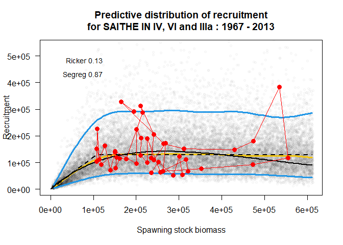
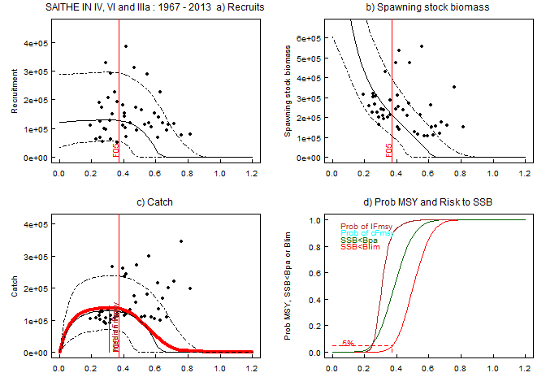
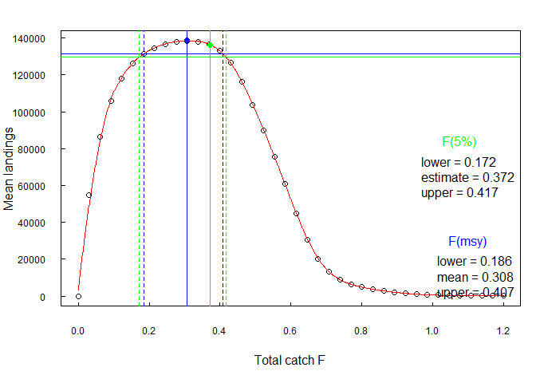
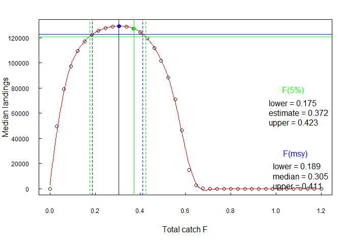
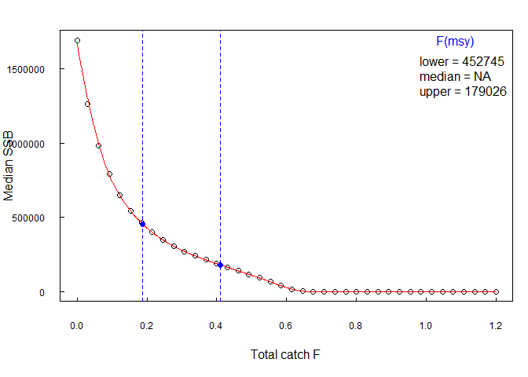

report_08_MSY.R
================
colin
2024-03-08

``` r
# install.packages("msy", repos = c("https://ices-tools-prod.r-universe.dev", "https://cloud.r-project.org"))

library(msy)
```

    ## 
    ## Attaching package: 'msy'

    ## The following object is masked _by_ '.GlobalEnv':
    ## 
    ##     bevholt2

``` r
FIT <- eqsr_fit(icesStocks$saiNS,
  nsamp = 1000,
  models = c("Ricker", "Segreg")
)

SIM <- eqsim_run(FIT,
  bio.years = c(2004, 2013),
  sel.years = c(2004, 2013),
  Fcv = 0.24,
  Fphi = 0.42,
  Blim = 106000,
  Bpa = 200000,
  Fscan = seq(0, 1.2, len = 40),
  verbose = FALSE
)

eqsr_plot(FIT, n = 2e4)
```

<!-- -->

``` r
SIM$Refs
```

    ##                   F05          F10          F50    medianMSY      meanMSY     FCrash05     FCrash50
    ## catF     3.721916e-01 4.007316e-01 5.042639e-01 3.076923e-01 3.076923e-01 4.923077e-01    0.6461538
    ## lanF               NA           NA           NA 3.076923e-01 3.076923e-01           NA           NA
    ## catch    1.270102e+05 1.244058e+05 9.649547e+04 1.292991e+05 1.292991e+05 1.015615e+05 2580.2475679
    ## landings           NA           NA           NA 1.292991e+05 1.292991e+05           NA           NA
    ## catB     2.104877e+05 1.871820e+05 1.059200e+05 2.705372e+05 2.705372e+05 1.151130e+05 2041.7186973
    ## lanB               NA           NA           NA 2.705372e+05 2.705372e+05           NA           NA

``` r
eqsim_plot(SIM, catch = TRUE)
```

<!-- -->

``` r
eqsim_plot_range(SIM, type = "mean")
```

<!-- -->

``` r
eqsim_plot_range(SIM, type = "median")
```

<!-- -->

``` r
eqsim_plot_range(SIM, type = "ssb")
```

<!-- -->
