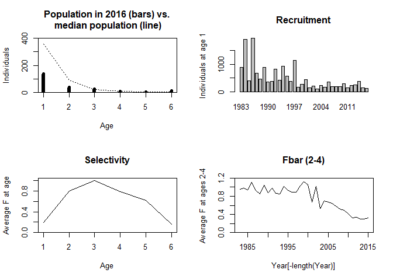
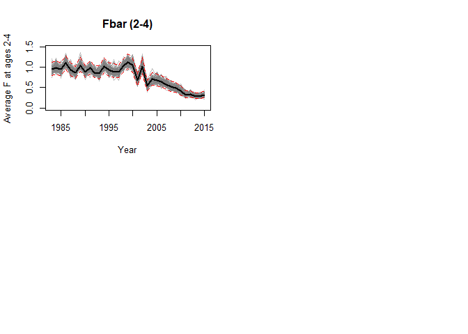

report_09_SCA.R
================
colin
2024-03-08

``` r
## Read data
C <- as.matrix(read.table("data/nscod_catage.dat",
  header = TRUE,
  check.names = FALSE, row.names = 1
))
I <- as.matrix(read.table("data/nscod_survey.dat",
  header = TRUE,
  check.names = FALSE, row.names = 1
))
M <- as.matrix(read.table("data/nscod_natmort.dat",
  header = TRUE,
  check.names = FALSE, row.names = 1
))

minYear <- min(as.integer(rownames(C)))
maxYear <- max(as.integer(rownames(C)))
minAge <- min(as.integer(colnames(C)))
maxAge <- max(as.integer(colnames(C)))
nYears <- maxYear - minYear + 1
nAges <- maxAge - minAge + 1

## Prepare containers
N <- matrix(NA_real_,
  nrow = nYears + 1, ncol = nAges,
  dimnames = list(minYear:(maxYear + 1), minAge:maxAge)
)
F <- matrix(NA_real_, nrow = nYears, ncol = nAges, dimnames = dimnames(C))

## Set parameter initial values
logNa <- c(6.8, 5.7, 3.5, 3.0, 1.8, 2.8)
logNt <- c(
  7.6, 6.0, 7.6, 6.5, 6.2, 6.8, 5.9, 6.0, 6.7, 6.1, 6.8, 6.3, 5.9, 7.0,
  5.2, 5.6, 6.1, 5.1, 5.4, 4.7, 5.4, 5.2, 5.9, 5.2, 5.3, 5.3, 5.7, 5.0,
  5.4, 5.6, 6.0, 5.1, 4.9
)
logFa <- c(0.2, 1.6, 1.8, 1.6, 1.4)
logFt <- c(
  -1.7, -1.7, -1.7, -1.6, -1.8, -1.8, -1.6, -1.8, -1.7, -1.8, -1.8,
  -1.7, -1.8, -1.8, -1.8, -1.7, -1.6, -1.6, -2.1, -1.7, -2.3, -2.0,
  -2.1, -2.1, -2.2, -2.3, -2.4, -2.6, -2.8, -2.8, -2.9, -2.9, -2.8
)
logQ <- c(-5.1, -3.6, -2.9, -2.9, -2.7)

## Evaluate F, Z, and N
Fa <- exp(c(logFa, 0))
Ft <- exp(logFt)
F[] <- Ft %o% Fa
Z <- F + M
N[1, ] <- exp(logNa)
N[-1, 1] <- exp(logNt)

A <- ncol(N)
T <- nrow(N)
for (t in 1:(T - 1))
{
  for (a in 1:(A - 2))
  {
    N[t + 1, a + 1] <- N[t, a] * exp(-Z[t, a])
  }
  N[t + 1, A] <- N[t, A - 1] * exp(-Z[t, A - 1]) + N[t, A] * exp(-Z[t, A])
}

## Predict C and I
Nc <- N[-nrow(N), ]
Chat <- F / Z * Nc * (1 - exp(-Z))
Chat <- Chat[rownames(Nc) %in% rownames(C), colnames(Nc) %in% colnames(C)]
Cres <- log(C) - log(Chat)

Ni <- N[rownames(N) %in% rownames(I), colnames(N) %in% colnames(I)]
Ihat <- sweep(Ni, 2, exp(logQ), "*")
Ires <- log(I) - log(Ihat)

## Evaluate SSQ
ssq <- function(res) {
  # if you want to switch to max likelihood
  #-sum(dnorm(res, sd=sqrt(mean(res^2)), log=TRUE))
  sum(res^2)
}

c(catch = ssq(Cres), survey = ssq(Ires))
```

    ##    catch   survey 
    ## 13.51522 15.76759

``` r
# now lets wrap all this in a function and apply

source("utilities_sca.R")

## Read data
C <-
  as.matrix(read.table("data/nscod_catage.dat",
    header = TRUE,
    check.names = FALSE, row.names = 1
  ))
I <- as.matrix(read.table("data/nscod_survey.dat",
  header = TRUE,
  check.names = FALSE, row.names = 1
))
M <- as.matrix(read.table("data/nscod_natmort.dat",
  header = TRUE,
  check.names = FALSE, row.names = 1
))
data <- list(C = C, I = I, M = M)

## Set initial parameter values

parlist <- list(
  logNa = rep(8, ncol(C)),
  logNt = rep(8, nrow(C)),
  logFa = rep(0, ncol(C) - 1),
  logFt = rep(0, nrow(C)),
  logQ = rep(-5, ncol(I))
)


par <- unlist(parlist)

################################################################################

## Fit model

sca(par, data, full = TRUE)
```

    ## $par
    ##  logNa1  logNa2  logNa3  logNa4  logNa5  logNa6  logNt1  logNt2  logNt3  logNt4  logNt5  logNt6  logNt7  logNt8  logNt9 logNt10 logNt11 logNt12 logNt13 logNt14 logNt15 
    ##       8       8       8       8       8       8       8       8       8       8       8       8       8       8       8       8       8       8       8       8       8 
    ## logNt16 logNt17 logNt18 logNt19 logNt20 logNt21 logNt22 logNt23 logNt24 logNt25 logNt26 logNt27 logNt28 logNt29 logNt30 logNt31 logNt32 logNt33  logFa1  logFa2  logFa3 
    ##       8       8       8       8       8       8       8       8       8       8       8       8       8       8       8       8       8       8       0       0       0 
    ##  logFa4  logFa5  logFt1  logFt2  logFt3  logFt4  logFt5  logFt6  logFt7  logFt8  logFt9 logFt10 logFt11 logFt12 logFt13 logFt14 logFt15 logFt16 logFt17 logFt18 logFt19 
    ##       0       0       0       0       0       0       0       0       0       0       0       0       0       0       0       0       0       0       0       0       0 
    ## logFt20 logFt21 logFt22 logFt23 logFt24 logFt25 logFt26 logFt27 logFt28 logFt29 logFt30 logFt31 logFt32 logFt33   logQ1   logQ2   logQ3   logQ4   logQ5 
    ##       0       0       0       0       0       0       0       0       0       0       0       0       0       0      -5      -5      -5      -5      -5 
    ## 
    ## $C
    ##            1       2      3      4     5     6
    ## 1983  80.437 139.526 21.480 11.787 2.803 2.153
    ## 1984 601.879  78.543 31.092  4.238 3.415 1.812
    ## 1985  72.096 153.957 19.003  7.779 1.369 1.925
    ## 1986 663.347  38.069 34.277  5.791 2.981 1.461
    ## 1987  49.451 189.722  9.761  8.689 1.528 1.634
    ## 1988  36.738  72.109 43.929  3.117 2.543 1.114
    ## 1989 198.992  44.768 18.544  9.791 0.994 1.484
    ## 1990  45.504 102.027 11.873  4.299 2.445 0.748
    ## 1991  60.761  31.528 17.002  3.267 1.372 1.440
    ## 1992 129.572  41.353  8.525  4.916 1.041 0.921
    ## 1993  38.121  82.709 11.145  3.126 1.546 0.772
    ## 1994 336.092  41.773 21.045  3.045 0.859 0.764
    ## 1995  60.242 106.084 12.783  5.223 0.790 0.504
    ## 1996  19.124  59.360 23.809  3.125 1.834 0.693
    ## 1997 109.552  42.494 18.430  6.409 1.221 0.927
    ## 1998  16.701 171.206 18.293  5.909 2.379 0.810
    ## 1999  36.793  15.180 39.904  3.959 1.419 0.947
    ## 2000  45.118  27.965  6.310  6.529 0.996 0.573
    ## 2001   7.624  53.403  6.797  1.114 1.053 0.270
    ## 2002  30.692  21.265 17.012  2.805 0.395 0.503
    ## 2003   6.135  14.975  4.328  3.127 0.397 0.152
    ## 2004  21.807  12.452  7.460  1.650 0.944 0.211
    ## 2005  11.222  16.478  4.831  1.863 0.546 0.431
    ## 2006  28.177  39.743  6.375  1.020 0.524 0.336
    ## 2007  16.947  29.381  4.921  2.043 0.451 0.250
    ## 2008  11.185  12.599 11.721  1.369 0.720 0.335
    ## 2009  10.127  13.887  5.494  3.539 0.646 0.357
    ## 2010  10.987  14.188  5.831  1.646 1.344 0.292
    ## 2011   5.035  12.391  4.970  1.489 0.616 0.540
    ## 2012  11.815   7.420  6.789  2.077 0.638 0.413
    ## 2013   6.871   8.743  3.919  2.989 0.949 0.374
    ## 2014   9.995  10.711  5.810  1.768 1.345 0.447
    ## 2015   4.977  15.418  6.853  2.118 0.799 0.844
    ## 
    ## $I
    ##           1      2     3     4     5
    ## 1983  3.742 14.132 1.724 0.942 0.385
    ## 1984 11.153  5.497 2.343 0.449 0.438
    ## 1985  0.544 14.312 1.968 0.742 0.240
    ## 1986 11.082  2.284 3.338 0.883 0.449
    ## 1987  4.344 13.889 0.703 0.740 0.219
    ## 1988  2.537  3.377 3.512 0.184 0.359
    ## 1989  8.362  3.247 2.622 1.092 0.154
    ## 1990  1.770  7.058 1.148 0.427 0.487
    ## 1991  1.538  2.120 1.874 0.493 0.271
    ## 1992  8.176  2.844 0.725 0.491 0.164
    ## 1993  2.821  7.560 0.932 0.324 0.249
    ## 1994  6.187  2.042 1.528 0.465 0.237
    ## 1995  6.769  8.786 1.633 0.540 0.159
    ## 1996  1.640  4.145 2.102 0.326 0.234
    ## 1997 13.785  2.499 1.156 0.507 0.170
    ## 1998  1.579  9.421 0.905 0.449 0.224
    ## 1999  1.305  0.860 4.033 0.362 0.213
    ## 2000  3.482  2.043 0.419 0.959 0.195
    ## 2001  0.921  3.624 0.812 0.163 0.162
    ## 2002  2.475  1.411 1.497 0.248 0.053
    ## 2003  0.365  2.066 0.556 0.428 0.134
    ## 2004  2.487  1.139 1.155 0.216 0.184
    ## 2005  0.943  1.458 0.477 0.403 0.069
    ## 2006  3.493  0.857 0.748 0.155 0.089
    ## 2007  1.203  2.645 0.702 0.232 0.087
    ## 2008  1.911  1.052 1.194 0.299 0.208
    ## 2009  0.961  1.775 0.873 0.398 0.131
    ## 2010  2.509  1.584 1.191 0.330 0.209
    ## 2011  0.663  2.898 0.628 0.359 0.237
    ## 2012  1.343  1.543 1.963 0.442 0.250
    ## 2013  1.405  1.367 0.805 0.591 0.402
    ## 2014  2.358  1.723 0.791 0.302 0.371
    ## 2015  1.510  3.623 1.278 0.465 0.206
    ## 2016  0.879  1.107 2.016 0.666 0.369
    ## 
    ## $M
    ##          1     2     3   4   5   6
    ## 1983 1.357 0.715 0.212 0.2 0.2 0.2
    ## 1984 1.344 0.717 0.212 0.2 0.2 0.2
    ## 1985 1.325 0.718 0.213 0.2 0.2 0.2
    ## 1986 1.301 0.718 0.213 0.2 0.2 0.2
    ## 1987 1.274 0.718 0.214 0.2 0.2 0.2
    ## 1988 1.247 0.718 0.215 0.2 0.2 0.2
    ## 1989 1.220 0.720 0.215 0.2 0.2 0.2
    ## 1990 1.196 0.722 0.216 0.2 0.2 0.2
    ## 1991 1.174 0.723 0.216 0.2 0.2 0.2
    ## 1992 1.157 0.725 0.217 0.2 0.2 0.2
    ## 1993 1.144 0.727 0.217 0.2 0.2 0.2
    ## 1994 1.136 0.730 0.217 0.2 0.2 0.2
    ## 1995 1.129 0.734 0.218 0.2 0.2 0.2
    ## 1996 1.122 0.740 0.219 0.2 0.2 0.2
    ## 1997 1.115 0.748 0.220 0.2 0.2 0.2
    ## 1998 1.106 0.756 0.222 0.2 0.2 0.2
    ## 1999 1.097 0.767 0.224 0.2 0.2 0.2
    ## 2000 1.088 0.779 0.226 0.2 0.2 0.2
    ## 2001 1.084 0.795 0.229 0.2 0.2 0.2
    ## 2002 1.085 0.814 0.232 0.2 0.2 0.2
    ## 2003 1.091 0.835 0.235 0.2 0.2 0.2
    ## 2004 1.100 0.854 0.237 0.2 0.2 0.2
    ## 2005 1.112 0.871 0.238 0.2 0.2 0.2
    ## 2006 1.126 0.884 0.239 0.2 0.2 0.2
    ## 2007 1.141 0.893 0.238 0.2 0.2 0.2
    ## 2008 1.159 0.900 0.237 0.2 0.2 0.2
    ## 2009 1.180 0.907 0.236 0.2 0.2 0.2
    ## 2010 1.208 0.916 0.235 0.2 0.2 0.2
    ## 2011 1.242 0.929 0.234 0.2 0.2 0.2
    ## 2012 1.283 0.945 0.233 0.2 0.2 0.2
    ## 2013 1.326 0.962 0.233 0.2 0.2 0.2
    ## 2014 1.326 0.962 0.233 0.2 0.2 0.2
    ## 2015 1.326 0.962 0.233 0.2 0.2 0.2
    ## 
    ## $N
    ##             1         2          3          4           5           6
    ## 1983 2980.958 2980.9580 2980.95799 2980.95799 2980.957987 2980.957987
    ## 1984 2980.958  282.3084  536.46429  887.13751  897.847292 1795.694583
    ## 1985 2980.958  286.0023   50.70376  159.65257  267.200684  811.279222
    ## 1986 2980.958  291.4883   51.31587   15.07443   48.086429  324.831905
    ## 1987 2980.958  298.5687   52.30019   15.25641    4.540331  112.320844
    ## 1988 2980.958  306.7399   53.57058   15.53352    4.595144   35.197910
    ## 1989 2980.958  315.1346   55.03669   15.89493    4.678605   11.985437
    ## 1990 2980.958  323.7592   56.42995   16.32994    4.787460    5.019113
    ## 1991 2980.958  331.6234   57.85848   16.72660    4.918482    2.953683
    ## 1992 2980.958  339.0000   59.20464   17.15003    5.037954    2.371051
    ## 1993 2980.958  344.8122   60.40066   17.53151    5.165490    2.231549
    ## 1994 2980.958  349.3240   61.31350   17.88567    5.280390    2.227945
    ## 1995 2980.958  352.1299   61.92971   18.15598    5.387061    2.261467
    ## 1996 2980.958  354.6034   62.17792   18.32012    5.468476    2.303692
    ## 1997 2980.958  357.0943   62.24013   18.37516    5.517915    2.340932
    ## 1998 2980.958  359.6028   62.17792   18.37516    5.534493    2.367039
    ## 1999 2980.958  362.8538   62.11578   18.32012    5.534493    2.379896
    ## 2000 2980.958  366.1342   61.99167   18.26524    5.517915    2.383768
    ## 2001 2980.958  369.4443   61.80597   18.19233    5.501386    2.379941
    ## 2002 2980.958  370.9250   61.37484   18.08350    5.479424    2.373810
    ## 2003 2980.958  370.5543   60.46109   17.90357    5.446646    2.365349
    ## 2004 2980.958  368.3376   59.14547   17.58419    5.392451    2.352928
    ## 2005 2980.958  365.0375   57.68516   17.16719    5.296255    2.332863
    ## 2006 2980.958  360.6832   56.20468   16.72660    5.170658    2.297846
    ## 2007 2980.958  355.6688   54.81698   16.28102    5.037954    2.249470
    ## 2008 2980.958  350.3736   53.57058   15.89493    4.903749    2.194930
    ## 2009 2980.958  344.1233   52.40489   15.54906    4.787460    2.138081
    ## 2010 2980.958  336.9721   51.11101   15.22593    4.683286    2.085933
    ## 2011 2980.958  327.6677   49.60045   14.86486    4.585962    2.038850
    ## 2012 2980.958  316.7143   47.60796   14.43997    4.477210    1.995355
    ## 2013 2980.958  303.9916   45.28609   13.87377    4.349235    1.949499
    ## 2014 2980.958  291.1970   42.73422   13.19714    4.178699    1.897142
    ## 2015 2980.958  291.1970   40.93560   12.45348    3.974902    1.830008
    ## 2016 2980.958  291.1970   40.93560   11.92933    3.750916    1.748405
    ## 
    ## $F
    ##      1 2 3 4 5 6
    ## 1983 1 1 1 1 1 1
    ## 1984 1 1 1 1 1 1
    ## 1985 1 1 1 1 1 1
    ## 1986 1 1 1 1 1 1
    ## 1987 1 1 1 1 1 1
    ## 1988 1 1 1 1 1 1
    ## 1989 1 1 1 1 1 1
    ## 1990 1 1 1 1 1 1
    ## 1991 1 1 1 1 1 1
    ## 1992 1 1 1 1 1 1
    ## 1993 1 1 1 1 1 1
    ## 1994 1 1 1 1 1 1
    ## 1995 1 1 1 1 1 1
    ## 1996 1 1 1 1 1 1
    ## 1997 1 1 1 1 1 1
    ## 1998 1 1 1 1 1 1
    ## 1999 1 1 1 1 1 1
    ## 2000 1 1 1 1 1 1
    ## 2001 1 1 1 1 1 1
    ## 2002 1 1 1 1 1 1
    ## 2003 1 1 1 1 1 1
    ## 2004 1 1 1 1 1 1
    ## 2005 1 1 1 1 1 1
    ## 2006 1 1 1 1 1 1
    ## 2007 1 1 1 1 1 1
    ## 2008 1 1 1 1 1 1
    ## 2009 1 1 1 1 1 1
    ## 2010 1 1 1 1 1 1
    ## 2011 1 1 1 1 1 1
    ## 2012 1 1 1 1 1 1
    ## 2013 1 1 1 1 1 1
    ## 2014 1 1 1 1 1 1
    ## 2015 1 1 1 1 1 1
    ## 
    ## $Z
    ##          1     2     3   4   5   6
    ## 1983 2.357 1.715 1.212 1.2 1.2 1.2
    ## 1984 2.344 1.717 1.212 1.2 1.2 1.2
    ## 1985 2.325 1.718 1.213 1.2 1.2 1.2
    ## 1986 2.301 1.718 1.213 1.2 1.2 1.2
    ## 1987 2.274 1.718 1.214 1.2 1.2 1.2
    ## 1988 2.247 1.718 1.215 1.2 1.2 1.2
    ## 1989 2.220 1.720 1.215 1.2 1.2 1.2
    ## 1990 2.196 1.722 1.216 1.2 1.2 1.2
    ## 1991 2.174 1.723 1.216 1.2 1.2 1.2
    ## 1992 2.157 1.725 1.217 1.2 1.2 1.2
    ## 1993 2.144 1.727 1.217 1.2 1.2 1.2
    ## 1994 2.136 1.730 1.217 1.2 1.2 1.2
    ## 1995 2.129 1.734 1.218 1.2 1.2 1.2
    ## 1996 2.122 1.740 1.219 1.2 1.2 1.2
    ## 1997 2.115 1.748 1.220 1.2 1.2 1.2
    ## 1998 2.106 1.756 1.222 1.2 1.2 1.2
    ## 1999 2.097 1.767 1.224 1.2 1.2 1.2
    ## 2000 2.088 1.779 1.226 1.2 1.2 1.2
    ## 2001 2.084 1.795 1.229 1.2 1.2 1.2
    ## 2002 2.085 1.814 1.232 1.2 1.2 1.2
    ## 2003 2.091 1.835 1.235 1.2 1.2 1.2
    ## 2004 2.100 1.854 1.237 1.2 1.2 1.2
    ## 2005 2.112 1.871 1.238 1.2 1.2 1.2
    ## 2006 2.126 1.884 1.239 1.2 1.2 1.2
    ## 2007 2.141 1.893 1.238 1.2 1.2 1.2
    ## 2008 2.159 1.900 1.237 1.2 1.2 1.2
    ## 2009 2.180 1.907 1.236 1.2 1.2 1.2
    ## 2010 2.208 1.916 1.235 1.2 1.2 1.2
    ## 2011 2.242 1.929 1.234 1.2 1.2 1.2
    ## 2012 2.283 1.945 1.233 1.2 1.2 1.2
    ## 2013 2.326 1.962 1.233 1.2 1.2 1.2
    ## 2014 2.326 1.962 1.233 1.2 1.2 1.2
    ## 2015 2.326 1.962 1.233 1.2 1.2 1.2
    ## 
    ## $Chat
    ##             1         2          3           4           5           6
    ## 1983 1144.951 1425.3608 1727.57465 1735.925579 1735.925579 1735.925579
    ## 1984 1149.725  134.8891  310.90076  516.614023  522.850737 1045.701474
    ## 1985 1156.761  136.6045   29.37290   92.971782  155.601154  472.438847
    ## 1986 1165.749  139.2248   29.72750    8.778416   28.002563  189.162013
    ## 1987 1175.997  142.6066   30.28556    8.884392    2.644008   65.408713
    ## 1988 1186.392  146.5094   31.00877    9.045759    2.675927   20.497086
    ## 1989 1196.936  150.4097   31.85741    9.256222    2.724530    6.979577
    ## 1990 1206.437  154.4139   32.65078    9.509545    2.787921    2.922821
    ## 1991 1215.252  158.1072   33.47734    9.740535    2.864220    1.720042
    ## 1992 1222.135  161.5068   34.24251    9.987118    2.933793    1.380753
    ## 1993 1227.441  164.1568   34.93425   10.209269    3.008062    1.299516
    ## 1994 1230.725  166.1239   35.46222   10.415510    3.074973    1.297418
    ## 1995 1233.609  167.2156   35.80426   10.572920    3.137091    1.316939
    ## 1996 1236.505  168.0249   35.93335   10.668506    3.184502    1.341528
    ## 1997 1239.411  168.7165   35.95489   10.700559    3.213292    1.363214
    ## 1998 1243.164  169.4117   35.89018   10.700559    3.222947    1.378417
    ## 1999 1246.936  170.2672   35.82560   10.668506    3.222947    1.385904
    ## 2000 1250.725  171.0670   35.72540   10.636548    3.213292    1.388159
    ## 2001 1252.415  171.6264   35.57565   10.594087    3.203667    1.385931
    ## 2002 1251.992  171.1488   35.28512   10.530713    3.190878    1.382360
    ## 2003 1249.460  169.7051   34.71814   10.425931    3.171790    1.377433
    ## 2004 1245.676  167.5580   33.93555   10.239943    3.140230    1.370199
    ## 2005 1240.660  165.0630   33.08446    9.997110    3.084211    1.358515
    ## 2006 1234.849  162.3494   32.22248    9.740535    3.011072    1.338124
    ## 2007 1228.671  159.5870   31.43946    9.481059    2.933793    1.309952
    ## 2008 1221.322  156.8256   30.73688    9.256222    2.855640    1.278191
    ## 2009 1212.838  153.6509   30.08007    9.054809    2.787921    1.245086
    ## 2010 1201.671  149.9852   29.34911    8.866641    2.727256    1.214718
    ## 2011 1188.334  145.1839   28.49310    8.656375    2.670581    1.187300
    ## 2012 1172.565  139.5518   27.35944    8.408945    2.607250    1.161971
    ## 2013 1156.389  133.1587   26.02511    8.079226    2.532726    1.135268
    ## 2014 1156.389  127.5542   24.55859    7.685197    2.433416    1.104778
    ## 2015 1156.389  127.5542   23.52495    7.252136    2.314737    1.065684
    ## 
    ## $Ihat
    ##             1         2          3           4           5
    ## 1983 20.08554 20.085537 20.0855369 20.08553692 20.08553692
    ## 1984 20.08554  1.902179  3.6146680  5.97748553  6.04964746
    ## 1985 20.08554  1.927069  0.3416392  1.07573054  1.80038404
    ## 1986 20.08554  1.964033  0.3457636  0.10157072  0.32400381
    ## 1987 20.08554  2.011740  0.3523959  0.10279691  0.03059251
    ## 1988 20.08554  2.066797  0.3609557  0.10466401  0.03096183
    ## 1989 20.08554  2.123361  0.3708343  0.10709918  0.03152419
    ## 1990 20.08554  2.181472  0.3802220  0.11003024  0.03225765
    ## 1991 20.08554  2.234461  0.3898474  0.11270291  0.03314047
    ## 1992 20.08554  2.284164  0.3989178  0.11555600  0.03394547
    ## 1993 20.08554  2.323327  0.4069764  0.11812640  0.03480480
    ## 1994 20.08554  2.353727  0.4131271  0.12051272  0.03557899
    ## 1995 20.08554  2.372632  0.4172791  0.12233403  0.03629773
    ## 1996 20.08554  2.389299  0.4189515  0.12344001  0.03684630
    ## 1997 20.08554  2.406083  0.4193707  0.12381088  0.03717942
    ## 1998 20.08554  2.422984  0.4189515  0.12381088  0.03729112
    ## 1999 20.08554  2.444890  0.4185328  0.12344001  0.03729112
    ## 2000 20.08554  2.466993  0.4176966  0.12307024  0.03717942
    ## 2001 20.08554  2.489296  0.4164454  0.12257895  0.03706805
    ## 2002 20.08554  2.499273  0.4135404  0.12184567  0.03692007
    ## 2003 20.08554  2.496775  0.4073836  0.12063329  0.03669921
    ## 2004 20.08554  2.481839  0.3985190  0.11848132  0.03633405
    ## 2005 20.08554  2.459603  0.3886796  0.11567162  0.03568589
    ## 2006 20.08554  2.430264  0.3787041  0.11270291  0.03483962
    ## 2007 20.08554  2.396478  0.3693539  0.10970065  0.03394547
    ## 2008 20.08554  2.360799  0.3609557  0.10709918  0.03304120
    ## 2009 20.08554  2.318685  0.3531014  0.10476872  0.03225765
    ## 2010 20.08554  2.270500  0.3443833  0.10259152  0.03155573
    ## 2011 20.08554  2.207808  0.3342052  0.10015863  0.03089997
    ## 2012 20.08554  2.134004  0.3207799  0.09729575  0.03016720
    ## 2013 20.08554  2.048279  0.3051353  0.09348073  0.02930492
    ## 2014 20.08554  1.962070  0.2879409  0.08892162  0.02815585
    ## 2015 20.08554  1.962070  0.2758219  0.08391088  0.02678268
    ## 2016 20.08554  1.962070  0.2758219  0.08037919  0.02527347
    ## 
    ## $Cres
    ##               1           2          3           4           5          6
    ## 1983 -2.6556429 -2.32392926 -4.3873515 -4.99229880 -6.42860575 -6.6924338
    ## 1984 -0.6472217 -0.54080686 -2.3025232 -4.80320457 -5.03111853 -6.3580120
    ## 1985 -2.7753807  0.11958369 -0.4354756 -2.48086823 -4.73321548 -5.5029823
    ## 1986 -0.5638212 -1.29668935  0.1424022 -0.41599104 -2.24003721 -4.8634827
    ## 1987 -3.1688897  0.28547019 -1.1322763 -0.02223817 -0.54833633 -3.6896245
    ## 1988 -3.4748606 -0.70891079  0.3483047 -1.06542502 -0.05095154 -2.9123256
    ## 1989 -1.7942559 -1.21186937 -0.5411237  0.05616757 -1.00831410 -1.5482472
    ## 1990 -3.2776260 -0.41439909 -1.0116019 -0.79391359 -0.13125090 -1.3629016
    ## 1991 -2.9957587 -1.61239744 -0.6775378 -1.09242389 -0.73602650 -0.1777058
    ## 1992 -2.2441181 -1.36240255 -1.3904648 -0.70880083 -1.03611424 -0.4049244
    ## 1993 -3.4719216 -0.68549342 -1.1424768 -1.18354179 -0.66562508 -0.5207628
    ## 1994 -1.2979736 -1.38048368 -0.5218048 -1.22979512 -1.27528238 -0.5295634
    ## 1995 -3.0193299 -0.45505303 -1.0299507 -0.70522408 -1.37901836 -0.9604889
    ## 1996 -4.1691001 -1.04049141 -0.4116023 -1.22786174 -0.55179665 -0.6605346
    ## 1997 -2.4259926 -1.37885681 -0.6682854 -0.51259277 -0.96762583 -0.3856470
    ## 1998 -4.3099467  0.01053551 -0.6739453 -0.59381941 -0.30361579 -0.5316569
    ## 1999 -3.5231366 -2.41739016  0.1078139 -0.99130456 -0.82034363 -0.3808089
    ## 2000 -3.3221973 -1.81110176 -1.7337262 -0.48804223 -1.17130405 -0.8848481
    ## 2001 -5.1015278 -1.16745335 -1.6551800 -2.25233888 -1.11265279 -1.6357051
    ## 2002 -3.7084893 -2.08547092 -0.7295425 -1.32289249 -2.08916554 -1.0109574
    ## 2003 -5.3164565 -2.42768000 -2.0821568 -1.20422195 -2.07811502 -2.2040962
    ## 2004 -4.0452030 -2.59944811 -1.5149078 -1.82552074 -1.20192514 -1.8708535
    ## 2005 -4.7055230 -2.30430079 -1.9240103 -1.68010793 -1.73143233 -1.1480396
    ## 2006 -3.7801980 -1.40731690 -1.6202804 -2.25649340 -1.74855962 -1.3819124
    ## 2007 -4.2835975 -1.69224117 -1.8545521 -1.53487671 -1.87258396 -1.6562852
    ## 2008 -4.6931158 -2.52151712 -0.9640811 -1.91121548 -1.37780009 -1.3390709
    ## 2009 -4.7855129 -2.40373004 -1.7002062 -0.93945182 -1.46225180 -1.2492242
    ## 2010 -4.6947559 -2.35813993 -1.6160738 -1.68394792 -0.70764578 -1.4255137
    ## 2011 -5.4638937 -2.46103081 -1.7462421 -1.76019127 -1.46680434 -0.7878679
    ## 2012 -4.5975792 -2.93425651 -1.3937580 -1.39837148 -1.40771302 -1.0344257
    ## 2013 -5.1257479 -2.72328823 -1.8932252 -0.99435714 -0.98164251 -1.1103679
    ## 2014 -4.7509726 -2.47727036 -1.4414811 -1.46944706 -0.59290201 -0.9048414
    ## 2015 -5.4482303 -2.11300595 -1.2333752 -1.23082378 -1.06369036 -0.2332193
    ## 
    ## $Ires
    ##               1           2            3          4          5
    ## 1983 -1.6803798 -0.35155827 -2.455352828 -3.0597500 -3.9545119
    ## 1984 -0.5882915  1.06120249 -0.433567840 -2.5887324 -2.6255364
    ## 1985 -3.6088060  2.00509835  1.751017799 -0.3714060 -2.0151164
    ## 1986 -0.5946778  0.15092829  2.267371825  2.1625699  0.3262676
    ## 1987 -1.5312044  1.93209716  0.690601613  1.9738949  1.9683165
    ## 1988 -2.0690177  0.49098774  2.275185676  0.5641805  2.4505671
    ## 1989 -0.8763024  0.42473149  1.955937385  2.3220109  1.5861973
    ## 1990 -2.4290205  1.17416173  1.105021298  1.3560287  2.7145088
    ## 1991 -2.5695171 -0.05258391  1.570075184  1.4757539  2.1013635
    ## 1992 -0.8987970  0.21921151  0.597416376  1.4466888  1.5751111
    ## 1993 -1.9629086  1.17987119  0.828577536  1.0089882  1.9676976
    ## 1994 -1.1775497 -0.14207028  1.307959691  1.3502821  1.8963049
    ## 1995 -1.0876466  1.30915955  1.364418814  1.4848139  1.4771489
    ## 1996 -2.5053038  0.55090279  1.612889272  0.9711421  1.8485658
    ## 1997 -0.3764190  0.03789065  1.013965770  1.4097557  1.5200432
    ## 1998 -2.5432083  1.35794124  0.770179665  1.2882676  1.7928908
    ## 1999 -2.7337970 -1.04482289  2.265510516  1.0758889  1.7425369
    ## 2000 -1.7523932 -0.18858068  0.003115641  2.0531358  1.6572443
    ## 2001 -3.0822952  0.37557839  0.667745061  0.2849949  1.4748411
    ## 2002 -2.0937596 -0.57170133  1.286463105  0.7106735  0.3615366
    ## 2003 -4.0078579 -0.18938563  0.311013015  1.2663679  1.2950845
    ## 2004 -2.0889228 -0.77884932  1.064100344  0.6005231  1.6221805
    ## 2005 -3.0586890 -0.52293437  0.204761212  1.2481813  0.6593512
    ## 2006 -1.7492390 -1.04231736  0.680647699  0.3186698  0.9378811
    ## 2007 -2.8151816  0.09867107  0.642178125  0.7489821  0.9411528
    ## 2008 -2.3523733 -0.80830689  1.196309015  1.0266883  1.8397828
    ## 2009 -3.0397809 -0.26719958  0.905180277  1.3346967  1.4014420
    ## 2010 -2.0801157 -0.36004671  1.240793290  1.1683374  1.8905790
    ## 2011 -3.4109803  0.27202084  0.630784887  1.2765671  2.0373049
    ## 2012 -2.7050941 -0.32427143  1.811473915  1.5135546  2.1147056
    ## 2013 -2.6599627 -0.40438144  0.970086998  1.8440607  2.6186968
    ## 2014 -2.1421862 -0.12993304  1.010542689  1.2226717  2.5784468
    ## 2015 -2.5878903  0.61330241  1.533296356  1.7122821  2.0401209
    ## 2016 -3.1289704 -0.57234635  1.989115350  2.1145344  2.6810414
    ## 
    ## $f
    ##     catch    survey 
    ## 1108.0203  476.9292

``` r
sca(par, data)
```

    ## [1] 1584.95

``` r
opt1 <- optim(par, sca, data = data)
opt1
```

    ## $par
    ##       logNa1       logNa2       logNa3       logNa4       logNa5       logNa6       logNt1       logNt2       logNt3       logNt4       logNt5       logNt6       logNt7 
    ##  8.058534792  7.973665350  7.936813859  7.970184625  7.955148501  7.950512662  8.076392952  7.981479323  8.033491680  8.027085788  7.996154558  8.048362032  7.989068750 
    ##       logNt8       logNt9      logNt10      logNt11      logNt12      logNt13      logNt14      logNt15      logNt16      logNt17      logNt18      logNt19      logNt20 
    ##  7.998406720  8.049159398  7.992735553  8.058933194  8.020167257  7.998315812  8.064229967  8.024158225  8.013060678  8.007763576  8.015166691  8.002071658  8.029578364 
    ##      logNt21      logNt22      logNt23      logNt24      logNt25      logNt26      logNt27      logNt28      logNt29      logNt30      logNt31      logNt32      logNt33 
    ##  7.988947937  8.032151478  7.992329071  8.004025384  7.977838279  7.975313895  7.997122950  7.972004096  7.980957934  7.976707426  7.988880169  7.968894902  8.044145859 
    ##       logFa1       logFa2       logFa3       logFa4       logFa5       logFt1       logFt2       logFt3       logFt4       logFt5       logFt6       logFt7       logFt8 
    ## -0.048505545 -0.086087270 -0.053825269  0.021143976  0.078782356  0.273963583  0.074118228  0.086944154 -0.148574032 -0.159070759 -0.006376561 -0.000531408  0.011901436 
    ##       logFt9      logFt10      logFt11      logFt12      logFt13      logFt14      logFt15      logFt16      logFt17      logFt18      logFt19      logFt20      logFt21 
    ##  0.121542468  0.007555946  0.110255536  0.005630796  0.005216842 -0.740113720  0.004116709  0.026201832  0.107890311  0.091333987  0.080614550  0.106195519  0.098770488 
    ##      logFt22      logFt23      logFt24      logFt25      logFt26      logFt27      logFt28      logFt29      logFt30      logFt31      logFt32      logFt33        logQ1 
    ##  0.105838753  0.078418147 -0.001602550  0.092057818  0.096198292  0.049408451  0.040924890 -0.020950111 -0.033061527 -0.047928403 -0.020368810  0.006123705 -5.896744537 
    ##        logQ2        logQ3        logQ4        logQ5 
    ## -4.831421198 -4.728720053 -4.740036672 -4.663944285 
    ## 
    ## $value
    ## [1] 1370.917
    ## 
    ## $counts
    ## function gradient 
    ##      501       NA 
    ## 
    ## $convergence
    ## [1] 1
    ## 
    ## $message
    ## NULL

``` r
optim(par, sca,
  data = data,
  control = list(maxit = 1000)
)
```

    ## $par
    ##      logNa1      logNa2      logNa3      logNa4      logNa5      logNa6      logNt1      logNt2      logNt3      logNt4      logNt5      logNt6      logNt7      logNt8 
    ##  8.10753025  8.08154321  7.69382058  7.58648291  7.88673947  7.23150060  8.15217870  8.05839195  8.25244605  8.00813318  8.00376209  8.11251068  8.11654638  8.09644626 
    ##      logNt9     logNt10     logNt11     logNt12     logNt13     logNt14     logNt15     logNt16     logNt17     logNt18     logNt19     logNt20     logNt21     logNt22 
    ##  8.11719430  8.06296868  8.12420373  8.04304126  8.06943524  8.09162889  7.80824364  7.91714535  8.39945547  7.87245394  7.99570307  7.82454902  7.96879529  7.90453333 
    ##     logNt23     logNt24     logNt25     logNt26     logNt27     logNt28     logNt29     logNt30     logNt31     logNt32     logNt33      logFa1      logFa2      logFa3 
    ##  8.02045783  7.87993041  8.07283841  8.04472270  7.99403118  8.01687801  8.01776352  7.99942635  7.93438407  7.86459258  8.04843232 -0.03678295 -0.14605316 -0.05852405 
    ##      logFa4      logFa5      logFt1      logFt2      logFt3      logFt4      logFt5      logFt6      logFt7      logFt8      logFt9     logFt10     logFt11     logFt12 
    ##  0.11049643  0.21817422 -0.17468806  0.31402358  0.15430447 -0.23753853 -0.25034974  0.05881916  0.07443318  0.18603874  0.07063601  0.08208697  0.05931077  0.09157141 
    ##     logFt13     logFt14     logFt15     logFt16     logFt17     logFt18     logFt19     logFt20     logFt21     logFt22     logFt23     logFt24     logFt25     logFt26 
    ##  0.08809115 -0.20773951 -0.11336587  0.76461404  0.15355839  0.10841529  0.07815803  0.09649523  0.09446403  0.09692709  0.09247457  0.05304045 -0.13230564  0.10205297 
    ##     logFt27     logFt28     logFt29     logFt30     logFt31     logFt32     logFt33       logQ1       logQ2       logQ3       logQ4       logQ5 
    ##  0.04886895  0.01988957 -0.04619387 -0.05211409 -0.07921941 -0.11261590 -0.13529111 -7.43928413 -4.74036331 -4.44513710 -4.43912861 -4.22248725 
    ## 
    ## $value
    ## [1] 1227.102
    ## 
    ## $counts
    ## function gradient 
    ##     1001       NA 
    ## 
    ## $convergence
    ## [1] 1
    ## 
    ## $message
    ## NULL

``` r
opt2 <- optim(par, sca, data = data, method = "BFGS")
opt2
```

    ## $par
    ##     logNa1     logNa2     logNa3     logNa4     logNa5     logNa6     logNt1     logNt2     logNt3     logNt4     logNt5     logNt6     logNt7     logNt8     logNt9 
    ##  6.7886847  5.7279138  3.5086721  3.0145367  1.7992736  2.7981368  7.5262239  5.9448985  7.5449723  6.5094492  6.1800901  6.7739927  5.8744979  5.9435828  6.6987117 
    ##    logNt10    logNt11    logNt12    logNt13    logNt14    logNt15    logNt16    logNt17    logNt18    logNt19    logNt20    logNt21    logNt22    logNt23    logNt24 
    ##  6.0763550  6.8359811  6.3507914  5.9429303  7.0516346  5.2038400  5.6216474  6.0927786  5.0589769  5.4070533  4.7399691  5.4339106  5.1798070  5.8684912  5.2452989 
    ##    logNt25    logNt26    logNt27    logNt28    logNt29    logNt30    logNt31    logNt32    logNt33     logFa1     logFa2     logFa3     logFa4     logFa5     logFt1 
    ##  5.3406622  5.3004501  5.7069280  5.0307995  5.4062075  5.5862699  5.9932605  5.1303737  4.9391576  0.1939464  1.6091310  1.8272922  1.5983696  1.3543459 -1.7267086 
    ##     logFt2     logFt3     logFt4     logFt5     logFt6     logFt7     logFt8     logFt9    logFt10    logFt11    logFt12    logFt13    logFt14    logFt15    logFt16 
    ## -1.7152413 -1.7471132 -1.5925324 -1.7625222 -1.8523183 -1.6435816 -1.8092330 -1.7034631 -1.8439672 -1.8439945 -1.6699259 -1.7427507 -1.7823857 -1.8043004 -1.6677525 
    ##    logFt17    logFt18    logFt19    logFt20    logFt21    logFt22    logFt23    logFt24    logFt25    logFt26    logFt27    logFt28    logFt29    logFt30    logFt31 
    ## -1.5742625 -1.6279085 -2.0834475 -1.6669803 -2.2952986 -2.0198522 -2.0619683 -2.1216777 -2.2149046 -2.3284004 -2.3837054 -2.5523497 -2.7960298 -2.7648677 -2.8907809 
    ##    logFt32    logFt33      logQ1      logQ2      logQ3      logQ4      logQ5 
    ## -2.9113216 -2.8242192 -5.0681524 -3.5571624 -2.9091426 -2.8991451 -2.7112721 
    ## 
    ## $value
    ## [1] 28.27704
    ## 
    ## $counts
    ## function gradient 
    ##      244       97 
    ## 
    ## $convergence
    ## [1] 0
    ## 
    ## $message
    ## NULL

``` r
# or we can use nlminb
# ?nlminb
opt4 <- nlminb(par, sca, data = data)
opt4
```

    ## $par
    ##     logNa1     logNa2     logNa3     logNa4     logNa5     logNa6     logNt1     logNt2     logNt3     logNt4     logNt5     logNt6     logNt7     logNt8     logNt9 
    ##  6.7887147  5.7279361  3.5086685  3.0145711  1.7993709  2.7985272  7.5262265  5.9448570  7.5449429  6.5095023  6.1802187  6.7740320  5.8745105  5.9435808  6.6987413 
    ##    logNt10    logNt11    logNt12    logNt13    logNt14    logNt15    logNt16    logNt17    logNt18    logNt19    logNt20    logNt21    logNt22    logNt23    logNt24 
    ##  6.0764018  6.8360501  6.3508446  5.9429120  7.0516098  5.2038037  5.6216127  6.0927627  5.0589701  5.4070822  4.7400243  5.4339396  5.1798159  5.8685026  5.2453134 
    ##    logNt25    logNt26    logNt27    logNt28    logNt29    logNt30    logNt31    logNt32    logNt33     logFa1     logFa2     logFa3     logFa4     logFa5     logFt1 
    ##  5.3406625  5.3004816  5.7069550  5.0308202  5.4062391  5.5863000  5.9932755  5.1303744  4.9392009  0.1942517  1.6094323  1.8275952  1.5985943  1.3545184 -1.7270555 
    ##     logFt2     logFt3     logFt4     logFt5     logFt6     logFt7     logFt8     logFt9    logFt10    logFt11    logFt12    logFt13    logFt14    logFt15    logFt16 
    ## -1.7155435 -1.7474011 -1.5928442 -1.7628589 -1.8526634 -1.6438164 -1.8095281 -1.7037477 -1.8443056 -1.8442950 -1.6702312 -1.7430376 -1.7826420 -1.8046217 -1.6680682 
    ##    logFt17    logFt18    logFt19    logFt20    logFt21    logFt22    logFt23    logFt24    logFt25    logFt26    logFt27    logFt28    logFt29    logFt30    logFt31 
    ## -1.5745934 -1.6282467 -2.0838161 -1.6672902 -2.2956754 -2.0201630 -2.0622528 -2.1220515 -2.2152637 -2.3287247 -2.3841114 -2.5526781 -2.7963614 -2.7652191 -2.8910707 
    ##    logFt32    logFt33      logQ1      logQ2      logQ3      logQ4      logQ5 
    ## -2.9116387 -2.8244787 -5.0681713 -3.5571822 -2.9091748 -2.8991974 -2.7113860 
    ## 
    ## $objective
    ## [1] 28.27704
    ## 
    ## $convergence
    ## [1] 0
    ## 
    ## $iterations
    ## [1] 109
    ## 
    ## $evaluations
    ## function gradient 
    ##      138    10826 
    ## 
    ## $message
    ## [1] "relative convergence (4)"

``` r
opt5 <- nlminb(par, sca,
  data = data,
  control = list(eval.max = 1000, iter.max = 1000)
)
opt5
```

    ## $par
    ##     logNa1     logNa2     logNa3     logNa4     logNa5     logNa6     logNt1     logNt2     logNt3     logNt4     logNt5     logNt6     logNt7     logNt8     logNt9 
    ##  6.7887147  5.7279361  3.5086685  3.0145711  1.7993709  2.7985272  7.5262265  5.9448570  7.5449429  6.5095023  6.1802187  6.7740320  5.8745105  5.9435808  6.6987413 
    ##    logNt10    logNt11    logNt12    logNt13    logNt14    logNt15    logNt16    logNt17    logNt18    logNt19    logNt20    logNt21    logNt22    logNt23    logNt24 
    ##  6.0764018  6.8360501  6.3508446  5.9429120  7.0516098  5.2038037  5.6216127  6.0927627  5.0589701  5.4070822  4.7400243  5.4339396  5.1798159  5.8685026  5.2453134 
    ##    logNt25    logNt26    logNt27    logNt28    logNt29    logNt30    logNt31    logNt32    logNt33     logFa1     logFa2     logFa3     logFa4     logFa5     logFt1 
    ##  5.3406625  5.3004816  5.7069550  5.0308202  5.4062391  5.5863000  5.9932755  5.1303744  4.9392009  0.1942517  1.6094323  1.8275952  1.5985943  1.3545184 -1.7270555 
    ##     logFt2     logFt3     logFt4     logFt5     logFt6     logFt7     logFt8     logFt9    logFt10    logFt11    logFt12    logFt13    logFt14    logFt15    logFt16 
    ## -1.7155435 -1.7474011 -1.5928442 -1.7628589 -1.8526634 -1.6438164 -1.8095281 -1.7037477 -1.8443056 -1.8442950 -1.6702312 -1.7430376 -1.7826420 -1.8046217 -1.6680682 
    ##    logFt17    logFt18    logFt19    logFt20    logFt21    logFt22    logFt23    logFt24    logFt25    logFt26    logFt27    logFt28    logFt29    logFt30    logFt31 
    ## -1.5745934 -1.6282467 -2.0838161 -1.6672902 -2.2956754 -2.0201630 -2.0622528 -2.1220515 -2.2152637 -2.3287247 -2.3841114 -2.5526781 -2.7963614 -2.7652191 -2.8910707 
    ##    logFt32    logFt33      logQ1      logQ2      logQ3      logQ4      logQ5 
    ## -2.9116387 -2.8244787 -5.0681713 -3.5571822 -2.9091748 -2.8991974 -2.7113860 
    ## 
    ## $objective
    ## [1] 28.27704
    ## 
    ## $convergence
    ## [1] 0
    ## 
    ## $iterations
    ## [1] 109
    ## 
    ## $evaluations
    ## function gradient 
    ##      138    10826 
    ## 
    ## $message
    ## [1] "relative convergence (4)"

``` r
## OR! we can use TMB
if (FALSE) {
  # need to fix
  library(RTMB)
  tmbsca <- function(params) {
    sca2(params, data)
  }
  tbmobj <- MakeADFun(tmbsca, parlist)

  obj$hessian <- TRUE
  opt <- do.call("optim", obj)
  opt
  opt$hessian ## <-- FD hessian from optim
  obj$he() ## <-- Analytical hessian
  rep <- sdreport(obj)
  summary(rep)
}

# summarise fits to check objective value and convergence
opt4$value <- opt4$objective
opt5$value <- opt5$objective
opts <- list(opt1 = opt1, opt2 = opt2, opt4 = opt4, opt5 = opt5)
sapply(
  opts,
  function(x) {
    c(
      value = x$value,
      convergence = x$convergence
    )
  }
)
```

    ##                 opt1     opt2     opt4     opt5
    ## value       1370.917 28.27704 28.27704 28.27704
    ## convergence    1.000  0.00000  0.00000  0.00000

``` r
# lets go with BFGS and maximum iterations of 1000

## final run (do it with maximum likelihood)

run <- optim(par = par, fn = sca, data = data, ssq = FALSE, method = "BFGS", hessian = TRUE)

run
```

    ## $par
    ##     logNa1     logNa2     logNa3     logNa4     logNa5     logNa6     logNt1     logNt2     logNt3     logNt4     logNt5     logNt6     logNt7     logNt8     logNt9 
    ##  6.7897306  5.7250802  3.5045297  3.0325890  1.8140744  2.8006547  7.5508187  5.9991618  7.5712900  6.5060393  6.1712270  6.7783294  5.8811180  5.9601711  6.7075690 
    ##    logNt10    logNt11    logNt12    logNt13    logNt14    logNt15    logNt16    logNt17    logNt18    logNt19    logNt20    logNt21    logNt22    logNt23    logNt24 
    ##  6.0702919  6.8442966  6.3385543  5.9480738  7.0381202  5.1993854  5.6173565  6.0914039  5.0559314  5.3760432  4.7409558  5.4247198  5.1978332  5.8828240  5.2452059 
    ##    logNt25    logNt26    logNt27    logNt28    logNt29    logNt30    logNt31    logNt32    logNt33     logFa1     logFa2     logFa3     logFa4     logFa5     logFt1 
    ##  5.3215993  5.3119165  5.6947573  5.0399614  5.4253156  5.5860506  5.9625463  5.0963816  4.9406157  0.2055178  1.6203200  1.8370431  1.6075545  1.3588095 -1.7459136 
    ##     logFt2     logFt3     logFt4     logFt5     logFt6     logFt7     logFt8     logFt9    logFt10    logFt11    logFt12    logFt13    logFt14    logFt15    logFt16 
    ## -1.7162043 -1.7513453 -1.5961933 -1.7673435 -1.8484738 -1.6531144 -1.8185066 -1.7147357 -1.8352379 -1.8497120 -1.6736412 -1.7660816 -1.8126754 -1.8110426 -1.6649907 
    ##    logFt17    logFt18    logFt19    logFt20    logFt21    logFt22    logFt23    logFt24    logFt25    logFt26    logFt27    logFt28    logFt29    logFt30    logFt31 
    ## -1.5822571 -1.6411704 -2.0962671 -1.6773791 -2.3200453 -2.0466519 -2.0894277 -2.1300975 -2.2363927 -2.3549968 -2.4093794 -2.5764001 -2.8161501 -2.7941155 -2.9203757 
    ##    logFt32    logFt33      logQ1      logQ2      logQ3      logQ4      logQ5 
    ## -2.9222611 -2.8268903 -5.0694051 -3.5577512 -2.9112256 -2.9046738 -2.7184447 
    ## 
    ## $value
    ## [1] 48.26342
    ## 
    ## $counts
    ## function gradient 
    ##      330      100 
    ## 
    ## $convergence
    ## [1] 1
    ## 
    ## $message
    ## NULL
    ## 
    ## $hessian
    ##                logNa1        logNa2        logNa3        logNa4        logNa5        logNa6        logNt1        logNt2        logNt3        logNt4        logNt5
    ## logNa1   1.314937e+02  1.089757e+00  4.389840e-01  9.154112e-01  4.841213e-01  2.007869e+00  1.957728e+00  1.310206e+00  1.433863e+00  2.898390e-02 -8.216703e-02
    ## logNa2   1.089757e+00  1.056115e+02  9.908030e-01  1.690875e+00  9.828154e-01  4.290199e+00  2.035565e+00  8.680253e-01  1.449507e+00  2.153915e-01  8.055711e-02
    ## logNa3   4.389840e-01  9.908030e-01  7.891302e+01  1.034851e+00  6.092620e-01  2.676620e+00  8.171085e-01  3.447300e-01  5.815010e-01  8.784740e-02  3.357332e-02
    ## logNa4   9.154112e-01  1.690875e+00  1.034851e+00  5.368745e+01  1.464148e+00  6.652315e+00  7.893257e-01 -8.711681e-01  4.611412e-01  5.362092e-01  4.368687e-01
    ## logNa5   4.841213e-01  9.828154e-01  6.092620e-01  1.464148e+00  2.728097e+01  5.990202e+00  6.333180e-01 -8.543412e-02  4.212645e-01  2.002601e-01  1.444581e-01
    ## logNa6   2.007869e+00  4.290199e+00  2.676620e+00  6.652315e+00  5.990202e+00  4.028439e+01  3.148154e+00  5.522159e-01  2.175716e+00  6.293157e-01  3.899932e-01
    ## logNt1   1.957728e+00  2.035565e+00  8.171085e-01  7.893257e-01  6.333180e-01  3.148154e+00  1.343465e+02 -1.524363e+00  2.786591e+00  1.715645e+00  1.299377e+00
    ## logNt2   1.310206e+00  8.680253e-01  3.447300e-01 -8.711681e-01 -8.543412e-02  5.522159e-01 -1.524363e+00  1.248807e+02 -1.070084e+00  2.215871e+00  2.028852e+00
    ## logNt3   1.433863e+00  1.449507e+00  5.815010e-01  4.611412e-01  4.212645e-01  2.175716e+00  2.786591e+00 -1.070084e+00  1.379004e+02  3.333675e+00  2.281438e+00
    ## logNt4   2.898390e-02  2.153915e-01  8.784740e-02  5.362092e-01  2.002601e-01  6.293157e-01  1.715645e+00  2.215871e+00  3.333675e+00  1.320325e+02  3.369542e-01
    ## logNt5  -8.216703e-02  8.055711e-02  3.357332e-02  4.368687e-01  1.444581e-01  3.899932e-01  1.299377e+00  2.028852e+00  2.281438e+00  3.369542e-01  1.318025e+02
    ## logNt6   2.833974e-01  3.318384e-01  1.334945e-01  2.194757e-01  1.299718e-01  5.726279e-01  9.548742e-01  3.332837e-01  2.480150e+00  1.230725e+00  1.317741e+00
    ## logNt7   4.669377e-02  9.290093e-02  3.760807e-02  1.444508e-01  6.081633e-02  2.146171e-01  4.983983e-01  5.149580e-01  1.057731e+00  3.527768e-01  3.889878e-01
    ## logNt8   1.913067e-01  1.729559e-01  6.923845e-02  3.620911e-03  3.513706e-02  2.259782e-01  1.894061e-01 -3.887885e-01  8.077080e-01  6.304274e-01  6.599581e-01
    ## logNt9   2.001572e-01  1.996273e-01  8.008743e-02  5.661003e-02  5.599001e-02  2.951359e-01  3.644946e-01 -1.825805e-01  1.161815e+00  7.328913e-01  7.744694e-01
    ## logNt10 -3.721873e-02  1.269310e-02  5.495171e-03  1.304501e-01  4.090016e-02  1.017703e-01  3.761594e-01  6.324374e-01  6.292384e-01  5.926484e-02  8.003370e-02
    ## logNt11  5.369945e-01  3.220415e-01  1.275203e-01 -4.526016e-01 -6.977983e-02  1.202183e-01 -9.257207e-01 -3.056532e+00 -5.070745e-01  1.128114e+00  1.117488e+00
    ## logNt12 -1.655082e-01 -7.434434e-02 -2.910542e-02  2.099970e-01  4.716749e-02  4.128831e-02  5.073186e-01  1.241334e+00  5.790031e-01 -2.498989e-01 -2.323703e-01
    ## logNt13 -8.251366e-02 -3.822871e-02 -1.499942e-02  1.014389e-01  2.232586e-02  1.694458e-02  2.426997e-01  6.051741e-01  2.690716e-01 -1.291811e-01 -1.211073e-01
    ## logNt14 -6.101231e-01 -3.129744e-01 -1.232287e-01  6.640237e-01  1.337993e-01  2.984461e-02  1.523470e+00  4.108686e+00  1.474209e+00 -1.073995e+00 -1.031641e+00
    ## logNt15 -2.061472e-01 -1.077938e-01 -4.249168e-02  2.186264e-01  4.311438e-02  3.680340e-03  4.967317e-01  1.364080e+00  4.636222e-01 -3.709464e-01 -3.578054e-01
    ## logNt16 -1.584694e-01 -8.096324e-02 -3.188630e-02  1.734385e-01  3.509975e-02  8.803514e-03  3.987763e-01  1.071416e+00  3.886318e-01 -2.776949e-01 -2.665061e-01
    ## logNt17 -9.458986e-02 -4.481139e-02 -1.761051e-02  1.135281e-01  2.458542e-02  1.633935e-02  2.695626e-01  6.821588e-01  2.918511e-01 -1.519864e-01 -1.432951e-01
    ## logNt18 -7.251346e-02 -3.675947e-02 -1.447395e-02  8.018265e-02  1.635900e-02  4.936858e-03  1.850578e-01  4.937564e-01  1.827395e-01 -1.259402e-01 -1.206553e-01
    ## logNt19 -5.779256e-01 -3.041376e-01 -1.198638e-01  6.072312e-01  1.188239e-01  4.110298e-03  1.374570e+00  3.799474e+00  1.266030e+00 -1.047455e+00 -1.011731e+00
    ## logNt20  1.830357e-01  9.787483e-02  3.861452e-02 -1.879862e-01 -3.604971e-02  3.543572e-03 -4.217407e-01 -1.185131e+00 -3.748920e-01  3.378621e-01  3.274336e-01
    ## logNt21 -1.474967e-01 -7.699174e-02 -3.032346e-02  1.567236e-01  3.096597e-02  3.010074e-03  3.562962e-01  9.770066e-01  3.336533e-01 -2.648384e-01 -2.553619e-01
    ## logNt22  4.121509e-01  2.188142e-01  8.627030e-02 -4.276404e-01 -8.276911e-02  3.088366e-03 -9.632551e-01 -2.686693e+00 -8.704120e-01  7.545304e-01  7.301500e-01
    ## logNt23  4.144219e-01  2.201107e-01  8.677650e-02 -4.297185e-01 -8.312641e-02  3.402564e-03 -9.676737e-01 -2.700252e+00 -8.735788e-01  7.590327e-01  7.345705e-01
    ## logNt24  6.825650e-02  3.635146e-02  1.432883e-02 -7.048410e-02 -1.358645e-02  8.774181e-04 -1.584518e-01 -4.434611e-01 -1.421548e-01  1.253946e-01  1.214224e-01
    ## logNt25 -4.192330e-01 -2.218567e-01 -8.744433e-02  4.369698e-01  8.491821e-02 -9.122338e-04  9.860151e-01  2.741119e+00  8.973374e-01 -7.646519e-01 -7.394435e-01
    ## logNt26  2.495541e-01  1.322382e-01  5.213618e-02 -2.596576e-01 -5.037852e-02  1.071020e-03 -5.855326e-01 -1.629883e+00 -5.313525e-01  4.558789e-01  4.409722e-01
    ## logNt27 -2.788520e-01 -1.476046e-01 -5.817597e-02  2.905361e-01  5.644288e-02 -7.280070e-04  6.554831e-01  1.822741e+00  5.961974e-01 -5.087472e-01 -4.920013e-01
    ## logNt28  2.433575e-01  1.288758e-01  5.081321e-02 -2.534459e-01 -4.921191e-02  7.896030e-04 -5.717442e-01 -1.590453e+00 -5.195492e-01  4.442570e-01  4.296749e-01
    ## logNt29  3.775658e-01  1.999411e-01  7.882156e-02 -3.932031e-01 -7.635057e-02  1.220452e-03 -8.869832e-01 -2.467388e+00 -8.060528e-01  6.892063e-01  6.665791e-01
    ## logNt30 -4.624659e-02 -2.449072e-02 -9.655827e-03  4.816325e-02  9.351980e-03 -1.498952e-04  1.086494e-01  3.022366e-01  9.873217e-02 -8.442288e-02 -8.165166e-02
    ## logNt31 -3.511345e-01 -1.859376e-01 -7.329146e-02  3.656646e-01  7.100486e-02 -1.131129e-03  8.248313e-01  2.294509e+00  7.496082e-01 -6.409147e-01 -6.198685e-01
    ## logNt32 -2.251427e-01 -1.192246e-01 -4.700073e-02  2.344666e-01  4.552786e-02 -7.275593e-04  5.289056e-01  1.471297e+00  4.806490e-01 -4.109719e-01 -3.974791e-01
    ## logNt33  6.431122e-05  3.369127e-05  1.276401e-05 -6.630252e-05 -1.296208e-05  0.000000e+00 -1.479155e-04 -4.122418e-04 -1.363718e-04  1.150271e-04  1.110276e-04
    ## logFa1  -9.483194e+00 -1.373355e+00 -5.523163e-01 -8.828184e-01 -5.303823e-01 -2.353170e+00 -1.239301e+01 -9.252620e+00 -1.783294e+01 -1.020938e+01 -8.008490e+00
    ## logFa2  -6.600126e+01 -6.490368e+01 -2.975295e+00 -5.392974e+00 -3.043686e+00 -1.308644e+01 -7.414010e+01 -7.798314e+01 -8.117497e+01 -6.014319e+01 -7.292088e+01
    ## logFa3  -5.449561e+01 -5.886893e+01 -5.267906e+01 -8.389184e+00 -4.630470e+00 -1.967299e+01 -8.011617e+01 -5.886146e+01 -7.372664e+01 -6.455787e+01 -5.207809e+01
    ## logFa4  -2.288483e+01 -2.085137e+01 -1.778882e+01 -2.068481e+01 -4.940903e+00 -2.137954e+01 -2.988873e+01 -1.852465e+01 -4.093490e+01 -1.936639e+01 -2.040162e+01
    ## logFa5   5.991715e+00  3.438108e+00  7.350056e+00  4.348370e+00  6.426589e+00 -2.072501e+01 -1.194736e+00  7.442142e+00 -7.008892e+00  3.650626e+00  5.438207e+00
    ## logFt1  -1.145960e+01 -6.392119e+01 -5.170623e+01 -1.896758e+01  6.234327e+00 -7.334331e+00 -4.639764e+00 -3.231042e-01 -3.165615e+00 -1.111435e+00 -7.396055e-01
    ## logFt2  -6.433915e+01 -5.556536e+01 -1.688489e+01  4.316457e+00 -1.503804e+00 -6.315934e+00 -1.666784e+01 -3.831365e+00 -5.588011e+00 -6.326493e-01 -1.367055e-01
    ## logFt3  -5.198243e+01 -1.812143e+01  8.072699e+00 -1.804415e+00 -1.039231e+00 -4.515396e+00 -6.732822e+01 -1.073484e+01 -6.864549e+00 -1.715961e+00 -9.934428e-01
    ## logFt4  -2.227284e+01  3.924347e+00 -1.247381e+00 -1.495904e+00 -1.052014e+00 -4.993451e+00 -6.897458e+01 -7.118752e+01 -2.198121e+01 -3.828360e+00 -2.599476e+00
    ## logFt5   7.102735e+00 -1.383741e+00 -5.554794e-01 -5.576806e-01 -4.367259e-01 -2.153858e+00 -2.176301e+01 -4.841777e+01 -6.986009e+01 -1.271132e+01 -3.111129e+00
    ## logFt6  -7.729327e-02 -3.530593e-01 -1.437005e-01 -8.034643e-01 -3.060344e-01 -9.821449e-01  1.321789e+00 -1.548873e+01 -5.729996e+01 -5.623616e+01 -8.686185e+00
    ## logFt7  -2.990705e-01 -6.572537e-01 -2.663940e-01 -1.101153e+00 -4.535860e-01 -1.570217e+00 -3.746193e+00  4.925178e+00 -3.184944e+01 -5.989546e+01 -6.980857e+01
    ## logFt8   1.151566e-01 -5.089278e-02 -2.168695e-02 -4.367408e-01 -1.385748e-01 -3.515530e-01 -1.268304e+00 -2.098131e+00 -1.922483e+00 -1.570685e+01 -4.807229e+01
    ## logFt9  -1.261393e-01 -2.773504e-01 -1.124320e-01 -4.647720e-01 -1.914391e-01 -6.626798e-01 -1.581062e+00 -1.707217e+00 -3.304594e+00  6.605205e+00 -1.764163e+01
    ## logFt10  4.141793e-01  1.446599e-01  5.590065e-02 -6.426431e-01 -1.606667e-01 -2.334719e-01 -1.638405e+00 -3.603689e+00 -2.151227e+00  4.629129e-01  8.797823e+00
    ## logFt11  1.739689e-01  3.997358e-02  1.499359e-02 -3.288360e-01 -8.891656e-02 -1.634791e-01 -8.737205e-01 -1.763957e+00 -1.256639e+00  1.128736e-01  7.260743e-02
    ## logFt12 -4.845775e-02 -1.407885e-01 -5.723432e-02 -2.753592e-01 -1.087911e-01 -3.622042e-01 -9.121848e-01 -1.066551e+00 -1.850139e+00 -5.403916e-01 -6.033567e-01
    ## logFt13 -6.289892e-01 -3.860752e-01 -1.530013e-01  5.050789e-01  7.261023e-02 -1.686731e-01  1.005412e+00  3.473848e+00  4.436444e-01 -1.356183e+00 -1.348807e+00
    ## logFt14 -5.672184e-01 -3.143788e-01 -1.241472e-01  5.510729e-01  1.002746e-01 -4.587930e-02  1.207701e+00  3.538500e+00  9.732707e-01 -1.090382e+00 -1.064403e+00
    ## logFt15  2.163694e-01  1.112077e-01  4.379737e-02 -2.348963e-01 -4.723255e-02 -9.915986e-03 -5.384362e-01 -1.454656e+00 -5.192299e-01  3.817390e-01  3.668425e-01
    ## logFt16  9.168533e-01  4.809841e-01  1.895235e-01 -9.675909e-01 -1.900595e-01 -1.126501e-02 -2.194034e+00 -6.045575e+00 -2.034042e+00  1.655759e+00  1.598219e+00
    ## logFt17  7.644020e-01  3.970174e-01  1.563798e-01 -8.180051e-01 -1.625696e-01 -2.194527e-02 -1.864813e+00 -5.088344e+00 -1.763576e+00  1.364786e+00  1.314530e+00
    ## logFt18  4.165312e-01  2.196016e-01  8.657241e-02 -4.365874e-01 -8.524526e-02 -1.742637e-03 -9.873855e-01 -2.734086e+00 -9.059673e-01  7.565392e-01  7.310182e-01
    ## logFt19  1.337349e-01  8.032064e-02  3.181891e-02 -1.124238e-01 -1.726649e-02  3.028914e-02 -2.296456e-01 -7.600890e-01 -1.244475e-01  2.814370e-01  2.788570e-01
    ## logFt20  2.188452e-01  1.124690e-01  4.433178e-02 -2.377418e-01 -4.781565e-02 -1.013357e-02 -5.451725e-01 -1.472358e+00 -5.258863e-01  3.861339e-01  3.710569e-01
    ## logFt21 -7.069222e-02 -3.189156e-02 -1.247772e-02  8.927162e-02  1.999637e-02  1.718443e-02  2.153348e-01  5.283029e-01  2.448320e-01 -1.072580e-01 -9.985083e-02
    ## logFt22 -1.900789e-01 -9.824104e-02 -3.866785e-02  2.047055e-01  4.090538e-02  6.937364e-03  4.677538e-01  1.270583e+00  4.464417e-01 -3.374393e-01 -3.246683e-01
    ## logFt23 -2.588775e-01 -1.360224e-01 -5.361091e-02  2.726311e-01  5.345176e-02  2.525240e-03  6.177141e-01  1.704670e+00  5.708255e-01 -4.683720e-01 -4.522468e-01
    ## logFt24 -6.373567e-02 -3.257365e-02 -1.281626e-02  6.968396e-02  1.409560e-02  3.484240e-03  1.601323e-01  4.304826e-01  1.559499e-01 -1.117057e-01 -1.072130e-01
    ## logFt25 -2.990313e-01 -1.573934e-01 -6.203189e-02  3.141250e-01  6.145625e-02  2.047252e-03  7.110157e-01  1.965647e+00  6.546469e-01 -5.420798e-01 -5.236103e-01
    ## logFt26 -3.056592e-01 -1.607052e-01 -6.332484e-02  3.215558e-01  6.299260e-02  2.631015e-03  7.282295e-01  2.011104e+00  6.720230e-01 -5.533829e-01 -5.344038e-01
    ## logFt27 -9.080060e-02 -4.726323e-02 -1.862892e-02  9.691310e-02  1.921403e-02  2.303025e-03  2.207349e-01  6.034570e-01  2.078943e-01 -1.625428e-01 -1.566309e-01
    ## logFt28 -7.199738e-02 -3.742867e-02 -1.475178e-02  7.697738e-02  1.528369e-02  1.974362e-03  1.754441e-01  4.790565e-01  1.656426e-01 -1.286976e-01 -1.239830e-01
    ## logFt29 -8.875833e-04 -7.178169e-05 -2.093259e-05  2.046743e-03  5.885461e-04  1.246923e-03  5.616712e-03  1.055109e-02  8.633088e-03 -5.431655e-05  2.265859e-04
    ## logFt30 -1.628742e-01 -8.593301e-02 -3.384686e-02  1.704342e-01  3.324235e-02  4.259215e-04  3.851386e-01  1.067580e+00  3.527515e-01 -2.960161e-01 -2.860760e-01
    ## logFt31 -2.135325e-01 -1.128524e-01 -4.448713e-02  2.230155e-01  4.341229e-02  1.763123e-05  5.036499e-01  1.398160e+00  4.596887e-01 -3.889030e-01 -3.759777e-01
    ## logFt32 -2.488297e-03 -1.154312e-03 -4.512852e-04  3.049339e-03  6.703793e-04  5.033360e-04  7.284999e-03  1.819177e-02  8.066188e-03 -3.898321e-03 -3.655855e-03
    ## logFt33  8.178366e-02  4.340381e-02  1.709940e-02 -8.485906e-02 -1.642965e-02  5.866427e-04 -1.911189e-01 -5.330000e-01 -1.728061e-01  1.496364e-01  1.447908e-01
    ## logQ1    1.101433e+01 -1.049629e-03 -3.978391e-04  2.065371e-03  4.036496e-04  0.000000e+00  1.102094e+01  1.102917e+01  1.102058e+01  1.101275e+01  1.101287e+01
    ## logQ2    1.102057e+01  1.101855e+01  8.410712e-04 -4.366355e-03 -8.533583e-04  0.000000e+00  1.100659e+01  1.098918e+01  1.100735e+01  1.102391e+01  1.102364e+01
    ## logQ3    1.101550e+01  1.101590e+01  1.101617e+01  8.535661e-04  1.668221e-04  0.000000e+00  1.101823e+01  1.102164e+01  1.101809e+01  1.101485e+01  1.101490e+01
    ## logQ4    1.100968e+01  1.101284e+01  1.101501e+01  1.102319e+01  1.340958e-03  0.000000e+00  1.103164e+01  1.105899e+01  1.103044e+01  1.100443e+01  1.100484e+01
    ## logQ5    1.101419e+01  1.101521e+01  1.101591e+01  1.101854e+01  1.101676e+01  0.000000e+00  1.102126e+01  1.103006e+01  1.102087e+01  1.101250e+01  1.101263e+01
    ##                logNt6        logNt7        logNt8        logNt9       logNt10       logNt11       logNt12       logNt13       logNt14       logNt15       logNt16
    ## logNa1   2.833974e-01  4.669377e-02  1.913067e-01  2.001572e-01 -3.721873e-02   0.536994494 -1.655082e-01 -8.251366e-02 -6.101231e-01  -0.206147242 -1.584694e-01
    ## logNa2   3.318384e-01  9.290093e-02  1.729559e-01  1.996273e-01  1.269310e-02   0.322041537 -7.434434e-02 -3.822871e-02 -3.129744e-01  -0.107793782 -8.096324e-02
    ## logNa3   1.334945e-01  3.760807e-02  6.923845e-02  8.008743e-02  5.495171e-03   0.127520338 -2.910542e-02 -1.499942e-02 -1.232287e-01  -0.042491681 -3.188630e-02
    ## logNa4   2.194757e-01  1.444508e-01  3.620911e-03  5.661003e-02  1.304501e-01  -0.452601618  2.099970e-01  1.014389e-01  6.640237e-01   0.218626351  1.734385e-01
    ## logNa5   1.299718e-01  6.081633e-02  3.513706e-02  5.599001e-02  4.090016e-02  -0.069779834  4.716749e-02  2.232586e-02  1.337993e-01   0.043114378  3.509975e-02
    ## logNa6   5.726279e-01  2.146171e-01  2.259782e-01  2.951359e-01  1.017703e-01   0.120218333  4.128831e-02  1.694458e-02  2.984461e-02   0.003680340  8.803514e-03
    ## logNt1   9.548742e-01  4.983983e-01  1.894061e-01  3.644946e-01  3.761594e-01  -0.925720740  5.073186e-01  2.426997e-01  1.523470e+00   0.496731693  3.987763e-01
    ## logNt2   3.332837e-01  5.149580e-01 -3.887885e-01 -1.825805e-01  6.324374e-01  -3.056531582  1.241334e+00  6.051741e-01  4.108686e+00   1.364080199  1.071416e+00
    ## logNt3   2.480150e+00  1.057731e+00  8.077080e-01  1.161815e+00  6.292384e-01  -0.507074492  5.790031e-01  2.690716e-01  1.474209e+00   0.463622235  3.886318e-01
    ## logNt4   1.230725e+00  3.527768e-01  6.304274e-01  7.328913e-01  5.926484e-02   1.128113801 -2.498989e-01 -1.291811e-01 -1.073995e+00  -0.370946437 -2.776949e-01
    ## logNt5   1.317741e+00  3.889878e-01  6.599581e-01  7.744694e-01  8.003370e-02   1.117487518 -2.323703e-01 -1.211073e-01 -1.031641e+00  -0.357805421 -2.665061e-01
    ## logNt6   1.357709e+02  1.485520e+00  1.565582e+00  2.044144e+00  7.037117e-01   0.837438882  2.839028e-01  1.164039e-01  2.000369e-01   0.023350434  5.928381e-02
    ## logNt7   1.485520e+00  1.321370e+02  9.598582e-01  1.234884e+00  3.857770e-01   0.674710981  9.981028e-02  3.545331e-02 -1.127575e-01  -0.063266954 -2.516399e-02
    ## logNt8   1.565582e+00  9.598582e-01  1.315419e+02  1.936506e+00  7.221732e-01   0.555281042  3.700889e-01  1.594182e-01  5.189710e-01   0.131189606  1.421224e-01
    ## logNt9   2.044144e+00  1.234884e+00  1.936506e+00  1.353283e+02  2.037813e+00   2.180657312  8.854027e-01  3.691848e-01  8.313466e-01   0.153769615  2.369815e-01
    ## logNt10  7.037117e-01  3.857770e-01  7.221732e-01  2.037813e+00  1.332959e+02   2.044960683  5.228829e-01  2.071805e-01  1.264724e-01  -0.051421846  4.841175e-02
    ## logNt11  8.374389e-01  6.747110e-01  5.552810e-01  2.180657e+00  2.044961e+00 139.412135379  2.565009e+00  1.099381e+00  3.412461e+00   0.837245566  9.386754e-01
    ## logNt12  2.839028e-01  9.981028e-02  3.700889e-01  8.854027e-01  5.228829e-01   2.565008921  1.366409e+02  5.445022e-01  4.663778e-01  -0.080947408  1.605241e-01
    ## logNt13  1.164039e-01  3.545331e-02  1.594182e-01  3.691848e-01  2.071805e-01   1.099380605  5.445022e-01  1.346129e+02  6.368513e-01   0.016352685  1.982420e-01
    ## logNt14  2.000369e-01 -1.127575e-01  5.189710e-01  8.313466e-01  1.264724e-01   3.412460766  4.663778e-01  6.368513e-01  1.420651e+02  -0.205867607  6.795112e-01
    ## logNt15  2.335043e-02 -6.326695e-02  1.311896e-01  1.537696e-01 -5.142185e-02   0.837245566 -8.094741e-02  1.635269e-02 -2.058676e-01 133.001424068  1.146489e-01
    ## logNt16  5.928381e-02 -2.516399e-02  1.421224e-01  2.369815e-01  4.841175e-02   0.938675422  1.605241e-01  1.982420e-01  6.795112e-01   0.114648898  1.348167e+02
    ## logNt17  1.121382e-01  2.851396e-02  1.614880e-01  3.620013e-01  1.921578e-01   1.108243628  5.093121e-01  4.629922e-01  1.960748e+00   0.453321226  1.889146e+00
    ## logNt18  3.341739e-02 -7.946480e-03  7.131518e-02  1.265138e-01  3.553240e-02   0.474430048  1.073416e-01  1.189596e-01  4.383871e-01   0.084005605  5.423926e-01
    ## logNt19  2.231075e-02 -2.017136e-01  3.246494e-01  3.071019e-01 -2.358551e-01   2.038993144 -4.590745e-01 -1.476435e-01 -1.450185e+00  -0.554080597  1.165080e-01
    ## logNt20  2.639194e-02  8.293224e-02 -6.942487e-02 -1.114636e-03  1.459173e-01  -0.406974022  3.258272e-01  1.971627e-01  1.137916e+00   0.343498645  5.403307e-01
    ## logNt21  1.922393e-02 -4.376967e-02  9.635810e-02  1.172591e-01 -3.138822e-02   0.616944313 -4.417703e-02  2.315861e-02 -9.559956e-02  -0.073439224  2.632167e-01
    ## logNt22  2.572115e-02  1.675045e-01 -1.899567e-01 -9.937756e-02  2.567850e-01  -1.156932564  5.517785e-01  2.923296e-01  1.878133e+00   0.604043183  6.348296e-01
    ## logNt23  2.794259e-02  1.695905e-01 -1.889213e-01 -9.395043e-02  2.626119e-01  -1.148443806  5.659803e-01  3.032425e-01  1.930455e+00   0.617745150  6.740655e-01
    ## logNt24  6.809848e-03  2.917470e-02 -2.890819e-02 -9.131041e-03  4.794204e-02  -0.173382050  1.050874e-01  5.983718e-02  3.625870e-01   0.112783089  1.490114e-01
    ## logNt25 -1.079486e-02 -1.616150e-01  2.085547e-01  1.452504e-01 -2.284708e-01   1.286481488 -4.783329e-01 -2.282264e-01 -1.598504e+00  -0.537185348 -3.804713e-01
    ## logNt26  1.003353e-02  9.828629e-02 -1.205526e-01 -7.609226e-02  1.437006e-01  -0.740073940  3.042650e-01  1.521373e-01  1.024997e+00   0.337980626  2.889195e-01
    ## logNt27 -8.028830e-03 -1.079724e-01  1.378701e-01  9.417507e-02 -1.537671e-01   0.849635471 -3.227164e-01 -1.555999e-01 -1.080368e+00  -0.361540408 -2.676519e-01
    ## logNt28  8.006849e-03  9.484736e-02 -1.193374e-01 -7.930979e-02  1.363584e-01  -0.734396965  2.871589e-01  1.403994e-01  9.636276e-01   0.320707396  2.511707e-01
    ## logNt29  1.243252e-02  1.471285e-01 -1.851310e-01 -1.230220e-01  2.115568e-01  -1.139305087  4.454952e-01  2.178020e-01  1.494941e+00   0.497517526  3.896455e-01
    ## logNt30 -1.521929e-03 -1.802351e-02  2.267769e-02  1.507080e-02 -2.591289e-02   0.139558150 -5.456947e-02 -2.668002e-02 -1.831197e-01  -0.060943942 -4.772994e-02
    ## logNt31 -1.157064e-02 -1.368069e-01  1.721546e-01  1.143879e-01 -1.967457e-01   1.059462711 -4.142850e-01 -2.025332e-01 -1.390192e+00  -0.462642063 -3.623328e-01
    ## logNt32 -7.413955e-03 -8.773167e-02  1.103929e-01  7.335696e-02 -1.261514e-01   0.679363931 -2.656479e-01 -1.298744e-01 -8.914292e-01  -0.296667598 -2.323440e-01
    ## logNt33  2.569500e-06  2.389910e-05 -3.066702e-05 -1.977796e-05  3.596323e-05  -0.000189468  7.461409e-05  3.594280e-05  2.494698e-04   0.000082232  6.445067e-05
    ## logFa1  -1.487080e+01 -8.650304e+00 -1.132709e+01 -1.068096e+01 -8.458580e+00 -15.478703467 -1.099817e+01 -8.744251e+00 -1.246110e+01 -11.608868887 -1.528489e+01
    ## logFa2  -7.016317e+01 -6.858797e+01 -6.150507e+01 -6.899605e+01 -7.380311e+01 -79.570292727 -6.559311e+01 -6.134937e+01 -8.646790e+01 -76.029350916 -7.635533e+01
    ## logFa3  -7.144383e+01 -5.229769e+01 -5.385651e+01 -7.542876e+01 -5.881703e+01 -73.180184647 -5.846453e+01 -6.292154e+01 -8.602255e+01 -59.846615695 -4.010451e+01
    ## logFa4  -2.706628e+01 -1.741931e+01 -2.374323e+01 -2.971126e+01 -2.012809e+01 -33.221209503 -2.674222e+01 -2.506713e+01 -3.602086e+01  -7.521735258 -2.316778e+01
    ## logFa5  -1.289004e+00  4.982189e+00  4.500559e+00 -1.968969e+00  3.991585e+00  -5.476311527  6.557910e-01  4.942060e+00 -1.860965e+00   7.663362354  7.091022e+00
    ## logFt1  -8.808254e-01 -3.603791e-01 -3.072610e-01 -4.265023e-01 -2.009805e-01   0.057493698 -1.578894e-01 -7.222610e-02 -3.631222e-01  -0.111266471 -9.622190e-02
    ## logFt2  -1.231130e+00 -3.095667e-01 -6.884990e-01 -7.725116e-01  4.500212e-03  -1.476163455  3.853779e-01  1.954046e-01  1.529361e+00   0.522486673  3.963380e-01
    ## logFt3  -1.740966e+00 -6.109520e-01 -7.425711e-01 -9.350778e-01 -2.481833e-01  -0.699131650  4.412082e-03  1.197986e-02  3.459147e-01   0.134092709  8.698368e-02
    ## logFt4  -2.900821e+00 -1.222265e+00 -9.646196e-01 -1.372407e+00 -7.139895e-01   0.473453447 -6.306034e-01 -2.919529e-01 -1.567666e+00  -0.490184497 -4.137756e-01
    ## logFt5  -3.952005e+00 -1.572005e+00 -1.438433e+00 -1.954375e+00 -8.358529e-01  -0.101651147 -5.684179e-01 -2.555651e-01 -1.158685e+00  -0.342536370 -3.090514e-01
    ## logFt6  -4.747437e+00 -1.622926e+00 -2.082051e+00 -2.588916e+00 -6.140175e-01  -2.249873742  1.456001e-01  9.815361e-02  1.392448e+00   0.515420056  3.544334e-01
    ## logFt7  -1.767270e+01 -2.354976e+00 -2.918368e+00 -3.658215e+00 -9.336918e-01  -2.895555715  8.530582e-02  8.010271e-02  1.575159e+00   0.598294402  3.983664e-01
    ## logFt8  -6.232459e+01 -9.744269e+00 -3.340695e+00 -4.273174e+00 -1.281313e+00  -2.564583231 -2.477275e-01 -7.526164e-02  7.082747e-01   0.324184457  1.700354e-01
    ## logFt9  -6.045919e+01 -6.518886e+01 -1.320833e+01 -5.475852e+00 -1.754385e+00  -2.804019879 -5.223453e-01 -1.960495e-01  2.400823e-01   0.194378762  4.368145e-02
    ## logFt10 -1.916465e+01 -4.687819e+01 -5.663171e+01 -1.282453e+01 -1.961744e+00  -4.235538779 -2.992701e-01 -7.467479e-02  1.403134e+00   0.605217264  3.428654e-01
    ## logFt11  2.908891e+00 -1.414855e+01 -4.679169e+01 -6.034498e+01 -9.658300e+00  -4.900616132 -1.153317e+00 -4.513486e-01 -9.116348e-02   0.186759639 -5.957300e-02
    ## logFt12 -2.506495e+00  6.482318e+00 -1.999235e+01 -6.450918e+01 -7.061464e+01 -18.874255236 -2.418849e+00 -9.835157e-01 -1.429262e+00  -0.091528063 -4.359522e-01
    ## logFt13 -1.173629e+00 -8.997503e-01  7.035354e+00 -2.256952e+01 -5.422162e+01 -69.621253552 -1.330659e+01 -1.880423e+00 -5.051806e+00  -1.114138665 -1.410296e+00
    ## logFt14 -3.234142e-01 -3.940663e-01 -2.617644e-02  2.538277e+00 -1.732612e+01 -58.156110098 -6.302987e+01 -9.853110e+00 -5.864339e+00  -1.225355312 -1.648312e+00
    ## logFt15 -6.634759e-02  4.261661e-02 -1.794650e-01 -2.816252e-01  6.787060e+00 -24.833019642 -5.335778e+01 -5.897522e+01 -1.266102e+01  -0.362401330 -1.172596e+00
    ## logFt16 -6.816560e-02  3.013622e-01 -5.477537e-01 -5.813756e-01  3.044236e-01  -5.007397541 -2.334814e+01 -5.985008e+01 -7.828836e+01 -10.863607971 -1.517093e+00
    ## logFt17 -1.436942e-01  2.019387e-01 -5.434158e-01 -7.343124e-01  6.900463e-02  -3.512007223  3.341708e+00 -2.318810e+01 -7.750344e+01 -74.422042034 -1.570741e+01
    ## logFt18 -7.711884e-03  1.501874e-01 -2.256460e-01 -1.972879e-01  1.878316e-01  -1.409887347  3.761069e-01  6.234171e+00 -3.138881e+01 -58.730134628 -7.301632e+01
    ## logFt19  2.109310e-01  1.694142e-01  1.406477e-01  5.498984e-01  5.143563e-01   1.070755415  1.270855e+00  1.004930e+00  2.569239e+00  -6.880295135 -3.517816e+01
    ## logFt20 -6.796821e-02  4.272170e-02 -1.824104e-01 -2.873140e-01 -3.722346e-02  -1.197133624 -1.465649e-01 -2.111511e-01 -6.558592e-01   8.097187179 -2.196351e+01
    ## logFt21  1.181051e-01  4.086761e-02  1.549131e-01  3.691083e-01  2.166405e-01   1.073014506  5.656833e-01  5.002699e-01  2.161361e+00   0.511132729  9.141402e+00
    ## logFt22  4.589712e-02 -4.438473e-02  1.452615e-01  2.118131e-01  4.510502e-03   0.945821273  5.697265e-02  1.247899e-01  3.052016e-01   0.011419401  7.036058e-01
    ## logFt23  1.475042e-02 -8.767325e-02  1.501793e-01  1.512306e-01 -9.554267e-02   0.947324170 -1.800527e-01 -4.480995e-02 -5.533740e-01  -0.224394289  1.340802e-01
    ## logFt24  2.340576e-02 -1.033393e-02  5.671310e-02  9.405748e-02  1.856480e-02   0.374370599  6.229430e-02  7.784454e-02  2.647778e-01   0.044033557  3.741219e-01
    ## logFt25  1.099831e-02 -1.046841e-01  1.674367e-01  1.573327e-01 -1.232000e-01   1.051126546 -2.404846e-01 -7.885268e-02 -7.614508e-01  -0.289442062  5.085172e-02
    ## logFt26  1.493109e-02 -1.048827e-01  1.748235e-01  1.714228e-01 -1.180627e-01   1.100732987 -2.258646e-01 -6.396894e-02 -7.032869e-01  -0.277259964  1.157702e-01
    ## logFt27  1.500818e-02 -2.518863e-02  6.250183e-02  8.130205e-02 -1.260334e-02   0.402497577 -1.021082e-02  2.841082e-02  5.015398e-03  -0.029441101  2.164512e-01
    ## logFt28  1.292563e-02 -1.939003e-02  5.058264e-02  6.741236e-02 -7.811673e-03   0.326467023 -2.569941e-03  2.713394e-02  2.476177e-02  -0.018199512  1.893096e-01
    ## logFt29  8.612617e-03  4.564955e-03  9.063502e-03  2.512246e-02  1.789150e-02   0.064365836  4.553366e-02  3.831543e-02  1.716784e-01   0.042197178  1.481160e-01
    ## logFt30  1.132043e-03 -5.970914e-02  8.632645e-02  7.173955e-02 -7.739145e-02   0.537771733 -1.569910e-01 -6.462029e-02 -5.125289e-01  -0.181796380 -5.560983e-02
    ## logFt31 -2.128678e-03 -8.042868e-02  1.095976e-01  8.366265e-02 -1.092183e-01   0.679335964 -2.255401e-01 -1.011646e-01 -7.461376e-01  -0.256789400 -1.358589e-01
    ## logFt32  3.451212e-03  1.040219e-03  4.747051e-03  1.096380e-02  6.125379e-03   0.032726823  1.611368e-02  1.444356e-02  6.179492e-02   0.014458347  5.837682e-02
    ## logFt33  4.970706e-03  3.312627e-02 -3.781558e-02 -2.010538e-02  5.064485e-02  -0.230487561  1.086785e-01  5.732798e-02  3.696174e-01   0.119071544  1.234272e-01
    ## logQ1    1.101625e+01  1.101559e+01  1.101729e+01  1.101695e+01  1.101521e+01  11.022231988  1.101401e+01  1.101521e+01  1.100856e+01  11.013768869  1.101432e+01
    ## logQ2    1.101650e+01  1.101790e+01  1.101431e+01  1.101503e+01  1.101870e+01  11.003853758  1.102124e+01  1.101870e+01  1.103276e+01  11.021745192  1.102057e+01
    ## logQ3    1.101630e+01  1.101602e+01  1.101672e+01  1.101658e+01  1.101587e+01  11.018769367  1.101537e+01  1.101587e+01  1.101312e+01  11.015271679  1.101550e+01
    ## logQ4    1.101606e+01  1.101386e+01  1.101950e+01  1.101838e+01  1.101261e+01  11.035936031  1.100861e+01  1.101261e+01  1.099051e+01  11.007821167  1.100966e+01
    ## logQ5    1.101624e+01  1.101553e+01  1.101735e+01  1.101699e+01  1.101513e+01  11.022641894  1.101384e+01  1.101513e+01  1.100802e+01  11.013590952  1.101418e+01
    ##               logNt17       logNt18       logNt19       logNt20       logNt21       logNt22       logNt23       logNt24       logNt25       logNt26       logNt27
    ## logNa1  -9.458986e-02 -7.251346e-02 -5.779256e-01  1.830357e-01 -1.474967e-01  4.121509e-01  4.144219e-01  6.825650e-02 -4.192330e-01  2.495541e-01 -2.788520e-01
    ## logNa2  -4.481139e-02 -3.675947e-02 -3.041376e-01  9.787483e-02 -7.699174e-02  2.188142e-01  2.201107e-01  3.635146e-02 -2.218567e-01  1.322382e-01 -1.476046e-01
    ## logNa3  -1.761051e-02 -1.447395e-02 -1.198638e-01  3.861452e-02 -3.032346e-02  8.627030e-02  8.677650e-02  1.432883e-02 -8.744433e-02  5.213618e-02 -5.817597e-02
    ## logNa4   1.135281e-01  8.018265e-02  6.072312e-01 -1.879862e-01  1.567236e-01 -4.276404e-01 -4.297185e-01 -7.048410e-02  4.369698e-01 -2.596576e-01  2.905361e-01
    ## logNa5   2.458542e-02  1.635900e-02  1.188239e-01 -3.604971e-02  3.096597e-02 -8.276911e-02 -8.312641e-02 -1.358645e-02  8.491821e-02 -5.037852e-02  5.644288e-02
    ## logNa6   1.633935e-02  4.936858e-03  4.110298e-03  3.543572e-03  3.010074e-03  3.088366e-03  3.402564e-03  8.774181e-04 -9.122338e-04  1.071020e-03 -7.280070e-04
    ## logNt1   2.695626e-01  1.850578e-01  1.374570e+00 -4.217407e-01  3.562962e-01 -9.632551e-01 -9.676737e-01 -1.584518e-01  9.860151e-01 -5.855326e-01  6.554831e-01
    ## logNt2   6.821588e-01  4.937564e-01  3.799474e+00 -1.185131e+00  9.770066e-01 -2.686693e+00 -2.700252e+00 -4.434611e-01  2.741119e+00 -1.629883e+00  1.822741e+00
    ## logNt3   2.918511e-01  1.827395e-01  1.266030e+00 -3.748920e-01  3.336533e-01 -8.704120e-01 -8.735788e-01 -1.421548e-01  8.973374e-01 -5.313525e-01  5.961974e-01
    ## logNt4  -1.519864e-01 -1.259402e-01 -1.047455e+00  3.378621e-01 -2.648384e-01  7.545304e-01  7.590327e-01  1.253946e-01 -7.646519e-01  4.558789e-01 -5.087472e-01
    ## logNt5  -1.432951e-01 -1.206553e-01 -1.011731e+00  3.274336e-01 -2.553619e-01  7.301500e-01  7.345705e-01  1.214224e-01 -7.394435e-01  4.409722e-01 -4.920013e-01
    ## logNt6   1.121382e-01  3.341739e-02  2.231075e-02  2.639194e-02  1.922393e-02  2.572115e-02  2.794259e-02  6.809848e-03 -1.079486e-02  1.003353e-02 -8.028830e-03
    ## logNt7   2.851396e-02 -7.946480e-03 -2.017136e-01  8.293224e-02 -4.376967e-02  1.675045e-01  1.695905e-01  2.917470e-02 -1.616150e-01  9.828629e-02 -1.079724e-01
    ## logNt8   1.614880e-01  7.131518e-02  3.246494e-01 -6.942487e-02  9.635810e-02 -1.899567e-01 -1.889213e-01 -2.890819e-02  2.085547e-01 -1.205526e-01  1.378701e-01
    ## logNt9   3.620013e-01  1.265138e-01  3.071019e-01 -1.114636e-03  1.172591e-01 -9.937756e-02 -9.395043e-02 -9.131041e-03  1.452504e-01 -7.609226e-02  9.417507e-02
    ## logNt10  1.921578e-01  3.553240e-02 -2.358551e-01  1.459173e-01 -3.138822e-02  2.567850e-01  2.626119e-01  4.794204e-02 -2.284708e-01  1.437006e-01 -1.537671e-01
    ## logNt11  1.108244e+00  4.744300e-01  2.038993e+00 -4.069740e-01  6.169443e-01 -1.156933e+00 -1.148444e+00 -1.733821e-01  1.286481e+00 -7.400739e-01  8.496355e-01
    ## logNt12  5.093121e-01  1.073416e-01 -4.590745e-01  3.258272e-01 -4.417703e-02  5.517785e-01  5.659803e-01  1.050874e-01 -4.783329e-01  3.042650e-01 -3.227164e-01
    ## logNt13  4.629922e-01  1.189596e-01 -1.476435e-01  1.971627e-01  2.315861e-02  2.923296e-01  3.032425e-01  5.983718e-02 -2.282264e-01  1.521373e-01 -1.555999e-01
    ## logNt14  1.960748e+00  4.383871e-01 -1.450185e+00  1.137916e+00 -9.559956e-02  1.878133e+00  1.930455e+00  3.625870e-01 -1.598504e+00  1.024997e+00 -1.080368e+00
    ## logNt15  4.533212e-01  8.400561e-02 -5.540806e-01  3.434986e-01 -7.343922e-02  6.040432e-01  6.177452e-01  1.127831e-01 -5.371853e-01  3.379806e-01 -3.615404e-01
    ## logNt16  1.889146e+00  5.423926e-01  1.165080e-01  5.403307e-01  2.632167e-01  6.348296e-01  6.740655e-01  1.490114e-01 -3.804713e-01  2.889195e-01 -2.676519e-01
    ## logNt17  1.383400e+02  1.787832e+00  1.742890e+00  1.163995e+00  1.138887e+00  8.914063e-01  1.002616e+00  2.781110e-01 -1.181899e-01  2.558941e-01 -1.219869e-01
    ## logNt18  1.787832e+00  1.331041e+02  9.566460e-01  6.938566e-01  6.473454e-01  5.576405e-01  6.224651e-01  1.681530e-01 -1.091562e-01  1.727562e-01 -9.780189e-02
    ## logNt19  1.742890e+00  9.566460e-01  1.327612e+02  2.069360e+00  1.109633e+00  2.346769e+00  2.501808e+00  5.631052e-01 -1.332643e+00  1.041422e+00 -9.443896e-01
    ## logNt20  1.163995e+00  6.938566e-01  2.069360e+00  1.314545e+02  1.403851e+00  1.493649e-01  2.565009e-01  1.552163e-01  6.362154e-01 -1.933368e-01  3.797979e-01
    ## logNt21  1.138887e+00  6.473454e-01  1.109633e+00  1.403851e+00  1.335833e+02  2.215379e+00  2.539372e+00  7.495922e-01  5.885872e-02  5.089640e-01 -8.806955e-02
    ## logNt22  8.914063e-01  5.576405e-01  2.346769e+00  1.493649e-01  2.215379e+00  1.317135e+02  1.616605e+00  6.818444e-01  1.660000e+00 -3.060076e-01  9.445755e-01
    ## logNt23  1.002616e+00  6.224651e-01  2.501808e+00  2.565009e-01  2.539372e+00  1.616605e+00  1.356185e+02  2.559636e+00  2.911489e+00  4.405483e-01  1.428175e+00
    ## logNt24  2.781110e-01  1.681530e-01  5.631052e-01  1.552163e-01  7.495922e-01  6.818444e-01  2.559636e+00  1.336749e+02  1.726855e+00  8.238104e-01  7.155354e-01
    ## logNt25 -1.181899e-01 -1.091562e-01 -1.332643e+00  6.362154e-01  5.885872e-02  1.660000e+00  2.911489e+00  1.726855e+00  1.330925e+02  2.221277e+00  2.585398e-01
    ## logNt26  2.558941e-01  1.727562e-01  1.041422e+00 -1.933368e-01  5.089640e-01 -3.060076e-01  4.405483e-01  8.238104e-01  2.221277e+00  1.330532e+02  1.951003e+00
    ## logNt27 -1.219869e-01 -9.780189e-02 -9.443896e-01  3.797979e-01 -8.806955e-02  9.445755e-01  1.428175e+00  7.155354e-01  2.585398e-01  1.951003e+00  1.327425e+02
    ## logNt28  1.586110e-01  1.156434e-01  8.939943e-01 -2.794654e-01  2.296338e-01 -6.329057e-01 -6.361304e-01 -1.045069e-01  6.454372e-01 -3.838568e-01  4.292039e-01
    ## logNt29  2.460422e-01  1.793988e-01  1.386916e+00 -4.335370e-01  3.562568e-01 -9.818661e-01 -9.868747e-01 -1.621327e-01  1.001321e+00 -5.954978e-01  6.658627e-01
    ## logNt30 -3.014038e-02 -2.197569e-02 -1.698872e-01  5.310672e-02 -4.363803e-02  1.202720e-01  1.208850e-01  1.985977e-02 -1.226538e-01  7.294474e-02 -8.156262e-02
    ## logNt31 -2.287838e-01 -1.668228e-01 -1.289738e+00  4.031455e-01 -3.313030e-01  9.130649e-01  9.177275e-01  1.507757e-01 -9.311687e-01  5.537675e-01 -6.192145e-01
    ## logNt32 -1.467134e-01 -1.069747e-01 -8.270143e-01  2.585163e-01 -2.124354e-01  5.854840e-01  5.884709e-01  9.667951e-02 -5.970856e-01  3.550935e-01 -3.970526e-01
    ## logNt33  4.006573e-05  2.963230e-05  2.315366e-04 -7.160406e-05  5.992540e-05 -1.637028e-04 -1.648095e-04 -2.723866e-05  1.675877e-04 -9.914558e-05  1.115632e-04
    ## logFa1  -1.592848e+01 -3.372165e+00 -1.311709e+01  3.899323e-01 -4.798325e+00 -3.406682e+00 -3.997174e+00 -8.290259e-01  9.562763e-01  1.988264e+00  4.152493e+00
    ## logFa2  -5.402188e+01 -7.124377e+01 -3.524086e+01 -4.567095e+01 -4.621079e+01 -4.341482e+01 -4.303492e+01 -3.120913e+01 -2.704611e+01 -2.179673e+01 -1.226500e+01
    ## logFa3  -7.509526e+01 -2.923561e+01 -4.175914e+01 -3.808968e+01 -3.872257e+01 -3.475615e+01 -3.572336e+01 -2.497167e+01 -1.609695e+01 -1.273977e+01 -8.825769e+00
    ## logFa4  -1.570224e+01 -1.177908e+01 -1.203954e+01 -9.574249e+00 -9.597869e+00 -7.657343e+00 -1.064181e+01 -2.149915e+00  3.001555e+00  1.180540e+00  5.252802e+00
    ## logFa5   5.905399e-01  7.493253e+00  5.341157e+00  9.090576e+00  7.081049e+00  8.879449e+00  6.603886e+00  1.046660e+01  1.075027e+01  1.169606e+01  1.223255e+01
    ## logFt1  -7.729805e-02 -4.565751e-02 -3.007230e-01  8.660536e-02 -8.023966e-02  2.036995e-01  2.042785e-01  3.307092e-02 -2.111611e-01  1.247743e-01 -1.402316e-01
    ## logFt2   2.267832e-01  1.805559e-01  1.470096e+00 -4.699604e-01  3.734171e-01 -1.053769e+00 -1.059818e+00 -1.748234e-01  1.069845e+00 -6.373508e-01  7.117042e-01
    ## logFt3   2.202118e-02  3.735239e-02  3.927623e-01 -1.374104e-01  9.497756e-02 -2.963103e-01 -2.987569e-01 -5.006830e-02  2.954266e-01 -1.772539e-01  1.968346e-01
    ## logFt4  -3.156737e-01 -1.949669e-01 -1.335431e+00  3.930892e-01 -3.528879e-01  9.151563e-01  9.183167e-01  1.492616e-01 -9.445721e-01  5.590864e-01 -6.275122e-01
    ## logFt5  -2.693919e-01 -1.483771e-01 -9.125639e-01  2.519896e-01 -2.478780e-01  6.047314e-01  6.057651e-01  9.733024e-02 -6.321345e-01  3.722892e-01 -4.195252e-01
    ## logFt6   1.341993e-01  1.558417e-01  1.487861e+00 -5.052667e-01  3.659207e-01 -1.103210e+00 -1.111309e+00 -1.852170e-01  1.106443e+00 -6.624294e-01  7.367720e-01
    ## logFt7   1.236824e-01  1.729342e-01  1.740912e+00 -6.013945e-01  4.240443e-01 -1.303587e+00 -1.313792e+00 -2.196279e-01  1.302929e+00 -7.811005e-01  8.678739e-01
    ## logFt8  -4.538259e-02  6.576769e-02  9.910484e-01 -3.781015e-01  2.269363e-01 -7.865471e-01 -7.948137e-01 -1.351056e-01  7.705084e-01 -4.656633e-01  5.141066e-01
    ## logFt9  -1.701880e-01  3.903192e-03  6.550391e-01 -2.931410e-01  1.325128e-01 -5.736701e-01 -5.821188e-01 -1.015043e-01  5.441366e-01 -3.331968e-01  3.640888e-01
    ## logFt10 -2.243392e-02  1.382787e-01  1.823972e+00 -6.768853e-01  4.253622e-01 -1.424072e+00 -1.438020e+00 -2.433480e-01  1.402912e+00 -8.458911e-01  9.356333e-01
    ## logFt11 -4.126157e-01 -5.816173e-02  7.351647e-01 -3.974180e-01  1.210453e-01 -7.289268e-01 -7.431091e-01 -1.332082e-01  6.657964e-01 -4.141603e-01  4.470010e-01
    ## logFt12 -9.389713e-01 -2.551117e-01  1.247204e-01 -3.355429e-01 -8.790360e-02 -4.572022e-01 -4.780758e-01 -9.824200e-02  3.290346e-01 -2.278499e-01  2.263461e-01
    ## logFt13 -1.870196e+00 -7.296110e-01 -2.545291e+00  3.578045e-01 -8.308969e-01  1.257353e+00  1.236418e+00  1.740639e-01 -1.484888e+00  8.355513e-01 -9.763011e-01
    ## logFt14 -2.295398e+00 -8.617275e-01 -2.698121e+00  2.826647e-01 -9.198757e-01  1.212703e+00  1.183880e+00  1.572833e-01 -1.496251e+00  8.289440e-01 -9.807402e-01
    ## logFt15 -2.359590e+00 -6.725808e-01 -8.395549e-02 -6.974830e-01 -3.143030e-01 -8.406853e-01 -8.901503e-01 -1.942681e-01  5.223857e-01 -3.892751e-01  3.657570e-01
    ## logFt16 -3.812403e+00 -9.324303e-01  1.810071e+00 -1.841607e+00 -5.107959e-02 -2.868239e+00 -2.962531e+00 -5.713879e-01  2.334624e+00 -1.526966e+00  1.584896e+00
    ## logFt17 -5.097116e+00 -1.371717e+00  8.424863e-01 -1.882718e+00 -4.385923e-01 -2.610542e+00 -2.724964e+00 -5.551563e-01  1.912808e+00 -1.313425e+00  1.313119e+00
    ## logFt18 -1.839375e+01 -2.054637e+00 -1.066565e+00 -1.762869e+00 -1.121879e+00 -1.852124e+00 -1.992427e+00 -4.664425e-01  9.186239e-01 -7.739956e-01  6.641052e-01
    ## logFt19 -4.529857e+01 -3.909711e+00 -2.291588e+00 -1.480732e+00 -1.477320e+00 -1.110230e+00 -1.253041e+00 -3.516580e-01  1.153806e-01 -3.072446e-01  1.325207e-01
    ## logFt20 -6.683065e+01 -6.934780e+01 -1.503139e+01 -2.964264e+00 -2.987774e+00 -2.197278e+00 -2.484577e+00 -7.016948e-01  1.937388e-01 -5.956211e-01  2.411525e-01
    ## logFt21 -8.037755e+00 -2.427357e+01 -3.131727e+01  9.559614e-02 -2.379593e+00 -9.556882e-01 -1.159442e+00 -4.019031e-01 -4.998702e-01 -4.873814e-02 -2.514977e-01
    ## logFt22  3.476275e+00 -9.811035e+00 -3.937607e+01 -4.232599e+01 -6.353650e+00 -1.525602e+00 -1.880672e+00 -6.781618e-01 -1.018991e+00  1.776023e-03 -5.363287e-01
    ## logFt23  1.024229e+00  8.834993e+00 -1.155979e+01 -3.268662e+01 -4.230379e+01 -3.644024e+00 -2.666820e+00 -9.558921e-01 -1.399216e+00 -1.520247e-02 -7.323107e-01
    ## logFt24  1.266236e+00  7.294165e-01  6.875731e+00 -6.682205e+00 -3.379241e+01 -3.892643e+01 -5.904120e+00 -1.763171e+00 -1.361901e+00 -6.115687e-01 -5.732342e-01
    ## logFt25  8.737764e-01  4.787051e-01  3.305051e-01  1.073335e+01 -7.341118e+00 -2.751806e+01 -3.647052e+01 -2.098825e+00 -2.739805e+00 -6.952287e-01 -1.278327e+00
    ## logFt26  1.082724e+00  5.994427e-01  5.913704e-01  1.632350e+00  8.473129e+00 -3.260725e+00 -2.623074e+01 -2.892070e+01 -1.151002e+00 -1.104270e+00 -1.559259e+00
    ## logFt27  8.630032e-01  4.925629e-01  8.995038e-01  1.026194e+00  2.618756e+00  1.020064e+01 -5.631442e+00 -2.184328e+01 -2.690925e+01  1.024297e+00 -1.553198e+00
    ## logFt28  7.368577e-01  4.210988e-01  7.835230e-01  8.662357e-01  2.230615e+00  3.069933e+00  8.810435e+00 -2.952016e-01 -1.648749e+01 -1.964129e+01  3.060786e+00
    ## logFt29  4.424875e-01  2.569612e-01  5.891902e-01  4.439233e-01  1.298477e+00  1.631784e+00  5.194311e+00  1.180006e+01  3.060560e+00 -9.054153e+00 -1.204276e+01
    ## logFt30  2.280628e-01  1.167458e-01 -1.513000e-01  5.209026e-01  8.261581e-01  1.652163e+00  4.340803e+00  3.405237e+00  1.134445e+01  3.640194e+00 -9.323678e+00
    ## logFt31  1.120980e-01  4.449444e-02 -4.484224e-01  4.963599e-01  5.353344e-01  1.479357e+00  3.502430e+00  2.599874e+00  3.635012e+00  1.306103e+01  4.990717e+00
    ## logFt32  1.795589e-01  1.040676e-01  2.331305e-01  1.839654e-01  5.289668e-01  6.727879e-01  2.129599e+00  1.809693e+00  3.022942e+00  4.591505e+00  1.318341e+01
    ## logFt33  1.694209e-01  1.063222e-01  4.556376e-01  2.228287e-02  4.178351e-01  2.146695e-01  1.147688e+00  1.124611e+00  2.159405e+00  2.812705e+00  6.209817e+00
    ## logQ1    1.101508e+01  1.101541e+01  1.100912e+01  1.101856e+01  1.101446e+01  1.102143e+01  1.102146e+01  1.101718e+01  1.101111e+01  1.101942e+01  1.101286e+01
    ## logQ2    1.101897e+01  1.101828e+01  1.103158e+01  1.101162e+01  1.102028e+01  1.100555e+01  1.100548e+01  1.101454e+01  1.102737e+01  1.100980e+01  1.102368e+01
    ## logQ3    1.101581e+01  1.101595e+01  1.101335e+01  1.101725e+01  1.101556e+01  1.101844e+01  1.101845e+01  1.101668e+01  1.101417e+01  1.101761e+01  1.101489e+01
    ## logQ4    1.101218e+01  1.101326e+01  1.099237e+01  1.102374e+01  1.101013e+01  1.103327e+01  1.103338e+01  1.101915e+01  1.099899e+01  1.102659e+01  1.100479e+01
    ## logQ5    1.101500e+01  1.101534e+01  1.100862e+01  1.101872e+01  1.101433e+01  1.102178e+01  1.102182e+01  1.101724e+01  1.101075e+01  1.101963e+01  1.101261e+01
    ##               logNt28       logNt29       logNt30       logNt31       logNt32       logNt33        logFa1        logFa2        logFa3        logFa4        logFa5
    ## logNa1   2.433575e-01  3.775658e-01 -4.624659e-02 -0.3511345312 -2.251427e-01  6.431122e-05 -9.483194e+00 -6.600126e+01 -5.449561e+01 -2.288483e+01  5.991715e+00
    ## logNa2   1.288758e-01  1.999411e-01 -2.449072e-02 -0.1859375605 -1.192246e-01  3.369127e-05 -1.373355e+00 -6.490368e+01 -5.886893e+01 -2.085137e+01  3.438108e+00
    ## logNa3   5.081321e-02  7.882156e-02 -9.655827e-03 -0.0732914556 -4.700073e-02  1.276401e-05 -5.523163e-01 -2.975295e+00 -5.267906e+01 -1.778882e+01  7.350056e+00
    ## logNa4  -2.534459e-01 -3.932031e-01  4.816325e-02  0.3656646035  2.344666e-01 -6.630252e-05 -8.828184e-01 -5.392974e+00 -8.389184e+00 -2.068481e+01  4.348370e+00
    ## logNa5  -4.921191e-02 -7.635057e-02  9.351980e-03  0.0710048553  4.552786e-02 -1.296208e-05 -5.303823e-01 -3.043686e+00 -4.630470e+00 -4.940903e+00  6.426589e+00
    ## logNa6   7.896030e-04  1.220452e-03 -1.498952e-04 -0.0011311290 -7.275593e-04  0.000000e+00 -2.353170e+00 -1.308644e+01 -1.967299e+01 -2.137954e+01 -2.072501e+01
    ## logNt1  -5.717442e-01 -8.869832e-01  1.086494e-01  0.8248313179  5.289056e-01 -1.479155e-04 -1.239301e+01 -7.414010e+01 -8.011617e+01 -2.988873e+01 -1.194736e+00
    ## logNt2  -1.590453e+00 -2.467388e+00  3.022366e-01  2.2945093203  1.471297e+00 -4.122418e-04 -9.252620e+00 -7.798314e+01 -5.886146e+01 -1.852465e+01  7.442142e+00
    ## logNt3  -5.195492e-01 -8.060528e-01  9.873217e-02  0.7496081693  4.806490e-01 -1.363718e-04 -1.783294e+01 -8.117497e+01 -7.372664e+01 -4.093490e+01 -7.008892e+00
    ## logNt4   4.442570e-01  6.892063e-01 -8.442288e-02 -0.6409147026 -4.109719e-01  1.150271e-04 -1.020938e+01 -6.014319e+01 -6.455787e+01 -1.936639e+01  3.650626e+00
    ## logNt5   4.296749e-01  6.665791e-01 -8.165166e-02 -0.6198685485 -3.974791e-01  1.110276e-04 -8.008490e+00 -7.292088e+01 -5.207809e+01 -2.040162e+01  5.438207e+00
    ## logNt6   8.006849e-03  1.243252e-02 -1.521929e-03 -0.0115706422 -7.413955e-03  2.569500e-06 -1.487080e+01 -7.016317e+01 -7.144383e+01 -2.706628e+01 -1.289004e+00
    ## logNt7   9.484736e-02  1.471285e-01 -1.802351e-02 -0.1368069205 -8.773167e-02  2.389910e-05 -8.650304e+00 -6.858797e+01 -5.229769e+01 -1.741931e+01  4.982189e+00
    ## logNt8  -1.193374e-01 -1.851310e-01  2.267769e-02  0.1721546035  1.103929e-01 -3.066702e-05 -1.132709e+01 -6.150507e+01 -5.385651e+01 -2.374323e+01  4.500559e+00
    ## logNt9  -7.930979e-02 -1.230220e-01  1.507080e-02  0.1143878823  7.335696e-02 -1.977796e-05 -1.068096e+01 -6.899605e+01 -7.542876e+01 -2.971126e+01 -1.968969e+00
    ## logNt10  1.363584e-01  2.115568e-01 -2.591289e-02 -0.1967457219 -1.261514e-01  3.596323e-05 -8.458580e+00 -7.380311e+01 -5.881703e+01 -2.012809e+01  3.991585e+00
    ## logNt11 -7.343970e-01 -1.139305e+00  1.395581e-01  1.0594627113  6.793639e-01 -1.894680e-04 -1.547870e+01 -7.957029e+01 -7.318018e+01 -3.322121e+01 -5.476312e+00
    ## logNt12  2.871589e-01  4.454952e-01 -5.456947e-02 -0.4142849743 -2.656479e-01  7.461409e-05 -1.099817e+01 -6.559311e+01 -5.846453e+01 -2.674222e+01  6.557910e-01
    ## logNt13  1.403994e-01  2.178020e-01 -2.668002e-02 -0.2025331511 -1.298744e-01  3.594280e-05 -8.744251e+00 -6.134937e+01 -6.292154e+01 -2.506713e+01  4.942060e+00
    ## logNt14  9.636276e-01  1.494941e+00 -1.831197e-01 -1.3901917075 -8.914292e-01  2.494698e-04 -1.246110e+01 -8.646790e+01 -8.602255e+01 -3.602086e+01 -1.860965e+00
    ## logNt15  3.207074e-01  4.975175e-01 -6.094394e-02 -0.4626420633 -2.966676e-01  8.223200e-05 -1.160887e+01 -7.602935e+01 -5.984662e+01 -7.521735e+00  7.663362e+00
    ## logNt16  2.511707e-01  3.896455e-01 -4.772994e-02 -0.3623327771 -2.323440e-01  6.445067e-05 -1.528489e+01 -7.635533e+01 -4.010451e+01 -2.316778e+01  7.091022e+00
    ## logNt17  1.586110e-01  2.460422e-01 -3.014038e-02 -0.2287838354 -1.467134e-01  4.006573e-05 -1.592848e+01 -5.402188e+01 -7.509526e+01 -1.570224e+01  5.905399e-01
    ## logNt18  1.156434e-01  1.793988e-01 -2.197569e-02 -0.1668227521 -1.069747e-01  2.963230e-05 -3.372165e+00 -7.124377e+01 -2.923561e+01 -1.177908e+01  7.493253e+00
    ## logNt19  8.939943e-01  1.386916e+00 -1.698872e-01 -1.2897376340 -8.270143e-01  2.315366e-04 -1.311709e+01 -3.524086e+01 -4.175914e+01 -1.203954e+01  5.341157e+00
    ## logNt20 -2.794654e-01 -4.335370e-01  5.310672e-02  0.4031455161  2.585163e-01 -7.160406e-05  3.899323e-01 -4.567095e+01 -3.808968e+01 -9.574249e+00  9.090576e+00
    ## logNt21  2.296338e-01  3.562568e-01 -4.363803e-02 -0.3313030348 -2.124354e-01  5.992540e-05 -4.798325e+00 -4.621079e+01 -3.872257e+01 -9.597869e+00  7.081049e+00
    ## logNt22 -6.329057e-01 -9.818661e-01  1.202720e-01  0.9130648602  5.854840e-01 -1.637028e-04 -3.406682e+00 -4.341482e+01 -3.475615e+01 -7.657343e+00  8.879449e+00
    ## logNt23 -6.361304e-01 -9.868747e-01  1.208850e-01  0.9177275464  5.884709e-01 -1.648095e-04 -3.997174e+00 -4.303492e+01 -3.572336e+01 -1.064181e+01  6.603886e+00
    ## logNt24 -1.045069e-01 -1.621327e-01  1.985977e-02  0.1507756826  9.667951e-02 -2.723866e-05 -8.290259e-01 -3.120913e+01 -2.497167e+01 -2.149915e+00  1.046660e+01
    ## logNt25  6.454372e-01  1.001321e+00 -1.226538e-01 -0.9311686666 -5.970856e-01  1.675877e-04  9.562763e-01 -2.704611e+01 -1.609695e+01  3.001555e+00  1.075027e+01
    ## logNt26 -3.838568e-01 -5.954978e-01  7.294474e-02  0.5537675358  3.550935e-01 -9.914558e-05  1.988264e+00 -2.179673e+01 -1.273977e+01  1.180540e+00  1.169606e+01
    ## logNt27  4.292039e-01  6.658627e-01 -8.156262e-02 -0.6192145205 -3.970526e-01  1.115632e-04  4.152493e+00 -1.226500e+01 -8.825769e+00  5.252802e+00  1.223255e+01
    ## logNt28  1.311308e+02 -5.810447e-01  7.117465e-02  0.5403241463  3.464751e-01 -9.657164e-05  7.106597e+00 -1.173338e+01 -6.390169e+00  5.358610e+00  1.365245e+01
    ## logNt29 -5.810447e-01  1.153192e+02  1.104168e-01  0.8382477361  5.375089e-01 -1.503011e-04  8.073829e+00 -4.865756e+00 -2.032055e+00  8.453067e+00  3.733555e-03
    ## logNt30  7.117465e-02  1.104168e-01  8.990604e+01 -0.1026788850 -6.584116e-02  1.837108e-05  1.068092e+01  3.613235e+00  8.925523e+00  1.843578e-01 -4.585488e-04
    ## logNt31  5.403241e-01  8.382477e-01 -1.026789e-01 62.8389877910 -4.998452e-01  1.401723e-04  1.243393e+01  1.123818e+01  2.206113e+00  1.399488e+00 -3.460282e-03
    ## logNt32  3.464751e-01  5.375089e-01 -6.584116e-02 -0.4998451688  3.699692e+01  8.964918e-05  1.405817e+01  6.849733e-01  1.414636e+00  8.974239e-01 -2.225704e-03
    ## logNt33 -9.657164e-05 -1.503011e-04  1.837108e-05  0.0001401723  8.964918e-05  1.101636e+01  4.671818e-07 -1.915623e-04 -3.944924e-04 -2.481073e-04  0.000000e+00
    ## logFa1   7.106597e+00  8.073829e+00  1.068092e+01 12.4339336702  1.405817e+01  4.671818e-07  5.641292e+02  3.327402e+02  2.925161e+02  1.033828e+02 -2.090729e+01
    ## logFa2  -1.173338e+01 -4.865756e+00  3.613235e+00 11.2381760546  6.849733e-01 -1.915623e-04  3.327402e+02  1.949228e+03  1.216834e+03  4.315175e+02 -9.118908e+01
    ## logFa3  -6.390169e+00 -2.032055e+00  8.925523e+00  2.2061126259  1.414636e+00 -3.944924e-04  2.925161e+02  1.216834e+03  2.074227e+03  5.537962e+02 -1.078090e+02
    ## logFa4   5.358610e+00  8.453067e+00  1.843578e-01  1.3994881014  8.974239e-01 -2.481073e-04  1.033828e+02  4.315175e+02  5.537962e+02  9.586634e+02 -8.725158e+01
    ## logFa5   1.365245e+01  3.733555e-03 -4.585488e-04 -0.0034602818 -2.225704e-03  0.000000e+00 -2.090729e+01 -9.118908e+01 -1.078090e+02 -8.725158e+01  4.254481e+02
    ## logFt1   1.221391e-01  1.894847e-01 -2.321038e-02 -0.1762093174 -1.129893e-01  3.170442e-05  2.267612e+01  9.485938e+01  1.499186e+02  8.413825e+01 -1.551881e+00
    ## logFt2  -6.213117e-01 -9.639139e-01  1.180699e-01  0.8963996603  5.747806e-01 -1.622693e-04  3.388015e+01  1.583743e+02  1.753552e+02  8.291454e+01 -2.053434e-01
    ## logFt3  -1.721578e-01 -2.671115e-01  3.271650e-02  0.2484218546  1.592793e-01 -4.598721e-05  4.998835e+01  1.529623e+02  1.819401e+02  8.560411e+01  1.337960e+00
    ## logFt4   5.468070e-01  8.483148e-01 -1.039112e-01 -0.7888878653 -5.058486e-01  1.422942e-04  5.812267e+01  2.162346e+02  2.027708e+02  1.047059e+02  4.312581e+00
    ## logFt5   3.650100e-01  5.663020e-01 -6.936468e-02 -0.5266532543 -3.376860e-01  9.617995e-05  5.372483e+01  1.547546e+02  1.869940e+02  8.473064e+01  8.798391e+00
    ## logFt6  -6.442344e-01 -9.993853e-01  1.224229e-01  0.9293094498  5.959282e-01 -1.641052e-04  4.986830e+01  1.537940e+02  1.438217e+02  9.006600e+01  1.061895e+01
    ## logFt7  -7.591033e-01 -1.177622e+00  1.442527e-01  1.0950855707  7.022120e-01 -1.953477e-04  5.342393e+01  1.904265e+02  1.968410e+02  8.927962e+01  5.968836e+00
    ## logFt8  -4.507269e-01 -6.992258e-01  8.565178e-02  0.6502170393  4.169457e-01 -1.159082e-04  4.858491e+01  1.392544e+02  1.699619e+02  8.124653e+01  7.121262e+00
    ## logFt9  -3.203959e-01 -4.970576e-01  6.088555e-02  0.4622340120  2.963943e-01 -8.319923e-05  5.227690e+01  1.701907e+02  1.555042e+02  8.374698e+01  1.148240e+00
    ## logFt10 -8.196585e-01 -1.271619e+00  1.557619e-01  1.1825414177  7.582644e-01 -2.134470e-04  4.359415e+01  1.349392e+02  1.488912e+02  6.259407e+01  1.309180e+00
    ## logFt11 -3.951743e-01 -6.130591e-01  7.509555e-02  0.5701014771  3.655655e-01 -1.022435e-04  4.465205e+01  1.263741e+02  1.498943e+02  7.878596e+01  3.040824e+00
    ## logFt12 -2.064949e-01 -3.203908e-01  3.924194e-02  0.2979762570  1.910500e-01 -5.533174e-05  5.046900e+01  1.871298e+02  1.854501e+02  9.101513e+01  3.695891e+00
    ## logFt13  8.386187e-01  1.300979e+00 -1.593631e-01 -1.2097972588 -7.757689e-01  2.158709e-04  4.971090e+01  1.523010e+02  1.845942e+02  8.714610e+01  9.864263e+00
    ## logFt14  8.387158e-01  1.301147e+00 -1.593822e-01 -1.2099679765 -7.758698e-01  2.166756e-04  5.211456e+01  1.530769e+02  1.498852e+02  9.295694e+01  1.310217e+01
    ## logFt15 -3.412541e-01 -5.294032e-01  6.484882e-02  0.4923021644  3.156814e-01 -8.801848e-05  4.650894e+01  1.635780e+02  1.632599e+02  7.932181e+01  8.528562e+00
    ## logFt16 -1.421894e+00 -2.205897e+00  2.702053e-01  2.0513461925  1.315371e+00 -3.688854e-04  5.559536e+01  1.841812e+02  2.341297e+02  1.040441e+02  5.005648e+00
    ## logFt17 -1.195225e+00 -1.854246e+00  2.271310e-01  1.7243323436  1.105683e+00 -3.100284e-04  6.204634e+01  2.293590e+02  2.090516e+02  1.086398e+02 -4.865634e+00
    ## logFt18 -6.434826e-01 -9.982613e-01  1.222815e-01  0.9282998805  5.952598e-01 -1.658318e-04  5.976595e+01  2.005538e+02  1.950293e+02  6.083007e+01 -8.897805e+00
    ## logFt19 -1.826879e-01 -2.834007e-01  3.471596e-02  0.2635300138  1.689904e-01 -4.660361e-05  3.834229e+01  9.403305e+01  9.664084e+01  4.011912e+01 -8.053606e+00
    ## logFt20 -3.454310e-01 -5.358471e-01  6.564134e-02  0.4982641437  3.195223e-01 -8.746071e-05  5.018526e+01  1.625438e+02  1.418258e+02  6.041956e+01 -1.113924e+01
    ## logFt21  1.222509e-01  1.896683e-01 -2.323194e-02 -0.1763886663 -1.130992e-01  3.220268e-05  2.671087e+01  4.915592e+01  5.543893e+01  1.704889e+01 -4.413408e+00
    ## logFt22  2.982541e-01  4.627247e-01 -5.667849e-02 -0.4303214389 -2.759225e-01  7.825740e-05  3.030170e+01  8.490302e+01  6.782326e+01  3.289532e+01 -8.797442e+00
    ## logFt23  4.010213e-01  6.221264e-01 -7.620657e-02 -0.5785303285 -3.709721e-01  1.035838e-04  2.900681e+01  6.800677e+01  7.555580e+01  1.816475e+01 -9.999061e+00
    ## logFt24  1.009120e-01  1.565585e-01 -1.917671e-02 -0.1455944396 -9.335570e-02  2.643752e-05  2.607802e+01  6.993962e+01  6.145348e+01  2.422680e+01 -1.148793e+01
    ## logFt25  4.625162e-01  7.175326e-01 -8.789269e-02 -0.6672556792 -4.278627e-01  1.197362e-04  2.472560e+01  5.298915e+01  4.814154e+01  1.951434e+01 -8.236392e+00
    ## logFt26  4.731370e-01  7.340185e-01 -8.991128e-02 -0.6825942931 -4.376937e-01  1.229044e-04  2.125427e+01  4.350567e+01  3.522119e+01  1.228383e+01 -7.443360e+00
    ## logFt27  1.417962e-01  2.199692e-01 -2.694545e-02 -0.2045486092 -1.311666e-01  3.629719e-05  2.012123e+01  3.314928e+01  2.811739e+01  7.107960e+00 -8.215370e+00
    ## logFt28  1.125474e-01  1.745953e-01 -2.138732e-02 -0.1623557768 -1.041104e-01  2.882494e-05  1.649720e+01  2.396233e+01  1.231942e+01  3.574086e+00 -5.921024e+00
    ## logFt29  7.113885e+00  3.614844e-03 -4.426681e-04 -0.0033627696 -2.155582e-03  6.643575e-07  1.399128e+01  1.073868e+01  8.689509e+00 -6.746562e-01 -4.280119e+00
    ## logFt30 -1.074170e+01  8.471297e+00 -4.774861e-02 -0.3625283389 -2.324518e-01  6.608314e-05  1.300183e+01  1.126794e+01  5.790267e+00  2.768570e+00 -4.584899e+00
    ## logFt31 -4.531781e+00 -3.206388e+00  1.061746e+01 -0.4748719746 -3.045024e-01  8.508660e-05  1.208709e+01  5.527427e+00  3.211616e+00  1.830535e-01  1.064336e+00
    ## logFt32  6.333012e+00  3.468863e-01  3.471762e+00 12.4208194805 -3.904306e-03  1.156408e-06  1.117013e+01  3.713400e+00 -1.771220e+00  1.153895e+00  5.542395e+00
    ## logFt33  1.352451e+01  9.763331e+00  8.658851e+00 10.3511677461  1.416981e+01 -3.302958e-05  9.651334e+00 -1.833001e+00 -2.143885e+00  3.186571e+00  8.625836e+00
    ## logQ1    1.101934e+01  1.102101e+01  1.101576e+01 11.0119654373  1.101354e+01  1.101633e+01 -1.451106e-05  5.967149e-03  1.228797e-02  7.728140e-03  0.000000e+00
    ## logQ2    1.100997e+01  1.100643e+01  1.101754e+01 11.0255623245  1.102224e+01 -3.081979e-06 -6.248604e+01 -1.261502e-02 -2.597771e-02 -1.633787e-02  0.000000e+00
    ## logQ3    1.101757e+01  1.101827e+01  1.101609e+01 11.0145272147 -1.153999e-03  6.057377e-07 -6.168515e+01 -2.571688e+02  5.078366e-03  3.193886e-03  0.000000e+00
    ## logQ4    1.102632e+01  1.103188e+01  1.101443e+01 -0.0145050212 -9.276240e-03  4.837020e-06 -6.095713e+01 -2.538552e+02 -3.193659e+02  2.567338e-02  0.000000e+00
    ## logQ5    1.101955e+01  1.102134e+01 -6.118839e-04 -0.0046695297 -2.986258e-03  1.555200e-06 -6.022766e+01 -2.508721e+02 -3.152996e+02 -2.539016e+02  0.000000e+00
    ##                logFt1        logFt2        logFt3        logFt4        logFt5        logFt6        logFt7        logFt8        logFt9       logFt10       logFt11
    ## logNa1  -1.145960e+01 -6.433915e+01 -5.198243e+01 -2.227284e+01  7.102735e+00 -7.729327e-02 -2.990705e-01  1.151566e-01 -1.261393e-01   0.414179314  1.739689e-01
    ## logNa2  -6.392119e+01 -5.556536e+01 -1.812143e+01  3.924347e+00 -1.383741e+00 -3.530593e-01 -6.572537e-01 -5.089278e-02 -2.773504e-01   0.144659892  3.997358e-02
    ## logNa3  -5.170623e+01 -1.688489e+01  8.072699e+00 -1.247381e+00 -5.554794e-01 -1.437005e-01 -2.663940e-01 -2.168695e-02 -1.124320e-01   0.055900651  1.499359e-02
    ## logNa4  -1.896758e+01  4.316457e+00 -1.804415e+00 -1.495904e+00 -5.576806e-01 -8.034643e-01 -1.101153e+00 -4.367408e-01 -4.647720e-01  -0.642643108 -3.288360e-01
    ## logNa5   6.234327e+00 -1.503804e+00 -1.039231e+00 -1.052014e+00 -4.367259e-01 -3.060344e-01 -4.535860e-01 -1.385748e-01 -1.914391e-01  -0.160666748 -8.891656e-02
    ## logNa6  -7.334331e+00 -6.315934e+00 -4.515396e+00 -4.993451e+00 -2.153858e+00 -9.821449e-01 -1.570217e+00 -3.515530e-01 -6.626798e-01  -0.233471923 -1.634791e-01
    ## logNt1  -4.639764e+00 -1.666784e+01 -6.732822e+01 -6.897458e+01 -2.176301e+01  1.321789e+00 -3.746193e+00 -1.268304e+00 -1.581062e+00  -1.638404833 -8.737205e-01
    ## logNt2  -3.231042e-01 -3.831365e+00 -1.073484e+01 -7.118752e+01 -4.841777e+01 -1.548873e+01  4.925178e+00 -2.098131e+00 -1.707217e+00  -3.603688678 -1.763957e+00
    ## logNt3  -3.165615e+00 -5.588011e+00 -6.864549e+00 -2.198121e+01 -6.986009e+01 -5.729996e+01 -3.184944e+01 -1.922483e+00 -3.304594e+00  -2.151226683 -1.256639e+00
    ## logNt4  -1.111435e+00 -6.326493e-01 -1.715961e+00 -3.828360e+00 -1.271132e+01 -5.623616e+01 -5.989546e+01 -1.570685e+01  6.605205e+00   0.462912930  1.128736e-01
    ## logNt5  -7.396055e-01 -1.367055e-01 -9.934428e-01 -2.599476e+00 -3.111129e+00 -8.686185e+00 -6.980857e+01 -4.807229e+01 -1.764163e+01   8.797823328  7.260743e-02
    ## logNt6  -8.808254e-01 -1.231130e+00 -1.740966e+00 -2.900821e+00 -3.952005e+00 -4.747437e+00 -1.767270e+01 -6.232459e+01 -6.045919e+01 -19.164648414  2.908891e+00
    ## logNt7  -3.603791e-01 -3.095667e-01 -6.109520e-01 -1.222265e+00 -1.572005e+00 -1.622926e+00 -2.354976e+00 -9.744269e+00 -6.518886e+01 -46.878185593 -1.414855e+01
    ## logNt8  -3.072610e-01 -6.884990e-01 -7.425711e-01 -9.646196e-01 -1.438433e+00 -2.082051e+00 -2.918368e+00 -3.340695e+00 -1.320833e+01 -56.631705170 -4.679169e+01
    ## logNt9  -4.265023e-01 -7.725116e-01 -9.350778e-01 -1.372407e+00 -1.954375e+00 -2.588916e+00 -3.658215e+00 -4.273174e+00 -5.475852e+00 -12.824525361 -6.034498e+01
    ## logNt10 -2.009805e-01  4.500212e-03 -2.481833e-01 -7.139895e-01 -8.358529e-01 -6.140175e-01 -9.336918e-01 -1.281313e+00 -1.754385e+00  -1.961743982 -9.658300e+00
    ## logNt11  5.749370e-02 -1.476163e+00 -6.991317e-01  4.734534e-01 -1.016511e-01 -2.249874e+00 -2.895556e+00 -2.564583e+00 -2.804020e+00  -4.235538779 -4.900616e+00
    ## logNt12 -1.578894e-01  3.853779e-01  4.412082e-03 -6.306034e-01 -5.684179e-01  1.456001e-01  8.530582e-02 -2.477275e-01 -5.223453e-01  -0.299270112 -1.153317e+00
    ## logNt13 -7.222610e-02  1.954046e-01  1.197986e-02 -2.919529e-01 -2.555651e-01  9.815361e-02  8.010271e-02 -7.526164e-02 -1.960495e-01  -0.074674786 -4.513486e-01
    ## logNt14 -3.631222e-01  1.529361e+00  3.459147e-01 -1.567666e+00 -1.158685e+00  1.392448e+00  1.575159e+00  7.082747e-01  2.400823e-01   1.403133761 -9.116348e-02
    ## logNt15 -1.112665e-01  5.224867e-01  1.340927e-01 -4.901845e-01 -3.425364e-01  5.154201e-01  5.982944e-01  3.241845e-01  1.943788e-01   0.605217264  1.867596e-01
    ## logNt16 -9.622190e-02  3.963380e-01  8.698368e-02 -4.137756e-01 -3.090514e-01  3.544334e-01  3.983664e-01  1.700354e-01  4.368145e-02   0.342865439 -5.957300e-02
    ## logNt17 -7.729805e-02  2.267832e-01  2.202118e-02 -3.156737e-01 -2.693919e-01  1.341993e-01  1.236824e-01 -4.538259e-02 -1.701880e-01  -0.022433917 -4.126157e-01
    ## logNt18 -4.565751e-02  1.805559e-01  3.735239e-02 -1.949669e-01 -1.483771e-01  1.558417e-01  1.729342e-01  6.576769e-02  3.903192e-03   0.138278657 -5.816173e-02
    ## logNt19 -3.007230e-01  1.470096e+00  3.927623e-01 -1.335431e+00 -9.125639e-01  1.487861e+00  1.740912e+00  9.910484e-01  6.550391e-01   1.823972041  7.351647e-01
    ## logNt20  8.660536e-02 -4.699604e-01 -1.374104e-01  3.930892e-01  2.519896e-01 -5.052667e-01 -6.013945e-01 -3.781015e-01 -2.931410e-01  -0.676885250 -3.974180e-01
    ## logNt21 -8.023966e-02  3.734171e-01  9.497756e-02 -3.528879e-01 -2.478780e-01  3.659207e-01  4.240443e-01  2.269363e-01  1.325128e-01   0.425362223  1.210453e-01
    ## logNt22  2.036995e-01 -1.053769e+00 -2.963103e-01  9.151563e-01  6.047314e-01 -1.103210e+00 -1.303587e+00 -7.865471e-01 -5.736701e-01  -1.424071908 -7.289268e-01
    ## logNt23  2.042785e-01 -1.059818e+00 -2.987569e-01  9.183167e-01  6.057651e-01 -1.111309e+00 -1.313792e+00 -7.948137e-01 -5.821188e-01  -1.438019940 -7.431091e-01
    ## logNt24  3.307092e-02 -1.748234e-01 -5.006830e-02  1.492616e-01  9.733024e-02 -1.852170e-01 -2.196279e-01 -1.351056e-01 -1.015043e-01  -0.243347954 -1.332082e-01
    ## logNt25 -2.111611e-01  1.069845e+00  2.954266e-01 -9.445721e-01 -6.321345e-01  1.106443e+00  1.302929e+00  7.705084e-01  5.441366e-01   1.402911730  6.657964e-01
    ## logNt26  1.247743e-01 -6.373508e-01 -1.772539e-01  5.590864e-01  3.722892e-01 -6.624294e-01 -7.811005e-01 -4.656633e-01 -3.331968e-01  -0.845891138 -4.141603e-01
    ## logNt27 -1.402316e-01  7.117042e-01  1.968346e-01 -6.275122e-01 -4.195252e-01  7.367720e-01  8.678739e-01  5.141066e-01  3.640888e-01   0.935633331  4.470010e-01
    ## logNt28  1.221391e-01 -6.213117e-01 -1.721578e-01  5.468070e-01  3.650100e-01 -6.442344e-01 -7.591033e-01 -4.507269e-01 -3.203959e-01  -0.819658518 -3.951743e-01
    ## logNt29  1.894847e-01 -9.639139e-01 -2.671115e-01  8.483148e-01  5.663020e-01 -9.993853e-01 -1.177622e+00 -6.992258e-01 -4.970576e-01  -1.271619225 -6.130591e-01
    ## logNt30 -2.321038e-02  1.180699e-01  3.271650e-02 -1.039112e-01 -6.936468e-02  1.224229e-01  1.442527e-01  8.565178e-02  6.088555e-02   0.155761939  7.509555e-02
    ## logNt31 -1.762093e-01  8.963997e-01  2.484219e-01 -7.888879e-01 -5.266533e-01  9.293094e-01  1.095086e+00  6.502170e-01  4.622340e-01   1.182541418  5.701015e-01
    ## logNt32 -1.129893e-01  5.747806e-01  1.592793e-01 -5.058486e-01 -3.376860e-01  5.959282e-01  7.022120e-01  4.169457e-01  2.963943e-01   0.758264354  3.655655e-01
    ## logNt33  3.170442e-05 -1.622693e-04 -4.598721e-05  1.422942e-04  9.617995e-05 -1.641052e-04 -1.953477e-04 -1.159082e-04 -8.319923e-05  -0.000213447 -1.022435e-04
    ## logFa1   2.267612e+01  3.388015e+01  4.998835e+01  5.812267e+01  5.372483e+01  4.986830e+01  5.342393e+01  4.858491e+01  5.227690e+01  43.594146306  4.465205e+01
    ## logFa2   9.485938e+01  1.583743e+02  1.529623e+02  2.162346e+02  1.547546e+02  1.537940e+02  1.904265e+02  1.392544e+02  1.701907e+02 134.939154479  1.263741e+02
    ## logFa3   1.499186e+02  1.753552e+02  1.819401e+02  2.027708e+02  1.869940e+02  1.438217e+02  1.968410e+02  1.699619e+02  1.555042e+02 148.891243184  1.498943e+02
    ## logFa4   8.413825e+01  8.291454e+01  8.560411e+01  1.047059e+02  8.473064e+01  9.006600e+01  8.927962e+01  8.124653e+01  8.374698e+01  62.594071975  7.878596e+01
    ## logFa5  -1.551881e+00 -2.053434e-01  1.337960e+00  4.312581e+00  8.798391e+00  1.061895e+01  5.968836e+00  7.121262e+00  1.148240e+00   1.309179923  3.040824e+00
    ## logFt1   2.185143e+02  7.980378e+01  2.138529e+01  5.435601e+00  1.377476e+00  1.718410e+00  2.658109e+00  6.875885e-01  1.121811e+00   0.627989205  3.808573e-01
    ## logFt2   7.980378e+01  2.376280e+02  7.732117e+01  3.504799e+01  1.774797e+00  2.025886e-01  2.156670e+00  1.840451e-02  9.100436e-01  -0.848799844 -2.984938e-01
    ## logFt3   2.138529e+01  7.732117e+01  2.242937e+02  9.964973e+01  2.442902e+01  1.866914e+00  2.528218e+00  8.668399e-01  1.873738e+00   0.339622527  3.189391e-01
    ## logFt4   5.435601e+00  3.504799e+01  9.964973e+01  2.875609e+02  9.093718e+01  2.643234e+01  5.828039e+00  2.381087e+00  3.814544e+00   2.383310642  1.405925e+00
    ## logFt5   1.377476e+00  1.774797e+00  2.442902e+01  9.093718e+01  2.239787e+02  7.372265e+01  3.472187e+01  5.921579e+00  3.274135e+00   2.418840169  1.516855e+00
    ## logFt6   1.718410e+00  2.025886e-01  1.866914e+00  2.643234e+01  7.372265e+01  2.062048e+02  8.710922e+01  2.349560e+01  2.051287e+00  -1.079378281  6.864414e-01
    ## logFt7   2.658109e+00  2.156670e+00  2.528218e+00  5.828039e+00  3.472187e+01  8.710922e+01  2.658393e+02  8.197130e+01  2.708542e+01  -2.876477287  1.978319e-01
    ## logFt8   6.875885e-01  1.840451e-02  8.668399e-01  2.381087e+00  5.921579e+00  2.349560e+01  8.197130e+01  2.070190e+02  7.787641e+01  17.373564843  1.244220e+00
    ## logFt9   1.121811e+00  9.100436e-01  1.873738e+00  3.814544e+00  3.274135e+00  2.051287e+00  2.708542e+01  7.787641e+01  2.324123e+02  69.978662196  2.053546e+01
    ## logFt10  6.279892e-01 -8.487998e-01  3.396225e-01  2.383311e+00  2.418840e+00 -1.079378e+00 -2.876477e+00  1.737356e+01  6.997866e+01 201.841549002  6.109068e+01
    ## logFt11  3.808573e-01 -2.984938e-01  3.189391e-01  1.405925e+00  1.516855e+00  6.864414e-01  1.978319e-01  1.244220e+00  2.053546e+01  61.090678303  1.947839e+02
    ## logFt12  6.234786e-01  4.453028e-01  1.009739e+00  2.131095e+00  2.699043e+00  2.659979e+00  3.881224e+00  3.308445e+00  3.134391e+00  25.004233699  8.164566e+01
    ## logFt13 -1.750876e-02  1.753823e+00  8.939488e-01 -3.822476e-01  3.323229e-01  2.830193e+00  3.678681e+00  3.373130e+00  2.035717e+00   2.991323965  2.431253e+01
    ## logFt14 -2.058556e-01  1.487218e+00  5.199525e-01 -1.001923e+00 -5.135596e-01  1.809390e+00  2.222944e+00  1.634137e+00  1.526310e+00   2.179717402  3.011642e+00
    ## logFt15  1.275942e-01 -5.429806e-01 -1.244558e-01  5.518664e-01  4.058225e-01 -4.985488e-01 -5.655306e-01 -2.600345e-01 -9.692808e-02  -0.511260367 -1.308123e+00
    ## logFt16  4.855459e-01 -2.327979e+00 -6.103475e-01  2.147856e+00  1.484010e+00 -2.327119e+00 -2.712914e+00 -1.509373e+00 -9.552836e-01  -2.796503186 -1.005131e+00
    ## logFt17  4.272772e-01 -1.929749e+00 -4.750332e-01  1.868403e+00  1.333368e+00 -1.852416e+00 -2.132502e+00 -1.092047e+00 -5.742442e-01  -2.074364341 -4.111339e-01
    ## logFt18  2.145944e-01 -1.060699e+00 -2.863242e-01  9.550763e-01  6.484486e-01 -1.081059e+00 -1.267420e+00 -7.304648e-01 -4.936158e-01  -1.339545017 -5.711510e-01
    ## logFt19  1.371588e-02 -3.679818e-01 -1.750301e-01  1.158329e-01 -2.794620e-02 -5.628746e-01 -7.247962e-01 -6.433357e-01 -7.044554e-01  -1.061966142 -1.232232e+00
    ## logFt20  1.293106e-01 -5.492313e-01 -1.255204e-01  5.590857e-01  4.114023e-01 -5.038740e-01 -5.711606e-01 -2.616637e-01 -9.602882e-02  -0.514895021  1.371050e-02
    ## logFt21 -6.661287e-02  1.649690e-01  3.119981e-03 -2.664865e-01 -2.392961e-01  6.524762e-02  4.101773e-02 -9.984598e-02 -2.150835e-01  -0.118570336 -4.771845e-01
    ## logFt22 -1.088589e-01  4.784724e-01  1.141778e-01 -4.736210e-01 -3.428177e-01  4.500868e-01  5.148975e-01  2.519163e-01  1.166818e-01   0.485539976  5.209621e-02
    ## logFt23 -1.359424e-01  6.579327e-01  1.740787e-01 -6.024722e-01 -4.140366e-01  6.617514e-01  7.728197e-01  4.348734e-01  2.812847e-01   0.803008779  3.059909e-01
    ## logFt24 -3.857553e-02  1.594120e-01  3.516296e-02 -1.659822e-01 -1.238201e-01  1.428301e-01  1.607258e-01  6.912482e-02  1.862351e-02   0.139083517 -2.191761e-02
    ## logFt25 -1.554605e-01  7.607340e-01  2.034356e-01 -6.904969e-01 -4.715760e-01  7.704181e-01  9.016116e-01  5.138445e-01  3.403335e-01   0.945388714  3.830823e-01
    ## logFt26 -1.598517e-01  7.770841e-01  2.065142e-01 -7.090662e-01 -4.861146e-01  7.836407e-01  9.159898e-01  5.180907e-01  3.383900e-01   0.955335938  3.733599e-01
    ## logFt27 -5.023156e-02  2.295356e-01  5.722302e-02 -2.201371e-01 -1.561009e-01  2.222673e-01  2.565092e-01  1.337556e-01  7.354092e-02   0.252604714  5.906016e-02
    ## logFt28 -4.009457e-02  1.818708e-01  4.497388e-02 -1.754672e-01 -1.249098e-01  1.752021e-01  2.018627e-01  1.040925e-01  5.568831e-02   0.197258169  4.178983e-02
    ## logFt29 -2.679087e-03  1.151021e-03 -2.736513e-03 -9.717117e-03 -1.089424e-02 -6.403002e-03 -1.011655e-02 -1.491963e-02 -2.094616e-02  -0.022608301 -4.104142e-02
    ## logFt30 -8.339715e-02  4.148800e-01  1.127131e-01 -3.716644e-01 -2.514895e-01  4.242222e-01  4.980357e-01  2.889887e-01  1.976743e-01   0.529097367  2.323212e-01
    ## logFt31 -1.084322e-01  5.445179e-01  1.491550e-01 -4.841537e-01 -3.256965e-01  5.602655e-01  6.587203e-01  3.860682e-01  2.685765e-01   0.704662247  3.226340e-01
    ## logFt32 -2.161327e-03  5.893757e-03  3.853220e-04 -8.745491e-03 -7.642194e-03  2.998285e-03  2.484351e-03 -2.169648e-03 -5.769436e-03  -0.002091568 -1.333486e-02
    ## logFt33  4.044339e-02 -2.090333e-01 -5.875357e-02  1.816691e-01  1.201508e-01 -2.186098e-01 -2.583238e-01 -1.557172e-01 -1.134270e-01  -0.282072234 -1.438756e-01
    ## logQ1   -9.877033e-04  5.054250e-03  1.432730e-03 -4.432328e-03 -2.996179e-03  5.111791e-03  6.084857e-03  3.610202e-03  2.591775e-03   0.006648819  3.184749e-03
    ## logQ2   -2.358671e+00 -2.442632e+00 -2.350999e+00 -2.732673e+00 -2.304372e+00 -2.141448e+00 -2.603186e+00 -2.203089e+00 -2.441001e+00  -2.173085493 -2.134737e+00
    ## logQ3   -1.207728e+01 -1.243896e+01 -1.201086e+01 -1.402923e+01 -1.182205e+01 -1.089755e+01 -1.324872e+01 -1.122974e+01 -1.245826e+01 -11.042138915 -1.088486e+01
    ## logQ4   -2.414756e+01 -2.485555e+01 -2.400873e+01 -2.805852e+01 -2.364233e+01 -2.177380e+01 -2.647188e+01 -2.244168e+01 -2.490029e+01 -22.059034881 -2.175324e+01
    ## logQ5   -3.373820e+01 -3.474908e+01 -3.355286e+01 -3.919074e+01 -3.302506e+01 -3.044311e+01 -3.701128e+01 -3.137098e+01 -3.480279e+01 -30.847158006 -3.040749e+01
    ##               logFt12       logFt13       logFt14       logFt15       logFt16       logFt17       logFt18       logFt19       logFt20       logFt21       logFt22
    ## logNa1  -4.845775e-02 -6.289892e-01 -5.672184e-01  2.163694e-01  9.168533e-01  7.644020e-01  4.165312e-01  1.337349e-01  2.188452e-01 -7.069222e-02 -1.900789e-01
    ## logNa2  -1.407885e-01 -3.860752e-01 -3.143788e-01  1.112077e-01  4.809841e-01  3.970174e-01  2.196016e-01  8.032064e-02  1.124690e-01 -3.189156e-02 -9.824104e-02
    ## logNa3  -5.723432e-02 -1.530013e-01 -1.241472e-01  4.379737e-02  1.895235e-01  1.563798e-01  8.657241e-02  3.181891e-02  4.433178e-02 -1.247772e-02 -3.866785e-02
    ## logNa4  -2.753592e-01  5.050789e-01  5.510729e-01 -2.348963e-01 -9.675909e-01 -8.180051e-01 -4.365874e-01 -1.124238e-01 -2.377418e-01  8.927162e-02  2.047055e-01
    ## logNa5  -1.087911e-01  7.261023e-02  1.002746e-01 -4.723255e-02 -1.900595e-01 -1.625696e-01 -8.524526e-02 -1.726649e-02 -4.781565e-02  1.999637e-02  4.090538e-02
    ## logNa6  -3.622042e-01 -1.686731e-01 -4.587930e-02 -9.915986e-03 -1.126501e-02 -2.194527e-02 -1.742637e-03  3.028914e-02 -1.013357e-02  1.718443e-02  6.937364e-03
    ## logNt1  -9.121848e-01  1.005412e+00  1.207701e+00 -5.384362e-01 -2.194034e+00 -1.864813e+00 -9.873855e-01 -2.296456e-01 -5.451725e-01  2.153348e-01  4.677538e-01
    ## logNt2  -1.066551e+00  3.473848e+00  3.538500e+00 -1.454656e+00 -6.045575e+00 -5.088344e+00 -2.734086e+00 -7.600890e-01 -1.472358e+00  5.283029e-01  1.270583e+00
    ## logNt3  -1.850139e+00  4.436444e-01  9.732707e-01 -5.192299e-01 -2.034042e+00 -1.763576e+00 -9.059673e-01 -1.244475e-01 -5.258863e-01  2.448320e-01  4.464417e-01
    ## logNt4  -5.403916e-01 -1.356183e+00 -1.090382e+00  3.817390e-01  1.655759e+00  1.364786e+00  7.565392e-01  2.814370e-01  3.861339e-01 -1.072580e-01 -3.374393e-01
    ## logNt5  -6.033567e-01 -1.348807e+00 -1.064403e+00  3.668425e-01  1.598219e+00  1.314530e+00  7.310182e-01  2.788570e-01  3.710569e-01 -9.985083e-02 -3.246683e-01
    ## logNt6  -2.506495e+00 -1.173629e+00 -3.234142e-01 -6.634759e-02 -6.816560e-02 -1.436942e-01 -7.711884e-03  2.109310e-01 -6.796821e-02  1.181051e-01  4.589712e-02
    ## logNt7   6.482318e+00 -8.997503e-01 -3.940663e-01  4.261661e-02  3.013622e-01  2.019387e-01  1.501874e-01  1.694142e-01  4.272170e-02  4.086761e-02 -4.438473e-02
    ## logNt8  -1.999235e+01  7.035354e+00 -2.617644e-02 -1.794650e-01 -5.477537e-01 -5.434158e-01 -2.256460e-01  1.406477e-01 -1.824104e-01  1.549131e-01  1.452615e-01
    ## logNt9  -6.450918e+01 -2.256952e+01  2.538277e+00 -2.816252e-01 -5.813756e-01 -7.343124e-01 -1.972879e-01  5.498984e-01 -2.873140e-01  3.691083e-01  2.118131e-01
    ## logNt10 -7.061464e+01 -5.422162e+01 -1.732612e+01  6.787060e+00  3.044236e-01  6.900463e-02  1.878316e-01  5.143563e-01 -3.722346e-02  2.166405e-01  4.510502e-03
    ## logNt11 -1.887426e+01 -6.962125e+01 -5.815611e+01 -2.483302e+01 -5.007398e+00 -3.512007e+00 -1.409887e+00  1.070755e+00 -1.197134e+00  1.073015e+00  9.458213e-01
    ## logNt12 -2.418849e+00 -1.330659e+01 -6.302987e+01 -5.335778e+01 -2.334814e+01  3.341708e+00  3.761069e-01  1.270855e+00 -1.465649e-01  5.656833e-01  5.697265e-02
    ## logNt13 -9.835157e-01 -1.880423e+00 -9.853110e+00 -5.897522e+01 -5.985008e+01 -2.318810e+01  6.234171e+00  1.004930e+00 -2.111511e-01  5.002699e-01  1.247899e-01
    ## logNt14 -1.429262e+00 -5.051806e+00 -5.864339e+00 -1.266102e+01 -7.828836e+01 -7.750344e+01 -3.138881e+01  2.569239e+00 -6.558592e-01  2.161361e+00  3.052016e-01
    ## logNt15 -9.152806e-02 -1.114139e+00 -1.225355e+00 -3.624013e-01 -1.086361e+01 -7.442204e+01 -5.873013e+01 -6.880295e+00  8.097187e+00  5.111327e-01  1.141940e-02
    ## logNt16 -4.359522e-01 -1.410296e+00 -1.648312e+00 -1.172596e+00 -1.517093e+00 -1.570741e+01 -7.301632e+01 -3.517816e+01 -2.196351e+01  9.141402e+00  7.036058e-01
    ## logNt17 -9.389713e-01 -1.870196e+00 -2.295398e+00 -2.359590e+00 -3.812403e+00 -5.097116e+00 -1.839375e+01 -4.529857e+01 -6.683065e+01 -8.037755e+00  3.476275e+00
    ## logNt18 -2.551117e-01 -7.296110e-01 -8.617275e-01 -6.725808e-01 -9.324303e-01 -1.371717e+00 -2.054637e+00 -3.909711e+00 -6.934780e+01 -2.427357e+01 -9.811035e+00
    ## logNt19  1.247204e-01 -2.545291e+00 -2.698121e+00 -8.395549e-02  1.810071e+00  8.424863e-01 -1.066565e+00 -2.291588e+00 -1.503139e+01 -3.131727e+01 -3.937607e+01
    ## logNt20 -3.355429e-01  3.578045e-01  2.826647e-01 -6.974830e-01 -1.841607e+00 -1.882718e+00 -1.762869e+00 -1.480732e+00 -2.964264e+00  9.559614e-02 -4.232599e+01
    ## logNt21 -8.790360e-02 -8.308969e-01 -9.198757e-01 -3.143030e-01 -5.107959e-02 -4.385923e-01 -1.121879e+00 -1.477320e+00 -2.987774e+00 -2.379593e+00 -6.353650e+00
    ## logNt22 -4.572022e-01  1.257353e+00  1.212703e+00 -8.406853e-01 -2.868239e+00 -2.610542e+00 -1.852124e+00 -1.110230e+00 -2.197278e+00 -9.556882e-01 -1.525602e+00
    ## logNt23 -4.780758e-01  1.236418e+00  1.183880e+00 -8.901503e-01 -2.962531e+00 -2.724964e+00 -1.992427e+00 -1.253041e+00 -2.484577e+00 -1.159442e+00 -1.880672e+00
    ## logNt24 -9.824200e-02  1.740639e-01  1.572833e-01 -1.942681e-01 -5.713879e-01 -5.551563e-01 -4.664425e-01 -3.516580e-01 -7.016948e-01 -4.019031e-01 -6.781618e-01
    ## logNt25  3.290346e-01 -1.484888e+00 -1.496251e+00  5.223857e-01  2.334624e+00  1.912808e+00  9.186239e-01  1.153806e-01  1.937388e-01 -4.998702e-01 -1.018991e+00
    ## logNt26 -2.278499e-01  8.355513e-01  8.289440e-01 -3.892751e-01 -1.526966e+00 -1.313425e+00 -7.739956e-01 -3.072446e-01 -5.956211e-01 -4.873814e-02  1.776023e-03
    ## logNt27  2.263461e-01 -9.763011e-01 -9.807402e-01  3.657570e-01  1.584896e+00  1.313119e+00  6.641052e-01  1.325207e-01  2.411525e-01 -2.514977e-01 -5.363287e-01
    ## logNt28 -2.064949e-01  8.386187e-01  8.387158e-01 -3.412541e-01 -1.421894e+00 -1.195225e+00 -6.434826e-01 -1.826879e-01 -3.454310e-01  1.222509e-01  2.982541e-01
    ## logNt29 -3.203908e-01  1.300979e+00  1.301147e+00 -5.294032e-01 -2.205897e+00 -1.854246e+00 -9.982613e-01 -2.834007e-01 -5.358471e-01  1.896683e-01  4.627247e-01
    ## logNt30  3.924194e-02 -1.593631e-01 -1.593822e-01  6.484882e-02  2.702053e-01  2.271310e-01  1.222815e-01  3.471596e-02  6.564134e-02 -2.323194e-02 -5.667849e-02
    ## logNt31  2.979763e-01 -1.209797e+00 -1.209968e+00  4.923022e-01  2.051346e+00  1.724332e+00  9.282999e-01  2.635300e-01  4.982641e-01 -1.763887e-01 -4.303214e-01
    ## logNt32  1.910500e-01 -7.757689e-01 -7.758698e-01  3.156814e-01  1.315371e+00  1.105683e+00  5.952598e-01  1.689904e-01  3.195223e-01 -1.130992e-01 -2.759225e-01
    ## logNt33 -5.533174e-05  2.158709e-04  2.166756e-04 -8.801848e-05 -3.688854e-04 -3.100284e-04 -1.658318e-04 -4.660361e-05 -8.746071e-05  3.220268e-05  7.825740e-05
    ## logFa1   5.046900e+01  4.971090e+01  5.211456e+01  4.650894e+01  5.559536e+01  6.204634e+01  5.976595e+01  3.834229e+01  5.018526e+01  2.671087e+01  3.030170e+01
    ## logFa2   1.871298e+02  1.523010e+02  1.530769e+02  1.635780e+02  1.841812e+02  2.293590e+02  2.005538e+02  9.403305e+01  1.625438e+02  4.915592e+01  8.490302e+01
    ## logFa3   1.854501e+02  1.845942e+02  1.498852e+02  1.632599e+02  2.341297e+02  2.090516e+02  1.950293e+02  9.664084e+01  1.418258e+02  5.543893e+01  6.782326e+01
    ## logFa4   9.101513e+01  8.714610e+01  9.295694e+01  7.932181e+01  1.040441e+02  1.086398e+02  6.083007e+01  4.011912e+01  6.041956e+01  1.704889e+01  3.289532e+01
    ## logFa5   3.695891e+00  9.864263e+00  1.310217e+01  8.528562e+00  5.005648e+00 -4.865634e+00 -8.897805e+00 -8.053606e+00 -1.113924e+01 -4.413408e+00 -8.797442e+00
    ## logFt1   6.234786e-01 -1.750876e-02 -2.058556e-01  1.275942e-01  4.855459e-01  4.272772e-01  2.145944e-01  1.371588e-02  1.293106e-01 -6.661287e-02 -1.088589e-01
    ## logFt2   4.453028e-01  1.753823e+00  1.487218e+00 -5.429806e-01 -2.327979e+00 -1.929749e+00 -1.060699e+00 -3.679818e-01 -5.492313e-01  1.649690e-01  4.784724e-01
    ## logFt3   1.009739e+00  8.939488e-01  5.199525e-01 -1.244558e-01 -6.103475e-01 -4.750332e-01 -2.863242e-01 -1.750301e-01 -1.255204e-01  3.119981e-03  1.141778e-01
    ## logFt4   2.131095e+00 -3.822476e-01 -1.001923e+00  5.518664e-01  2.147856e+00  1.868403e+00  9.550763e-01  1.158329e-01  5.590857e-01 -2.664865e-01 -4.736210e-01
    ## logFt5   2.699043e+00  3.323229e-01 -5.135596e-01  4.058225e-01  1.484010e+00  1.333368e+00  6.484486e-01 -2.794620e-02  4.114023e-01 -2.392961e-01 -3.428177e-01
    ## logFt6   2.659979e+00  2.830193e+00  1.809390e+00 -4.985488e-01 -2.327119e+00 -1.852416e+00 -1.081059e+00 -5.628746e-01 -5.038740e-01  6.524762e-02  4.500868e-01
    ## logFt7   3.881224e+00  3.678681e+00  2.222944e+00 -5.655306e-01 -2.712914e+00 -2.132502e+00 -1.267420e+00 -7.247962e-01 -5.711606e-01  4.101773e-02  5.148975e-01
    ## logFt8   3.308445e+00  3.373130e+00  1.634137e+00 -2.600345e-01 -1.509373e+00 -1.092047e+00 -7.304648e-01 -6.433357e-01 -2.616637e-01 -9.984598e-02  2.519163e-01
    ## logFt9   3.134391e+00  2.035717e+00  1.526310e+00 -9.692808e-02 -9.552836e-01 -5.742442e-01 -4.936158e-01 -7.044554e-01 -9.602882e-02 -2.150835e-01  1.166818e-01
    ## logFt10  2.500423e+01  2.991324e+00  2.179717e+00 -5.112604e-01 -2.796503e+00 -2.074364e+00 -1.339545e+00 -1.061966e+00 -5.148950e-01 -1.185703e-01  4.855400e-01
    ## logFt11  8.164566e+01  2.431253e+01  3.011642e+00 -1.308123e+00 -1.005131e+00 -4.111339e-01 -5.711510e-01 -1.232232e+00  1.371050e-02 -4.771845e-01  5.209621e-02
    ## logFt12  2.572130e+02  8.959837e+01  2.817463e+01 -5.524486e-01  4.465340e-01  8.450387e-01 -1.640280e-01 -1.940257e+00  4.789098e-01 -1.005293e+00 -3.001745e-01
    ## logFt13  8.959837e+01  2.188842e+02  7.955507e+01  2.602977e+01  1.082648e+01  4.193002e+00  1.722341e+00 -2.306476e+00  1.761314e+00 -1.857282e+00 -1.353814e+00
    ## logFt14  2.817463e+01  7.955507e+01  2.071421e+02  7.636908e+01  3.814960e+01  7.340866e+00  5.807303e-01 -3.068547e+00  2.038581e+00 -2.301758e+00 -1.546471e+00
    ## logFt15 -5.524486e-01  2.602977e+01  7.636908e+01  2.203696e+02  9.220423e+01  3.352388e+01  1.392878e+00 -4.223758e+00  1.318016e+00 -2.505972e+00 -8.621417e-01
    ## logFt16  4.465340e-01  1.082648e+01  3.814960e+01  9.220423e+01  2.714946e+02  1.170013e+02  3.607290e+01 -4.672717e+00 -3.348357e-01 -4.149939e+00 -8.665062e-01
    ## logFt17  8.450387e-01  4.193002e+00  7.340866e+00  3.352388e+01  1.170013e+02  2.973086e+02  1.147191e+02  1.036276e+01 -6.781739e-01 -7.267971e+00 -1.585308e+00
    ## logFt18 -1.640280e-01  1.722341e+00  5.807303e-01  1.392878e+00  3.607290e+01  1.147191e+02  2.639872e+02  4.999969e+01  2.966252e+01 -1.099055e+01 -2.992081e+00
    ## logFt19 -1.940257e+00 -2.306476e+00 -3.068547e+00 -4.223758e+00 -4.672717e+00  1.036276e+01  4.999969e+01  1.463349e+02  6.525389e+01 -3.919323e-01 -2.169669e+00
    ## logFt20  4.789098e-01  1.761314e+00  2.038581e+00  1.318016e+00 -3.348357e-01 -6.781739e-01  2.966252e+01  6.525389e+01  2.531408e+02  2.938455e+01  1.260640e+01
    ## logFt21 -1.005293e+00 -1.857282e+00 -2.301758e+00 -2.505972e+00 -4.149939e+00 -7.267971e+00 -1.099055e+01 -3.919323e-01  2.938455e+01  1.150567e+02  2.785910e+01
    ## logFt22 -3.001745e-01 -1.353814e+00 -1.546471e+00 -8.621417e-01 -8.665062e-01 -1.585308e+00 -2.992081e+00 -2.169669e+00  1.260640e+01  2.785910e+01  1.472165e+02
    ## logFt23  1.383775e-02 -1.203873e+00 -1.289852e+00 -1.403351e-01  6.309156e-01  1.481476e-01 -7.758280e-01 -2.587308e+00 -7.726637e+00  2.730713e+00  2.990257e+01
    ## logFt24 -1.715454e-01 -5.613551e-01 -6.555289e-01 -4.624388e-01 -5.941750e-01 -9.184283e-01 -1.432397e+00 -1.633765e+00 -4.525402e+00 -4.163301e+00  2.534364e+00
    ## logFt25  6.936746e-02 -1.309675e+00 -1.386734e+00 -3.160931e-02  9.572993e-01  4.623256e-01 -5.175434e-01 -1.149672e+00 -2.342061e+00 -3.270251e+00 -8.319927e+00
    ## logFt26  3.821489e-02 -1.388139e+00 -1.480565e+00 -1.123257e-01  8.383099e-01  2.939890e-01 -7.611231e-01 -1.418916e+00 -2.884731e+00 -2.546610e+00 -5.347643e+00
    ## logFt27 -8.208206e-02 -5.540237e-01 -6.204326e-01 -2.617509e-01 -1.509110e-01 -4.223072e-01 -8.887551e-01 -1.117647e+00 -2.258435e+00 -1.767246e+00 -3.118125e+00
    ## logFt28 -7.415419e-02 -4.530343e-01 -5.094752e-01 -2.297267e-01 -1.585091e-01 -3.843521e-01 -7.690591e-01 -9.537962e-01 -1.926837e+00 -1.499416e+00 -2.643809e+00
    ## logFt29 -7.569132e-02 -1.188520e-01 -1.507470e-01 -1.857014e-01 -3.222631e-01 -4.128370e-01 -5.400292e-01 -5.690543e-01 -1.145728e+00 -8.275787e-01 -1.445677e+00
    ## logFt30  8.060015e-02 -6.482614e-01 -6.724225e-01  8.729591e-02  7.043254e-01  4.850023e-01  2.142691e-02 -3.074488e-01 -6.339634e-01 -7.055488e-01 -1.288937e+00
    ## logFt31  1.378436e-01 -8.014580e-01 -8.196365e-01  1.933996e-01  1.061884e+00  8.121100e-01  2.570130e-01 -1.627941e-01 -3.473720e-01 -5.763201e-01 -1.080898e+00
    ## logFt32 -2.914696e-02 -5.591561e-02 -6.896016e-02 -7.295983e-02 -1.193722e-01 -1.583875e-01 -2.152147e-01 -2.311039e-01 -4.654983e-01 -3.394795e-01 -5.937676e-01
    ## logFt33 -8.946311e-02  2.512909e-01  2.429847e-01 -1.636346e-01 -5.634944e-01 -5.108834e-01 -3.583350e-01 -2.107267e-01 -4.167152e-01 -1.757976e-01 -2.785636e-01
    ## logQ1    1.723628e-03 -6.724188e-03 -6.749404e-03  2.741460e-03  1.149065e-02  9.657131e-03  5.165369e-03  1.451442e-03  2.724350e-03 -1.003025e-03 -2.437599e-03
    ## logQ2   -2.541337e+00 -2.299409e+00 -2.194028e+00 -2.217701e+00 -2.584032e+00 -2.800940e+00 -2.632366e+00 -1.666079e+00 -2.533984e+00 -1.327444e+00 -1.742450e+00
    ## logQ3   -1.298129e+01 -1.183852e+01 -1.129971e+01 -1.131425e+01 -1.309004e+01 -1.422026e+01 -1.340832e+01 -8.506819e+00 -1.293244e+01 -6.802032e+00 -8.941170e+00
    ## logQ4   -2.594812e+01 -2.368455e+01 -2.260742e+01 -2.261279e+01 -2.614116e+01 -2.840527e+01 -2.679325e+01 -1.700335e+01 -2.584796e+01 -1.360124e+01 -1.788142e+01
    ## logQ5   -3.626383e+01 -3.307074e+01 -3.156555e+01 -3.160697e+01 -3.656846e+01 -3.972560e+01 -3.745705e+01 -2.376421e+01 -3.612746e+01 -1.900162e+01 -2.497726e+01
    ##               logFt23       logFt24       logFt25       logFt26       logFt27       logFt28       logFt29       logFt30       logFt31       logFt32       logFt33
    ## logNa1  -2.588775e-01 -6.373567e-02 -2.990313e-01 -3.056592e-01 -9.080060e-02 -7.199738e-02 -8.875833e-04 -1.628742e-01 -2.135325e-01 -2.488297e-03  8.178366e-02
    ## logNa2  -1.360224e-01 -3.257365e-02 -1.573934e-01 -1.607052e-01 -4.726323e-02 -3.742867e-02 -7.178169e-05 -8.593301e-02 -1.128524e-01 -1.154312e-03  4.340381e-02
    ## logNa3  -5.361091e-02 -1.281626e-02 -6.203189e-02 -6.332484e-02 -1.862892e-02 -1.475178e-02 -2.093259e-05 -3.384686e-02 -4.448713e-02 -4.512852e-04  1.709940e-02
    ## logNa4   2.726311e-01  6.968396e-02  3.141250e-01  3.215558e-01  9.691310e-02  7.697738e-02  2.046743e-03  1.704342e-01  2.230155e-01  3.049339e-03 -8.485906e-02
    ## logNa5   5.345176e-02  1.409560e-02  6.145625e-02  6.299260e-02  1.921403e-02  1.528369e-02  5.885461e-04  3.324235e-02  4.341229e-02  6.703793e-04 -1.642965e-02
    ## logNa6   2.525240e-03  3.484240e-03  2.047252e-03  2.631015e-03  2.303025e-03  1.974362e-03  1.246923e-03  4.259215e-04  1.763123e-05  5.033360e-04  5.866427e-04
    ## logNt1   6.177141e-01  1.601323e-01  7.110157e-01  7.282295e-01  2.207349e-01  1.754441e-01  5.616712e-03  3.851386e-01  5.036499e-01  7.284999e-03 -1.911189e-01
    ## logNt2   1.704670e+00  4.304826e-01  1.965647e+00  2.011104e+00  6.034570e-01  4.790565e-01  1.055109e-02  1.067580e+00  1.398160e+00  1.819177e-02 -5.330000e-01
    ## logNt3   5.708255e-01  1.559499e-01  6.546469e-01  6.720230e-01  2.078943e-01  1.656426e-01  8.633088e-03  3.527515e-01  4.596887e-01  8.066188e-03 -1.728061e-01
    ## logNt4  -4.683720e-01 -1.117057e-01 -5.420798e-01 -5.533829e-01 -1.625428e-01 -1.286976e-01 -5.431655e-05 -2.960161e-01 -3.889030e-01 -3.898321e-03  1.496364e-01
    ## logNt5  -4.522468e-01 -1.072130e-01 -5.236103e-01 -5.344038e-01 -1.566309e-01 -1.239830e-01  2.265859e-04 -2.860760e-01 -3.759777e-01 -3.655855e-03  1.447908e-01
    ## logNt6   1.475042e-02  2.340576e-02  1.099831e-02  1.493109e-02  1.500818e-02  1.292563e-02  8.612617e-03  1.132043e-03 -2.128678e-03  3.451212e-03  4.970706e-03
    ## logNt7  -8.767325e-02 -1.033393e-02 -1.046841e-01 -1.048827e-01 -2.518863e-02 -1.939003e-02  4.564955e-03 -5.970914e-02 -8.042868e-02  1.040219e-03  3.312627e-02
    ## logNt8   1.501793e-01  5.671310e-02  1.674367e-01  1.748235e-01  6.250183e-02  5.058264e-02  9.063502e-03  8.632645e-02  1.095976e-01  4.747051e-03 -3.781558e-02
    ## logNt9   1.512306e-01  9.405748e-02  1.573327e-01  1.714228e-01  8.130205e-02  6.741236e-02  2.512246e-02  7.173955e-02  8.366265e-02  1.096380e-02 -2.010538e-02
    ## logNt10 -9.554267e-02  1.856480e-02 -1.232000e-01 -1.180627e-01 -1.260334e-02 -7.811673e-03  1.789150e-02 -7.739145e-02 -1.092183e-01  6.125379e-03  5.064485e-02
    ## logNt11  9.473242e-01  3.743706e-01  1.051127e+00  1.100733e+00  4.024976e-01  3.264670e-01  6.436584e-02  5.377717e-01  6.793360e-01  3.272682e-02 -2.304876e-01
    ## logNt12 -1.800527e-01  6.229430e-02 -2.404846e-01 -2.258646e-01 -1.021082e-02 -2.569941e-03  4.553366e-02 -1.569910e-01 -2.255401e-01  1.611368e-02  1.086785e-01
    ## logNt13 -4.480995e-02  7.784454e-02 -7.885268e-02 -6.396894e-02  2.841082e-02  2.713394e-02  3.831543e-02 -6.462029e-02 -1.011646e-01  1.444356e-02  5.732798e-02
    ## logNt14 -5.533740e-01  2.647778e-01 -7.614508e-01 -7.032869e-01  5.015398e-03  2.476177e-02  1.716784e-01 -5.125289e-01 -7.461376e-01  6.179492e-02  3.696174e-01
    ## logNt15 -2.243943e-01  4.403356e-02 -2.894421e-01 -2.772600e-01 -2.944110e-02 -1.819951e-02  4.219718e-02 -1.817964e-01 -2.567894e-01  1.445835e-02  1.190715e-01
    ## logNt16  1.340802e-01  3.741219e-01  5.085172e-02  1.157702e-01  2.164512e-01  1.893096e-01  1.481160e-01 -5.560983e-02 -1.358589e-01  5.837682e-02  1.234272e-01
    ## logNt17  1.024229e+00  1.266236e+00  8.737764e-01  1.082724e+00  8.630032e-01  7.368577e-01  4.424875e-01  2.280628e-01  1.120980e-01  1.795589e-01  1.694209e-01
    ## logNt18  8.834993e+00  7.294165e-01  4.787051e-01  5.994427e-01  4.925629e-01  4.210988e-01  2.569612e-01  1.167458e-01  4.449444e-02  1.040676e-01  1.063222e-01
    ## logNt19 -1.155979e+01  6.875731e+00  3.305051e-01  5.913704e-01  8.995038e-01  7.835230e-01  5.891902e-01 -1.513000e-01 -4.484224e-01  2.331305e-01  4.556376e-01
    ## logNt20 -3.268662e+01 -6.682205e+00  1.073335e+01  1.632350e+00  1.026194e+00  8.662357e-01  4.439233e-01  5.209026e-01  4.963599e-01  1.839654e-01  2.228287e-02
    ## logNt21 -4.230379e+01 -3.379241e+01 -7.341118e+00  8.473129e+00  2.618756e+00  2.230615e+00  1.298477e+00  8.261581e-01  5.353344e-01  5.289668e-01  4.178351e-01
    ## logNt22 -3.644024e+00 -3.892643e+01 -2.751806e+01 -3.260725e+00  1.020064e+01  3.069933e+00  1.631784e+00  1.652163e+00  1.479357e+00  6.727879e-01  2.146695e-01
    ## logNt23 -2.666820e+00 -5.904120e+00 -3.647052e+01 -2.623074e+01 -5.631442e+00  8.810435e+00  5.194311e+00  4.340803e+00  3.502430e+00  2.129599e+00  1.147688e+00
    ## logNt24 -9.558921e-01 -1.763171e+00 -2.098825e+00 -2.892070e+01 -2.184328e+01 -2.952016e-01  1.180006e+01  3.405237e+00  2.599874e+00  1.809693e+00  1.124611e+00
    ## logNt25 -1.399216e+00 -1.361901e+00 -2.739805e+00 -1.151002e+00 -2.690925e+01 -1.648749e+01  3.060560e+00  1.134445e+01  3.635012e+00  3.022942e+00  2.159405e+00
    ## logNt26 -1.520247e-02 -6.115687e-01 -6.952287e-01 -1.104270e+00  1.024297e+00 -1.964129e+01 -9.054153e+00  3.640194e+00  1.306103e+01  4.591505e+00  2.812705e+00
    ## logNt27 -7.323107e-01 -5.732342e-01 -1.278327e+00 -1.559259e+00 -1.553198e+00  3.060786e+00 -1.204276e+01 -9.323678e+00  4.990717e+00  1.318341e+01  6.209817e+00
    ## logNt28  4.010213e-01  1.009120e-01  4.625162e-01  4.731370e-01  1.417962e-01  1.125474e-01  7.113885e+00 -1.074170e+01 -4.531781e+00  6.333012e+00  1.352451e+01
    ## logNt29  6.221264e-01  1.565585e-01  7.175326e-01  7.340185e-01  2.199692e-01  1.745953e-01  3.614844e-03  8.471297e+00 -3.206388e+00  3.468863e-01  9.763331e+00
    ## logNt30 -7.620657e-02 -1.917671e-02 -8.789269e-02 -8.991128e-02 -2.694545e-02 -2.138732e-02 -4.426681e-04 -4.774861e-02  1.061746e+01  3.471762e+00  8.658851e+00
    ## logNt31 -5.785303e-01 -1.455944e-01 -6.672557e-01 -6.825943e-01 -2.045486e-01 -1.623558e-01 -3.362770e-03 -3.625283e-01 -4.748720e-01  1.242082e+01  1.035117e+01
    ## logNt32 -3.709721e-01 -9.335570e-02 -4.278627e-01 -4.376937e-01 -1.311666e-01 -1.041104e-01 -2.155582e-03 -2.324518e-01 -3.045024e-01 -3.904306e-03  1.416981e+01
    ## logNt33  1.035838e-04  2.643752e-05  1.197362e-04  1.229044e-04  3.629719e-05  2.882494e-05  6.643575e-07  6.608314e-05  8.508660e-05  1.156408e-06 -3.302958e-05
    ## logFa1   2.900681e+01  2.607802e+01  2.472560e+01  2.125427e+01  2.012123e+01  1.649720e+01  1.399128e+01  1.300183e+01  1.208709e+01  1.117013e+01  9.651334e+00
    ## logFa2   6.800677e+01  6.993962e+01  5.298915e+01  4.350567e+01  3.314928e+01  2.396233e+01  1.073868e+01  1.126794e+01  5.527427e+00  3.713400e+00 -1.833001e+00
    ## logFa3   7.555580e+01  6.145348e+01  4.814154e+01  3.522119e+01  2.811739e+01  1.231942e+01  8.689509e+00  5.790267e+00  3.211616e+00 -1.771220e+00 -2.143885e+00
    ## logFa4   1.816475e+01  2.422680e+01  1.951434e+01  1.228383e+01  7.107960e+00  3.574086e+00 -6.746562e-01  2.768570e+00  1.830535e-01  1.153895e+00  3.186571e+00
    ## logFa5  -9.999061e+00 -1.148793e+01 -8.236392e+00 -7.443360e+00 -8.215370e+00 -5.921024e+00 -4.280119e+00 -4.584899e+00  1.064336e+00  5.542395e+00  8.625836e+00
    ## logFt1  -1.359424e-01 -3.857553e-02 -1.554605e-01 -1.598517e-01 -5.023156e-02 -4.009457e-02 -2.679087e-03 -8.339715e-02 -1.084322e-01 -2.161327e-03  4.044339e-02
    ## logFt2   6.579327e-01  1.594120e-01  7.607340e-01  7.770841e-01  2.295356e-01  1.818708e-01  1.151021e-03  4.148800e-01  5.445179e-01  5.893757e-03 -2.090333e-01
    ## logFt3   1.740787e-01  3.516296e-02  2.034356e-01  2.065142e-01  5.722302e-02  4.497388e-02 -2.736513e-03  1.127131e-01  1.491550e-01  3.853220e-04 -5.875357e-02
    ## logFt4  -6.024722e-01 -1.659822e-01 -6.904969e-01 -7.090662e-01 -2.201371e-01 -1.754672e-01 -9.717117e-03 -3.716644e-01 -4.841537e-01 -8.745491e-03  1.816691e-01
    ## logFt5  -4.140366e-01 -1.238201e-01 -4.715760e-01 -4.861146e-01 -1.561009e-01 -1.249098e-01 -1.089424e-02 -2.514895e-01 -3.256965e-01 -7.642194e-03  1.201508e-01
    ## logFt6   6.617514e-01  1.428301e-01  7.704181e-01  7.836407e-01  2.222673e-01  1.752021e-01 -6.403002e-03  4.242222e-01  5.602655e-01  2.998285e-03 -2.186098e-01
    ## logFt7   7.728197e-01  1.607258e-01  9.016116e-01  9.159898e-01  2.565092e-01  2.018627e-01 -1.011655e-02  4.980357e-01  6.587203e-01  2.484351e-03 -2.583238e-01
    ## logFt8   4.348734e-01  6.912482e-02  5.138445e-01  5.180907e-01  1.337556e-01  1.040925e-01 -1.491963e-02  2.889887e-01  3.860682e-01 -2.169648e-03 -1.557172e-01
    ## logFt9   2.812847e-01  1.862351e-02  3.403335e-01  3.383900e-01  7.354092e-02  5.568831e-02 -2.094616e-02  1.976743e-01  2.685765e-01 -5.769436e-03 -1.134270e-01
    ## logFt10  8.030088e-01  1.390835e-01  9.453887e-01  9.553359e-01  2.526047e-01  1.972582e-01 -2.260830e-02  5.290974e-01  7.046622e-01 -2.091568e-03 -2.820722e-01
    ## logFt11  3.059909e-01 -2.191761e-02  3.830823e-01  3.733599e-01  5.906016e-02  4.178983e-02 -4.104142e-02  2.323212e-01  3.226340e-01 -1.333486e-02 -1.438756e-01
    ## logFt12  1.383775e-02 -1.715454e-01  6.936746e-02  3.821489e-02 -8.208206e-02 -7.415419e-02 -7.569132e-02  8.060015e-02  1.378436e-01 -2.914696e-02 -8.946311e-02
    ## logFt13 -1.203873e+00 -5.613551e-01 -1.309675e+00 -1.388139e+00 -5.540237e-01 -4.530343e-01 -1.188520e-01 -6.482614e-01 -8.014580e-01 -5.591561e-02  2.512909e-01
    ## logFt14 -1.289852e+00 -6.555289e-01 -1.386734e+00 -1.480565e+00 -6.204326e-01 -5.094752e-01 -1.507470e-01 -6.724225e-01 -8.196365e-01 -6.896016e-02  2.429847e-01
    ## logFt15 -1.403351e-01 -4.624388e-01 -3.160931e-02 -1.123257e-01 -2.617509e-01 -2.297267e-01 -1.857014e-01  8.729591e-02  1.933996e-01 -7.295983e-02 -1.636346e-01
    ## logFt16  6.309156e-01 -5.941750e-01  9.572993e-01  8.383099e-01 -1.509110e-01 -1.585091e-01 -3.222631e-01  7.043254e-01  1.061884e+00 -1.193722e-01 -5.634944e-01
    ## logFt17  1.481476e-01 -9.184283e-01  4.623256e-01  2.939890e-01 -4.223072e-01 -3.843521e-01 -4.128370e-01  4.850023e-01  8.121100e-01 -1.583875e-01 -5.108834e-01
    ## logFt18 -7.758280e-01 -1.432397e+00 -5.175434e-01 -7.611231e-01 -8.887551e-01 -7.690591e-01 -5.400292e-01  2.142691e-02  2.570130e-01 -2.152147e-01 -3.583350e-01
    ## logFt19 -2.587308e+00 -1.633765e+00 -1.149672e+00 -1.418916e+00 -1.117647e+00 -9.537962e-01 -5.690543e-01 -3.074488e-01 -1.627941e-01 -2.311039e-01 -2.107267e-01
    ## logFt20 -7.726637e+00 -4.525402e+00 -2.342061e+00 -2.884731e+00 -2.258435e+00 -1.926837e+00 -1.145728e+00 -6.339634e-01 -3.473720e-01 -4.654983e-01 -4.167152e-01
    ## logFt21  2.730713e+00 -4.163301e+00 -3.270251e+00 -2.546610e+00 -1.767246e+00 -1.499416e+00 -8.275787e-01 -7.055488e-01 -5.763201e-01 -3.394795e-01 -1.757976e-01
    ## logFt22  2.990257e+01  2.534364e+00 -8.319927e+00 -5.347643e+00 -3.118125e+00 -2.643809e+00 -1.445677e+00 -1.288937e+00 -1.080898e+00 -5.937676e-01 -2.785636e-01
    ## logFt23  1.402822e+02  2.704203e+01 -1.347030e+00 -8.161077e+00 -5.365381e+00 -3.702516e+00 -2.027308e+00 -1.795935e+00 -1.500676e+00 -8.325017e-01 -3.964917e-01
    ## logFt24  2.704203e+01  1.446150e+02  2.037799e+01 -2.282617e+00 -8.622740e+00 -5.957413e+00 -3.397475e+00 -2.629259e+00 -2.014983e+00 -1.390170e+00 -8.568329e-01
    ## logFt25 -1.347030e+00  2.037799e+01  1.299860e+02  1.476081e+01 -3.060837e+00 -8.592594e+00 -6.525822e+00 -4.499267e+00 -3.556611e+00 -2.276739e+00 -1.301494e+00
    ## logFt26 -8.161077e+00 -2.282617e+00  1.476081e+01  1.183733e+02  1.074478e+01 -5.827039e+00 -1.058479e+01 -6.732203e+00 -4.697297e+00 -3.092664e+00 -1.821029e+00
    ## logFt27 -5.365381e+00 -8.622740e+00 -3.060837e+00  1.074478e+01  1.150274e+02  4.272516e+00 -1.027496e+01 -1.013175e+01 -6.681440e+00 -4.223287e+00 -2.659496e+00
    ## logFt28 -3.702516e+00 -5.957413e+00 -8.592594e+00 -5.827039e+00  4.272516e+00  1.041410e+02 -3.272639e+00 -8.880774e+00 -9.547488e+00 -5.921274e+00 -3.535009e+00
    ## logFt29 -2.027308e+00 -3.397475e+00 -6.525822e+00 -1.058479e+01 -1.027496e+01 -3.272639e+00  9.589365e+01 -2.496921e+00 -8.241668e+00 -7.758950e+00 -4.956217e+00
    ## logFt30 -1.795935e+00 -2.629259e+00 -4.499267e+00 -6.732203e+00 -1.013175e+01 -8.880774e+00 -2.496921e+00  9.526931e+01 -5.900603e+00 -9.543531e+00 -8.812819e+00
    ## logFt31 -1.500676e+00 -2.014983e+00 -3.556611e+00 -4.697297e+00 -6.681440e+00 -9.547488e+00 -8.241668e+00 -5.900603e+00  8.939454e+01 -7.470729e+00 -1.035956e+01
    ## logFt32 -8.325017e-01 -1.390170e+00 -2.276739e+00 -3.092664e+00 -4.223287e+00 -5.921274e+00 -7.758950e+00 -9.543531e+00 -7.470729e+00  8.755917e+01 -1.179242e+01
    ## logFt33 -3.964917e-01 -8.568329e-01 -1.301494e+00 -1.821029e+00 -2.659496e+00 -3.535009e+00 -4.956217e+00 -8.812819e+00 -1.035956e+01 -1.179242e+01  8.022021e+01
    ## logQ1   -3.226752e-03 -8.235341e-04 -3.729705e-03 -3.828339e-03 -1.130907e-03 -8.977699e-04 -2.082423e-05 -2.058471e-03 -2.650485e-03 -3.583622e-05  1.028703e-03
    ## logQ2   -1.667602e+00 -1.605951e+00 -1.437686e+00 -1.275804e+00 -1.213549e+00 -1.027009e+00 -8.095251e-01 -8.232540e-01 -7.238363e-01 -7.279898e-01 -8.030955e-01
    ## logQ3   -8.567138e+00 -8.224764e+00 -7.396608e+00 -6.569580e+00 -6.220819e+00 -5.263921e+00 -4.141499e+00 -4.234610e+00 -3.732670e+00 -3.724560e+00 -3.295902e+00
    ## logQ4   -1.713562e+01 -1.644514e+01 -1.479673e+01 -1.314357e+01 -1.243959e+01 -1.052596e+01 -8.279806e+00 -8.471042e+00 -7.469031e+00 -6.718226e+00 -4.090622e+00
    ## logQ5   -2.393232e+01 -2.297609e+01 -2.066236e+01 -1.835202e+01 -1.737797e+01 -1.470487e+01 -1.156942e+01 -1.182935e+01 -9.697675e+00 -6.680137e+00 -3.253415e+00
    ##                 logQ1         logQ2         logQ3         logQ4         logQ5
    ## logNa1   1.101433e+01  1.102057e+01  1.101550e+01  1.100968e+01  1.101419e+01
    ## logNa2  -1.049629e-03  1.101855e+01  1.101590e+01  1.101284e+01  1.101521e+01
    ## logNa3  -3.978391e-04  8.410712e-04  1.101617e+01  1.101501e+01  1.101591e+01
    ## logNa4   2.065371e-03 -4.366355e-03  8.535661e-04  1.102319e+01  1.101854e+01
    ## logNa5   4.036496e-04 -8.533583e-04  1.668221e-04  1.340958e-03  1.101676e+01
    ## logNa6   0.000000e+00  0.000000e+00  0.000000e+00  0.000000e+00  0.000000e+00
    ## logNt1   1.102094e+01  1.100659e+01  1.101823e+01  1.103164e+01  1.102126e+01
    ## logNt2   1.102917e+01  1.098918e+01  1.102164e+01  1.105899e+01  1.103006e+01
    ## logNt3   1.102058e+01  1.100735e+01  1.101809e+01  1.103044e+01  1.102087e+01
    ## logNt4   1.101275e+01  1.102391e+01  1.101485e+01  1.100443e+01  1.101250e+01
    ## logNt5   1.101287e+01  1.102364e+01  1.101490e+01  1.100484e+01  1.101263e+01
    ## logNt6   1.101625e+01  1.101650e+01  1.101630e+01  1.101606e+01  1.101624e+01
    ## logNt7   1.101559e+01  1.101790e+01  1.101602e+01  1.101386e+01  1.101553e+01
    ## logNt8   1.101729e+01  1.101431e+01  1.101672e+01  1.101950e+01  1.101735e+01
    ## logNt9   1.101695e+01  1.101503e+01  1.101658e+01  1.101838e+01  1.101699e+01
    ## logNt10  1.101521e+01  1.101870e+01  1.101587e+01  1.101261e+01  1.101513e+01
    ## logNt11  1.102223e+01  1.100385e+01  1.101877e+01  1.103594e+01  1.102264e+01
    ## logNt12  1.101401e+01  1.102124e+01  1.101537e+01  1.100861e+01  1.101384e+01
    ## logNt13  1.101521e+01  1.101870e+01  1.101587e+01  1.101261e+01  1.101513e+01
    ## logNt14  1.100856e+01  1.103276e+01  1.101312e+01  1.099051e+01  1.100802e+01
    ## logNt15  1.101377e+01  1.102175e+01  1.101527e+01  1.100782e+01  1.101359e+01
    ## logNt16  1.101432e+01  1.102057e+01  1.101550e+01  1.100966e+01  1.101418e+01
    ## logNt17  1.101508e+01  1.101897e+01  1.101581e+01  1.101218e+01  1.101500e+01
    ## logNt18  1.101541e+01  1.101828e+01  1.101595e+01  1.101326e+01  1.101534e+01
    ## logNt19  1.100912e+01  1.103158e+01  1.101335e+01  1.099237e+01  1.100862e+01
    ## logNt20  1.101856e+01  1.101162e+01  1.101725e+01  1.102374e+01  1.101872e+01
    ## logNt21  1.101446e+01  1.102028e+01  1.101556e+01  1.101013e+01  1.101433e+01
    ## logNt22  1.102143e+01  1.100555e+01  1.101844e+01  1.103327e+01  1.102178e+01
    ## logNt23  1.102146e+01  1.100548e+01  1.101845e+01  1.103338e+01  1.102182e+01
    ## logNt24  1.101718e+01  1.101454e+01  1.101668e+01  1.101915e+01  1.101724e+01
    ## logNt25  1.101111e+01  1.102737e+01  1.101417e+01  1.099899e+01  1.101075e+01
    ## logNt26  1.101942e+01  1.100980e+01  1.101761e+01  1.102659e+01  1.101963e+01
    ## logNt27  1.101286e+01  1.102368e+01  1.101489e+01  1.100479e+01  1.101261e+01
    ## logNt28  1.101934e+01  1.100997e+01  1.101757e+01  1.102632e+01  1.101955e+01
    ## logNt29  1.102101e+01  1.100643e+01  1.101827e+01  1.103188e+01  1.102134e+01
    ## logNt30  1.101576e+01  1.101754e+01  1.101609e+01  1.101443e+01 -6.118839e-04
    ## logNt31  1.101197e+01  1.102556e+01  1.101453e+01 -1.450502e-02 -4.669530e-03
    ## logNt32  1.101354e+01  1.102224e+01 -1.153999e-03 -9.276240e-03 -2.986258e-03
    ## logNt33  1.101633e+01 -3.081979e-06  6.057377e-07  4.837020e-06  1.555200e-06
    ## logFa1  -1.451106e-05 -6.248604e+01 -6.168515e+01 -6.095713e+01 -6.022766e+01
    ## logFa2   5.967149e-03 -1.261502e-02 -2.571688e+02 -2.538552e+02 -2.508721e+02
    ## logFa3   1.228797e-02 -2.597771e-02  5.078366e-03 -3.193659e+02 -3.152996e+02
    ## logFa4   7.728140e-03 -1.633787e-02  3.193886e-03  2.567338e-02 -2.539016e+02
    ## logFa5   0.000000e+00  0.000000e+00  0.000000e+00  0.000000e+00  0.000000e+00
    ## logFt1  -9.877033e-04 -2.358671e+00 -1.207728e+01 -2.414756e+01 -3.373820e+01
    ## logFt2   5.054250e-03 -2.442632e+00 -1.243896e+01 -2.485555e+01 -3.474908e+01
    ## logFt3   1.432730e-03 -2.350999e+00 -1.201086e+01 -2.400873e+01 -3.355286e+01
    ## logFt4  -4.432328e-03 -2.732673e+00 -1.402923e+01 -2.805852e+01 -3.919074e+01
    ## logFt5  -2.996179e-03 -2.304372e+00 -1.182205e+01 -2.364233e+01 -3.302506e+01
    ## logFt6   5.111791e-03 -2.141448e+00 -1.089755e+01 -2.177380e+01 -3.044311e+01
    ## logFt7   6.084857e-03 -2.603186e+00 -1.324872e+01 -2.647188e+01 -3.701128e+01
    ## logFt8   3.610202e-03 -2.203089e+00 -1.122974e+01 -2.244168e+01 -3.137098e+01
    ## logFt9   2.591775e-03 -2.441001e+00 -1.245826e+01 -2.490029e+01 -3.480279e+01
    ## logFt10  6.648819e-03 -2.173085e+00 -1.104214e+01 -2.205903e+01 -3.084716e+01
    ## logFt11  3.184749e-03 -2.134737e+00 -1.088486e+01 -2.175324e+01 -3.040749e+01
    ## logFt12  1.723628e-03 -2.541337e+00 -1.298129e+01 -2.594812e+01 -3.626383e+01
    ## logFt13 -6.724188e-03 -2.299409e+00 -1.183852e+01 -2.368455e+01 -3.307074e+01
    ## logFt14 -6.749404e-03 -2.194028e+00 -1.129971e+01 -2.260742e+01 -3.156555e+01
    ## logFt15  2.741460e-03 -2.217701e+00 -1.131425e+01 -2.261279e+01 -3.160697e+01
    ## logFt16  1.149065e-02 -2.584032e+00 -1.309004e+01 -2.614116e+01 -3.656846e+01
    ## logFt17  9.657131e-03 -2.800940e+00 -1.422026e+01 -2.840527e+01 -3.972560e+01
    ## logFt18  5.165369e-03 -2.632366e+00 -1.340832e+01 -2.679325e+01 -3.745705e+01
    ## logFt19  1.451442e-03 -1.666079e+00 -8.506819e+00 -1.700335e+01 -2.376421e+01
    ## logFt20  2.724350e-03 -2.533984e+00 -1.293244e+01 -2.584796e+01 -3.612746e+01
    ## logFt21 -1.003025e-03 -1.327444e+00 -6.802032e+00 -1.360124e+01 -1.900162e+01
    ## logFt22 -2.437599e-03 -1.742450e+00 -8.941170e+00 -1.788142e+01 -2.497726e+01
    ## logFt23 -3.226752e-03 -1.667602e+00 -8.567138e+00 -1.713562e+01 -2.393232e+01
    ## logFt24 -8.235341e-04 -1.605951e+00 -8.224764e+00 -1.644514e+01 -2.297609e+01
    ## logFt25 -3.729705e-03 -1.437686e+00 -7.396608e+00 -1.479673e+01 -2.066236e+01
    ## logFt26 -3.828339e-03 -1.275804e+00 -6.569580e+00 -1.314357e+01 -1.835202e+01
    ## logFt27 -1.130907e-03 -1.213549e+00 -6.220819e+00 -1.243959e+01 -1.737797e+01
    ## logFt28 -8.977699e-04 -1.027009e+00 -5.263921e+00 -1.052596e+01 -1.470487e+01
    ## logFt29 -2.082423e-05 -8.095251e-01 -4.141499e+00 -8.279806e+00 -1.156942e+01
    ## logFt30 -2.058471e-03 -8.232540e-01 -4.234610e+00 -8.471042e+00 -1.182935e+01
    ## logFt31 -2.650485e-03 -7.238363e-01 -3.732670e+00 -7.469031e+00 -9.697675e+00
    ## logFt32 -3.583622e-05 -7.279898e-01 -3.724560e+00 -6.718226e+00 -6.680137e+00
    ## logFt33  1.028703e-03 -8.030955e-01 -3.295902e+00 -4.090622e+00 -3.253415e+00
    ## logQ1    3.745545e+02  9.594725e-05 -1.875566e-05 -1.507940e-04 -4.855050e-05
    ## logQ2    9.594725e-05  3.745543e+02  3.965539e-05  3.187708e-04  1.026166e-04
    ## logQ3   -1.875566e-05  3.965539e-05  3.745545e+02 -6.232348e-05 -2.006217e-05
    ## logQ4   -1.507940e-04  3.187708e-04 -6.232348e-05  3.745540e+02 -1.612595e-04
    ## logQ5   -4.855050e-05  1.026166e-04 -2.006217e-05 -1.612595e-04  3.745545e+02

``` r
# evaluate the model at the optimised parameter values
predictions <- sca(run$par, data, full = TRUE)

## View results

par(mfrow = c(2, 2))

## 1 Population
round(predictions$N)
```

    ##         1   2  3  4 5  6
    ## 1983  889 306 33 21 6 16
    ## 1984 1902 185 62  9 7 14
    ## 1985  403 398 36 16 3 12
    ## 1986 1942  87 81 10 6 10
    ## 1987  669 412 15 18 3  9
    ## 1988  479 152 85  4 6  7
    ## 1989  879 113 33 25 2  8
    ## 1990  358 205 21  8 8  6
    ## 1991  388  89 44  6 3  8
    ## 1992  819  96 17 11 2  6
    ## 1993  433 212 21  5 4  5
    ## 1994  939 114 46  6 2  6
    ## 1995  566 239 21 11 2  5
    ## 1996  383 148 48  6 4  4
    ## 1997 1139 102 31 14 2  5
    ## 1998  181 306 21  9 5  4
    ## 1999  275  48 55  5 3  5
    ## 2000  442  71  8 12 2  4
    ## 2001  157 117 12  2 4  3
    ## 2002  216  46 28  5 1  4
    ## 2003  115  58  8  7 1  3
    ## 2004  227  34 15  3 4  3
    ## 2005  181  64  8  5 1  4
    ## 2006  359  51 14  3 2  4
    ## 2007  190 101 12  5 1  4
    ## 2008  205  53 24  5 3  4
    ## 2009  203  57 13 10 2  4
    ## 2010  297  56 15  6 5  4
    ## 2011  154  81 15  7 3  7
    ## 2012  227  41 24  8 4  7
    ## 2013  267  58 12 13 5  8
    ## 2014  389  66 17  7 8 10
    ## 2015  163  97 19 10 4 13
    ## 2016  140  40 27 11 6 13

``` r
Year <- as.integer(rownames(predictions$N))
plot(apply(predictions$N, 2, median),
  ylim = c(0, 400),
  yaxs = "i", type = "l", lty = 3,
  main = "Population in 2016 (bars) vs.\n median population (line)",
  xlab = "Age", ylab = "Individuals"
)
points(c(tail(predictions$N, 1)), type = "h", lwd = 6)

## 2 Recruitment
barplot(predictions$N[, 1], ylab = "Individuals at age 1", main = "Recruitment")

## 3 Selectivity
round(predictions$F, 2)
```

    ##         1    2    3    4    5    6
    ## 1983 0.21 0.88 1.10 0.87 0.68 0.17
    ## 1984 0.22 0.91 1.13 0.90 0.70 0.18
    ## 1985 0.21 0.88 1.09 0.87 0.68 0.17
    ## 1986 0.25 1.02 1.27 1.01 0.79 0.20
    ## 1987 0.21 0.86 1.07 0.85 0.66 0.17
    ## 1988 0.19 0.80 0.99 0.79 0.61 0.16
    ## 1989 0.24 0.97 1.20 0.96 0.75 0.19
    ## 1990 0.20 0.82 1.02 0.81 0.63 0.16
    ## 1991 0.22 0.91 1.13 0.90 0.70 0.18
    ## 1992 0.20 0.81 1.00 0.80 0.62 0.16
    ## 1993 0.19 0.80 0.99 0.78 0.61 0.16
    ## 1994 0.23 0.95 1.18 0.94 0.73 0.19
    ## 1995 0.21 0.86 1.07 0.85 0.67 0.17
    ## 1996 0.20 0.83 1.02 0.81 0.64 0.16
    ## 1997 0.20 0.83 1.03 0.82 0.64 0.16
    ## 1998 0.23 0.96 1.19 0.94 0.74 0.19
    ## 1999 0.25 1.04 1.29 1.03 0.80 0.21
    ## 2000 0.24 0.98 1.22 0.97 0.75 0.19
    ## 2001 0.15 0.62 0.77 0.61 0.48 0.12
    ## 2002 0.23 0.94 1.17 0.93 0.73 0.19
    ## 2003 0.12 0.50 0.62 0.49 0.38 0.10
    ## 2004 0.16 0.65 0.81 0.64 0.50 0.13
    ## 2005 0.15 0.63 0.78 0.62 0.48 0.12
    ## 2006 0.15 0.60 0.75 0.59 0.46 0.12
    ## 2007 0.13 0.54 0.67 0.53 0.42 0.11
    ## 2008 0.12 0.48 0.60 0.47 0.37 0.09
    ## 2009 0.11 0.45 0.56 0.45 0.35 0.09
    ## 2010 0.09 0.38 0.48 0.38 0.30 0.08
    ## 2011 0.07 0.30 0.38 0.30 0.23 0.06
    ## 2012 0.08 0.31 0.38 0.31 0.24 0.06
    ## 2013 0.07 0.27 0.34 0.27 0.21 0.05
    ## 2014 0.07 0.27 0.34 0.27 0.21 0.05
    ## 2015 0.07 0.30 0.37 0.30 0.23 0.06

``` r
plot(colMeans(predictions$F) / max(colMeans(predictions$F)),
  ylim = c(0, 1.05), yaxs = "i", type = "l",
  main = "Selectivity", xlab = "Age", ylab = "Average F at age"
)

## 4 Fbar
Fbar2.4 <- rowMeans(predictions$F[, 2:4])
plot(Year[-length(Year)], Fbar2.4,
  ylim = c(0, 1.2), yaxs = "i", type = "l",
  main = "Fbar (2-4)", ylab = "Average F at ages 2-4"
)
```

<!-- -->

``` r
# get some errors out, sometimes called a parametric bootstrap
library(MASS)
Sigma <- solve(run$hessian)
par_sim <- mvrnorm(1000, run$par, Sigma)

sims <- lapply(1:1000, function(i) sca(par_sim[i, ], data, full = TRUE))

Fbar2.4_sim <-
  sapply(
    sims,
    function(x) {
      rowMeans(x$F[, 2:4])
    }
  )

# check out: ?sapply, ?lapply, ?sweep, ?apply...

# plot a few curves to see the uncertainty in the estimate
matplot(Year[-length(Year)], Fbar2.4_sim[, sample(1:ncol(Fbar2.4_sim), 100)],
  type = "l", lty = 1, col = grey(0.5, alpha = 0.5),
  ylim = c(0, max(Fbar2.4_sim)), # set y limits
  main = "Fbar (2-4)", ylab = "Average F at ages 2-4", xlab = "Year"
)

# overlay fit
lines(Year[-length(Year)], Fbar2.4, lty = 1, lwd = 2)

# add confidence intervals
lines(Year[-length(Year)], apply(Fbar2.4_sim, 1, quantile, 0.025), col = "red", lty = 2)
lines(Year[-length(Year)], apply(Fbar2.4_sim, 1, quantile, 0.975), col = "red", lty = 2)
```

<!-- -->
